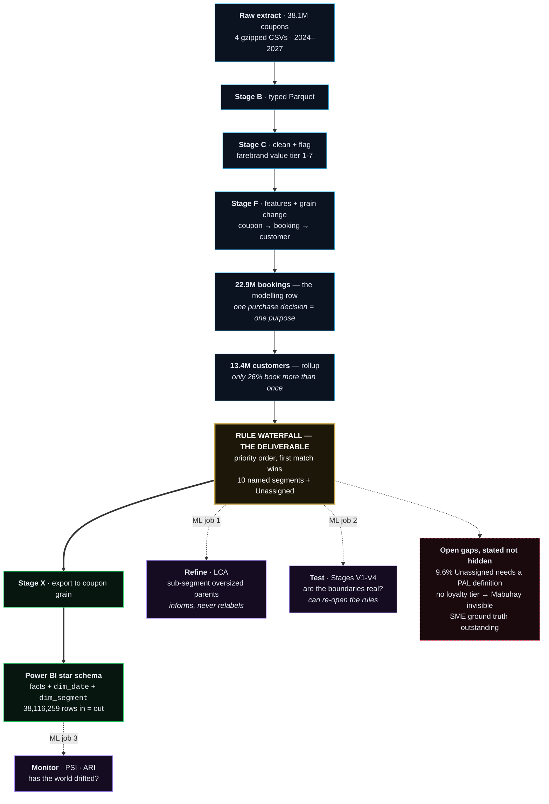
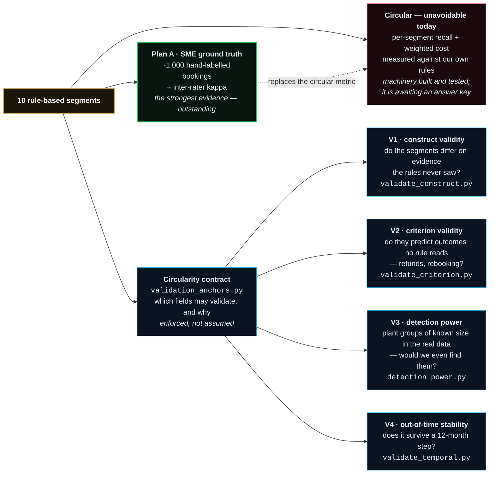

# PAL Customer Segmentation — ML Pipeline Methodology

**Client:** Philippine Airlines (PAL)
**Version:** v1.7 — 17 August 2026

> **Changelog**
> - **v1.7 (17 Aug 2026):** **Four descriptive fields added to Stage F; the waterfall is untouched.**
>   In response to the RM-Domestic SME constraint sheet (`docs/sme-constraints-intake.md`),
>   `src/features_real.py` now emits **`stay_nights`** (nights at the destination, from the largest
>   inter-coupon gap — robust to connections, which inflate a naive last-minus-first span on 9.60% of
>   round trips), **`dep_dow`**, **`turn_dest`** (outbound destination) and **`route_theme`**. The last
>   joins a new tracked reference, `data/reference/route_theme.csv` (`src/build_airport_ref.py`) —
>   32 airports across 8 trip-purpose themes, kept **separate from `airport_region.csv`** because it is
>   keyed on *trip* endpoints (so OAL codeshare beyond-points FCO/TLV/CDG/LIS resolve, none of which is
>   a PR sector endpoint) and because `is_domestic` is load-bearing while themes are experimental.
>   `airport_region.csv` is byte-identical. **No modelling logic changed and no proxy label moved** —
>   segment counts and the 9.58% Unassigned share are unchanged. `stay_nights` coverage: **9,785,597
>   bookings = 100% of round trips, 42.71% of the book, median 5 nights**; it is NULL on one-ways *by
>   definition*, and `assert_stay_contract()` now fails the build if that ever stops being true, because
>   the missingness pattern **is** the `round_trip` rule bit. All four are registered in
>   `CANDIDATE_ANCHORS` (not `ANCHORS`) with their declared leaks — see the corrected anchor tier table,
>   which also **fixes doc-vs-code drift**: `age`/`age_known` were still listed as Tier-A months after
>   the leak audit moved them out. **Also fixes a pre-existing reproducibility defect:** coupons were
>   ordered by `departure_dt` alone, which ties on 8,014 bookings (3,205 with differing `trip_origin`),
>   so `arg_min`/`arg_max` picked arbitrarily and **`round_trip` flipped on ~20 bookings between
>   identical runs** — tiny, but it meant two runs of the same code emitted different Parquet.
>   Ordering is now `(departure_dt, coupon_number)`; consecutive runs are byte-stable. `round_trip`
>   settles at **9,785,666**; segment shares move by at most one booking.
> - **v1.6 (12 Aug 2026):** **Rule-confidence diagnostics added; no modelling logic changed.**
>   `src/rule_confidence.py` measures *internal* confidence on the full 22.9M-booking population —
>   **rule competition** (how many of the 10 branch predicates a booking satisfies), **runner-up label**
>   (what it would be called one priority step lower) and **boundary fragility** (label flips when a
>   threshold moves a notch). This is deliberately a **separate axis from Stages V1–V4**: it says how
>   *determined* a label is by the rule set, never whether it is *correct*. Headline results:
>   **66.5% of bookings match exactly one rule, 24.0% match two or more, 9.6% match none**;
>   **Corporate is the most contested segment (6.4% uncontested, 25.6% matching 3+ rules) and carries
>   the highest penalty weight (×10)**; **84.1% of Last-Minute would otherwise be Budget/Adventure**, so
>   it behaves as an overlay rather than a peer segment; the **Corporate `lead_days<=7` cut is nearly
>   inert (0.15–0.17% flips)** while the **Last-Minute 3-day cut is the most consequential arbitrary
>   number in the model (widening to 7 days relabels 8.57% of the book)**. Also **corrects a stale figure**
>   propagated across four docs: `DaysBeforeMonthEnd` has **12** distinct values at **91.45%** `-7`, not
>   8 at 99.7% — the one-value-per-departure-month finding is re-confirmed at 37/37 and the conclusion is
>   unchanged. Full detail: `outputs/rule_confidence/summary.md`, `docs/pipeline-study-guide.md` §8.2.
> - **v1.5 (31 Jul 2026):** **Birds-eye view added, and Stage X ships a per-segment scorecard.** Two new
>   Mermaid diagrams (the end-to-end pipeline; the validation ladder) plus
>   [The model of record](#the-model-of-record--one-page) and
>   [Techniques used](#techniques-used--and-the-status-of-each) — the latter statuses every technique as
>   *in pipeline* / *candidate* / *diagnostic only* / *dropped*, because conflating those three is the
>   most common way to misread this spec. Stage X adds **`model/scorecard_segment_month.csv`** (segment ×
>   travel month, 1,835 rows, all columns additive) so per-segment scorecards do not require aggregating
>   20M rows. **No stored percentages** — a share is only valid in the filter context that produced it.
>   Every flag in that file is coalesced non-NULL, because a NULL would make `IsRefund = FALSE` silently
>   drop rows and break reconciliation, and the export now **asserts the scorecard ties to the fact
>   table** on every build. No modelling logic changed.
> - **v1.4 (31 Jul 2026):** **Stage X now ships a persona dimension.** `src/export_powerbi.py` emits
>   `model/dim_segment.csv` — one row per segment (11), joined on `CustomerSegment` = `Segment` — so
>   **persona cards render natively in Power BI** and cross-filter with every other visual, instead of the
>   segment narrative living only in prose. Columns are deliberately split into three kinds so a reader can
>   tell evidence from assertion: **measured** (lead days, round-trip/international/premium/connecting rates,
>   median+mean revenue, coupons per booking, top-3 regions, modal channel/country, bookings, share) —
>   **recomputed from `pal_features_booking.parquet` on every build, at booking grain** so multi-coupon
>   segments are not over-weighted; **editorial** (`PersonaName`, `WhyTheyFly`, `WhatTheyWant`,
>   `WhatNotToDo`) — informed inference, never to be presented as a finding; and **governance**
>   (`Trust`, `DataCaveat`, `IsModelledSegment`, `PenaltyWeight`, `RevenueAtRiskPerError`,
>   `SegmentColorHex`). The governance columns exist because **persona cards persuade**: a card reading
>   *"Mabuhay Loyalist · 0.03% of bookings"* invites the conclusion that the loyalty programme is
>   irrelevant, when the truth is that we cannot see it — so the caveat ships as a column rather than a
>   croppable footnote. No modelling logic changed. Stakeholder-facing write-up:
>   `docs/stakeholder-report.md` (§8 persona cards); deck: `assets/tuesday-slides/josh-slides.html`.
> - **v1.3 (29 Jul 2026):** **Out-of-time stability tested.** Added
>   [Stage V4 — out-of-time stability](#stage-v4--out-of-time-stability-srcvalidate_temporalpy)
>   (`src/validate_temporal.py`): two adjacent 12-month issuance windows, and every stability question
>   re-asked across the step. **Records a data-structure fact that governs all future temporal work — the
>   extract is filtered on *departure* date (2024-05-01 → 2027-05-31), not issuance**, so issuance is
>   left-truncated (pre-window bookings survive only if their lead time was long) and right-truncated (the
>   observable-lead ceiling falls below the 365-day clip after ~2026-06). Naive "2024–25 vs 2026–27"
>   windows would have shown a fake lead-time collapse; issuance never reaches 2027 at all. **Results:**
>   segment shares hold (TVD 1.93 pp on full-population counts), revenue mix is the weaker leg
>   (3.21 pp — `Balikbayan/VFR` 29.35%→26.64% of revenue on a flat headcount share), populations are
>   *mildly* distinguishable (adversarial AUC 0.61 against controls at 0.49 and 0.99), composition is
>   stable across the 98.2% of bookings that carry the volume, and **a model fitted a year earlier
>   transfers for free** (GMM(full) 0.763 vs a within-window ceiling of 0.746). `flown_any`/`refund_any`
>   are excluded throughout as right-censored. Full detail: `outputs/validate_temporal/summary.md`.
> - **v1.2 (29 Jul 2026):** **The null result is now falsifiable.** Added
>   [Stage V3 — detection power](#stage-v3--detection-power-srcdetection_powerpy)
>   (`src/detection_power.py`): **planted** segments of known prevalence and distinctness are *appended* to the
>   real population and the deployable panel is re-fitted at k=10 to see whether they come back out. Every
>   prior diagnostic returned "no natural clusters"; that finding could not answer **"or are your methods
>   blind?"** until now. Detection thresholds are **pre-registered and derived from `w=0` negative controls**.
>   **Result:** a majority of the panel recovers a planted segment at **≥2% of bookings** (distinctness
>   ≈0.34), **≥5%** (≈0.23) and **≥10%** (≈0.13) — but **never below ~1% prevalence at any distinctness
>   tested**, so that blind spot (~229k bookings) is now a stated limitation of the deliverable rather than an
>   unknown. Floors are **majority-rule**: the single most sensitive cell of 12 method × archetype
>   combinations is a cherry-pick and must not be quoted. Also **retires the H0 significant-component count
>   as a detector** — it returned **1 → 120 components across 100 draws of unchanged data** (median 1, p75 3),
>   which qualifies how the v1.0 H0 result should be quoted without overturning it. Full detail:
>   `outputs/detection_power/summary.md`.
> - **v1.1 (28 Jul 2026):** **Validation is no longer blocked on SME labels.** Added the
>   [Non-Circular Validation](#non-circular-validation-plan-b) stage — `src/validation_anchors.py` (the
>   circularity contract), `src/validate_construct.py` (segment-distinguishability matrix with negative and
>   positive controls) and `src/validate_criterion.py` (outcome-prediction ladder). Records the
>   **circularity audit** of the proxy waterfall, including the *semantic* leaks a name-based check misses
>   (`dest_region`→`is_domestic`, `issue_country`→`foreign_issue`, `channel`→`corp_channel`), and flags
>   **OFW/Migrant vs Balikbayan/VFR** — 6.8M bookings split on the single bit `round_trip` — as the weakest
>   boundary in the taxonomy, pending the full run. Proxy-referenced validation is now *one* leg of the story
>   rather than the only one; SME labels (Plan A) remain the strongest evidence but are no longer a blocker.
> - **v1.0 (28 Jul 2026):** **Ten-method stress test** (`src/model_stress_test.py` + `src/model_zoo.py`)
>   widened the algorithm field to six families — added **GMM** (full + diag), **SVD+KMeans**,
>   **Spectral(Gower)**, **Support Vector Clustering**, **TDA-Mapper** and **persistent homology**, plus a
>   KMeans floor — scored on **eight axes** (agreement · separation · natural-k · split-half · bootstrap ·
>   perturbation · feature-dropout · SVM-separability). **`GMM(full)` now leads the composite (0.849) ahead of
>   LCA (0.763), and still leads with the circular agreement axis zeroed (0.798 vs 0.762)** — so the
>   refinement layer is **under review, not yet switched**: the benchmark tests *top-level* segmentation while
>   LCA's pipeline job is *sub-segmentation*, so a stage-matched head-to-head is required first. The
>   **continuum finding is reconfirmed by four independent new tests**, separation ceilings at **0.381**
>   across all ten methods, and a new caveat is recorded: **every method is fragile to leave-one-feature-out**
>   (min ARI 0.15–0.49). No pipeline stage changed in this version.
> - **v0.9 (27 Jul 2026):** Added **Stage X — Power BI export** (`src/export_powerbi.py`): the rule-based
>   segment joined back to coupon grain as a preliminary BI **star schema** (coupon + flight-level agg +
>   dashboard-grain agg + date dimension), with booking identity (`BookingID`, `IsPrimaryCoupon`) and
>   exclusion flags so measures filter rather than guess. `CouponNumber` added to Stage C. Surfaced two
>   blocking BI data gaps — the **forward-book boundary** (travel months after 2026-07-21 are still filling;
>   guarded by `IsCompleteTravelMonth`/`IsCompleteTravelYear`) and `DaysBeforeMonthEnd` being
>   departure-month metadata rather than a booking snapshot, so it cannot drive LY-vs-CY pickup
>   (use `LeadTimeDays`, or request repeated dated extracts).
> - **v0.8 (27 Jul 2026):** Algorithm choice **re-tested and unchanged** — full k-prototypes / k-modes / LCA
>   head-to-head (`src/kproto_compare.py`) confirms LCA as the refinement layer; k-prototypes demoted to a
>   diagnostic cross-check. Balikbayan/VFR sub-types flagged provisional (low stability).
> - **v0.7 (23 Jul 2026):** Added the [Tools & Libraries disclosure](#tools--libraries-disclosure); reconciled the header version with the footer (was drifting at v0.5 vs v0.6).
> - **v0.6 (23 Jul 2026):** Real-data track pivot — rule-based purpose×value segmentation is primary, LCA refines/validates; HDBSCAN dropped for the real data. Added the real-data at-a-glance summary.
> - **v0.5 (17 Jul 2026):** Added an adapted PNR/coupon-level prototype pipeline — since **superseded** and
>   reduced to a stub, see [Prior Prototype Track](#prior-prototype-track-superseded). Baseline (v0.4)
>   pipeline on `sample-features.csv` retained unchanged below as the reference implementation.
> - **v0.4 (11 May 2026):** Baseline 8-stage pipeline on `sample-features.csv`.

---

## Current Methodology at a Glance

**Active track — the Real-Data Pipeline** (real 38M-coupon extract, 2024–2027; anonymous
trip-purpose × value segmentation at the **booking** grain, rolled up to **customer**).

### The pipeline, end to end

The load-bearing idea in one picture: **the rules label, and ML checks the labels.** Clustering is a
validator and a refiner in this design, never the labeller — see the approach decision below for why.

```text
gz → typed Parquet → Stage C clean+flag (coupon grain; farebrand → value tier 1-7)
→ Stage F features: coupon → BOOKING (customer_id, issue_date) → customer  (+ airport→region
     and airport→route-theme joins; stay_nights / dep_dow / turn_dest / route_theme are descriptive only)
→ RULE WATERFALL: purpose×value proxy segmentation   ← PRIMARY DELIVERABLE (the 10 segments)
→ Stage X export: segment joined back down to coupon grain → Power BI star schema
   ├── LCA refinement       sub-segments oversized parents   ← ML's job 1
   ├── Stages V1-V4         test whether the boundaries hold ← ML's job 2
   └── PSI / ARI monitoring drift on the input distribution  ← ML's job 3
→ pending SME ground truth for non-circular validation
```

*(The same pipeline as a diagram — renders on GitHub and in any Mermaid-enabled viewer. If you see raw
code below instead of a picture, your Markdown preview has no Mermaid support; the text version above is
authoritative and complete.)*



**Reading it:** blue = data preparation · **gold = the deliverable** · violet = ML's three real jobs ·
green = delivery · dashed red = known gaps. Dashed arrows are checks and feedback, not data flow.
Stage detail: [Stage C](#stage-1--data-ingestion--cleaning) onward below; scripts in
[Scripts Reference](#scripts-reference).

### The validation ladder — and why circularity is the crux

Every agreement number this project produces is measured against `proxy_segment`, which is the rule
waterfall's own output. That is **circular** by construction. Two independent routes out, both live:

```text
10 rule-based segments
├── CIRCULAR (unavoidable today) ── per-segment recall + weighted cost, measured against our own
│                                   rules. Machinery built and tested; awaiting an answer key.
├── PLAN B — no labels needed ──── gated by the circularity contract (validation_anchors.py):
│     V1 construct validity   do the segments differ on evidence the rules never saw?
│     V2 criterion validity   do they predict outcomes no rule reads (refunds, rebooking)?
│     V3 detection power      plant groups of known size — would we even find them?
│     V4 out-of-time          does it survive a 12-month step?
└── PLAN A — ground truth ───── ~1,000 SME-labelled bookings + inter-rater agreement.
                                Replaces the circular metric. Outstanding.
```



**Plan B answers "is there real structure here?" without any labels. Plan A answers "are these the
*right* labels for PAL?" and nothing else can.** They are complements, not substitutes — which is why
the SME ask is the critical path even though Plan B is complete.

### The model of record — one page

| | |
|---|---|
| **Problem type** | Started as unsupervised segmentation; **reframed as rule-based labelling with model-based validation** after the data showed no natural clusters |
| **Unit of analysis** | The **booking** = `(customer_id, issue_date)` — one purchase decision, one trip purpose. 22.9M rows, rolled up to 13.4M customers |
| **The model** | A **prioritised rule waterfall** ("first match wins") over observable booking attributes → **10 named segments + Unassigned**. Value axis is PAL's authoritative **farebrand ladder** (tiers 1–7) |
| **What fits/learns** | Nothing, at the top level — the segment assignment is deterministic and auditable. Models are used *below* it (sub-segmentation) and *around* it (validation, drift) |
| **Lens** | **Anonymous trip-purpose × value** — no loyalty/CRM join required. A named industry approach (Sabre's anonymous segmentation) |
| **Scoring a new booking** | Apply the same waterfall. No inference, no drift in the labeller itself — drift can only enter through the input distribution, which is what monitoring watches |
| **Output** | `proxy_segment` at booking grain → joined down to all 38.1M coupons → Power BI star schema |
| **Headline honest limitation** | Validation is **proxy-referenced (circular)** until SME labels land. There is **no ground-truth accuracy figure yet**, by design rather than by omission |

### Techniques used — and the status of each

The status column is the part that matters: it separates *what is in the pipeline* from *what was run
once to answer a question* from *what was tested and rejected*. Conflating those three is the most
common way to misread this document.

| Technique | The job it does | Where | Status |
|---|---|---|---|
| **Rule waterfall** (priority CASE) | Assigns the segment | `features_real.py` | ✅ **In pipeline — primary** |
| **Farebrand value ladder** | Ordinal value axis, tiers 1–7 | `clean_real.py` | ✅ In pipeline |
| **Negative learning** (impossibility rules) | Rules out invalid segments before labelling | rule design | ✅ Retained as design principle |
| **LCA** (Latent Class Analysis) | Sub-segments oversized parent segments | `sub_segment.py` | ✅ In pipeline — refinement layer, **under review** |
| **GMM** (full covariance) | Beat LCA on the top-level benchmark (0.849 vs 0.763) | `model_zoo.py` | ⏸️ **Candidate** — needs a stage-matched re-test before replacing LCA |
| **PSI · ARI · centroid/volume drift** | Production monitoring, retrain triggers | `monitor_metrics.py` | 📋 Specified, not yet wired |
| **Asymmetric cost matrix + per-segment recall** | The optimisation target — business cost, not accuracy | Stage 7 | ✅ Built, **awaiting ground truth** |
| **Gradient-boosted classifiers on held-out anchors** | Construct + criterion validity (V1, V2) | `validate_construct.py`, `validate_criterion.py` | ✅ Run |
| **Planted-segment injection** | Detection power — bounds the null result (V3) | `detection_power.py` | ✅ Run |
| **Adversarial AUC + transfer ARI** | Out-of-time stability (V4) | `validate_temporal.py` | ✅ Run |
| **Circularity contract** | Enforces which fields may validate | `validation_anchors.py` | ✅ Enforced in code |
| **Rule-confidence diagnostics** (rule competition · runner-up label · boundary fragility) | *Internal* confidence — how determined a label is by the rule set, on the full 22.9M population | `rule_confidence.py` | 🔬 Diagnostic only — **not a correctness measure** |
| **k-prototypes · k-modes** | Mixed-type cross-check | `kproto_compare.py` | 🔬 Diagnostic only — stable but poorly separated |
| **KMeans · SVD+KMeans · Spectral (Gower)** | Benchmark floor and comparison | `model_zoo.py` | 🔬 Benchmark only |
| **Support Vector Clustering · TDA-Mapper · persistent homology (H₀)** | Assumption-free structure tests | `model_zoo.py` | 🔬 Benchmark only — all found no structure |
| **HDBSCAN** | Was the original plan of record | `hdbscan_final.py` | ❌ **Dropped for real data** — categorical-heavy, not density-separable |

**Evaluation metrics and what each is for:** *Gower silhouette* (mixed-type separation — the honest
ceiling here is **0.381**) · *ARI* (chance-corrected agreement; also split-half and bootstrap stability)
· *AUC* (construct/criterion validity, and the adversarial population test) · *TVD* (segment-share drift
across time windows) · *per-segment recall + weighted cost* (the business target). **DBCV is not used on
the real extract** — it presumes density structure, which categorical-heavy data does not have.

**Two cautions this project established, both quotable:**
**(a)** an **SVM separability probe scores 0.85–0.99 for nearly every method, including those with
silhouette ≈ 0.1** — a geometric cut through a continuum is perfectly learnable while being wholly
arbitrary, so *never quote a separability or accuracy figure without the silhouette beside it*;
**(b)** **KMeans and k-prototypes were the most stable methods in the field with nearly the least
separation** — *stability without separation is not structure.*

- **Approach decision (2026-07-23, evidence-based):** a mixed-type clustering diagnostic
  (`src/cluster_diagnostic.py`: LCA + k-prototypes) showed the customer base is a **continuum**
  (BIC has no elbow — no natural *k*) whose structure follows the rule axes (route / direction / value /
  timing), with only moderate cluster–taxonomy agreement (ARI ≈ 0.2–0.34). **So the rule-based
  segmentation is primary; clustering (LCA) refines and validates — it is NOT the labeler.**
  **HDBSCAN is dropped for the real data** (categorical-heavy → not density-separable).
- **Algorithm re-test (2026-07-27) — decision unchanged.** `src/kproto_compare.py` ran the full
  **k-prototypes vs k-modes vs LCA** head-to-head on the same 20k booking sample (k = 3–12) across four
  axes. **LCA wins as the refinement layer:** taxonomy agreement ARI **0.336** (k=4) vs k-prototypes 0.216 /
  k-modes 0.212, and Gower silhouette (mixed-type separation) **0.30** vs 0.09 / 0.15 — including inside all
  three big parent segments. Neither distance method finds an elbow (their cost falls monotonically by
  construction), and the three methods agree with each other only weakly (pairwise ARI 0.12–0.43) —
  the continuum finding, reconfirmed by a second model family. **k-prototypes' one advantage is
  reproducibility** (split-half ARI 0.97–0.98 vs LCA's 0.67–0.86) but paired with the *worst* separation:
  a hard-centroid method partitions a smooth density stably without the partition being meaningful. So it
  stays a **diagnostic cross-check, not a pipeline stage**. Side-finding: the **Balikbayan/VFR** LCA
  sub-types are the least reproducible (split-half ARI **0.495**) → treat as **provisional**.
- **Ten-method stress test (2026-07-28) — the continuum finding hardens; the refinement layer goes under
  review.** `src/model_stress_test.py` (library: `src/model_zoo.py`) benchmarked **ten methods across six
  families** on the same 20k booking sample and feature set, over **eight axes**. Two results matter:
  1. **`GMM(full)` overtakes LCA** — composite **0.849 vs 0.763**, and **0.798 vs 0.762** when taxonomy
     agreement (the one *circular* axis) is weighted to zero, so the win is not borrowed from the proxy
     rules. It leads on agreement (ARI **0.409** @k=6 vs 0.337), split-half+bootstrap stability (0.812 vs
     0.680) and noise/dropout robustness (0.757 vs 0.645); **LCA retains the better separation** (Gower
     silhouette 0.298 vs 0.262). **The pipeline is unchanged pending a stage-matched re-test:** this
     benchmark scores *top-level* segmentation, whereas LCA's actual job (Stage: LCA refinement) is
     *sub-segmenting inside big parent segments*. Re-run the head-to-head there — as
     `kproto_compare.py` §5 does — before swapping the layer.
  2. **The continuum is confirmed by four independent new tests**, none of which existed in the earlier
     decisions: **H0 persistent homology** (no labels, no k, no centroid, no distributional assumption) finds
     **1 significant component**, gap ratio 1.195; **SVC's emergent k = 1** for all γ ≤ 0.8, fragmenting to
     27–39 shards only by ejecting 43–62% of rows; **TDA-Mapper finds nothing** (separation ≈ 0, negative at
     k ≥ 5); and **median cross-method ARI is 0.41**. **Separation ceilings at 0.381** across the whole field
     — the honest upper bound on any clustering claim on this data.

  Three methodological cautions this run establishes, all quotable:
  **(a)** the **SVM separability probe** scores 0.85–0.99 for nearly every method *including* those with
  silhouette ≈ 0.1 — a geometric cut of a continuum is perfectly learnable while being wholly arbitrary, so
  **never quote an accuracy/separability figure without the silhouette beside it**;
  **(b)** **KMeans is the most stable and robust method in the field** (0.970 / 0.802) with nearly the
  *least* separation — the third method after k-prototypes to show that **stability without separation is not
  structure**;
  **(c)** **every method is fragile to feature dropout** (leave-one-out ARI minima 0.15–0.49; best
  SVD+KMeans 0.487, LCA 0.480, GMM(full) 0.409) — a production risk worth stating given the extract's
  known field gaps. Full detail: `outputs/model_stress_test/summary.md`.
- **Detection power (2026-07-29) — the null is now bounded, and so is our sensitivity.**
  `src/detection_power.py` plants segments of known prevalence and distinctness into the real population and
  checks whether the deployable panel recovers them, which is the only way the repeated "no clusters" result
  becomes falsifiable rather than merely negative. **A majority of the panel recovers a planted segment at
  ≥2% of bookings** (distinctness ≈0.34), ≥5% (≈0.23) and ≥10% (≈0.13) — direction-independent, confirmed by
  a **random-direction control** that detects at the same rate (29%) as the two business-plausible
  archetypes. **The bound matters as much as the finding: below ~1% prevalence nothing is detected at any
  distinctness tested** — ~229k bookings — so *"a segment smaller than ~1% could exist and we would not have
  found it"* now travels with the continuum claim. Two cautions established: **never quote the single most
  sensitive cell** (of 12 combinations, the luckiest would have claimed 0.5% / 0.059 while groups at 0.555
  distinctness were missed elsewhere — all floors are majority-rule), and **the H0 significant-component
  count is retired as a detector** (1 → 120 across 100 draws of unchanged data; median 1, so the v1.0
  continuum reading holds, but as the centre of a noisy distribution, not a measurement). Failure mode is
  **smearing**: at `w=1` recall is 1.00 for every method while precision lags (SVD+KMeans 0.39), so a faint
  group is found and then absorbed into a larger cluster. Full detail: `outputs/detection_power/summary.md`.
- **Out-of-time stability (2026-07-29) — the segmentation is not a one-period artefact.**
  `src/validate_temporal.py` splits the extract into two adjacent 12-month **issuance** windows
  (2024-05→2025-04 vs 2025-05→2026-04; 9.77M vs 10.08M bookings) and re-asks every stability question.
  **Segment shares hold** — TVD **1.93 pp** on full-population counts, largest single move
  `Budget/Adventure` −1.49 pp. **A model fitted a year earlier transfers for free** — GMM(full) transfer ARI
  **0.763** against a within-window *ceiling* of 0.746 (ratio 1.02). **Composition is stable where the
  volume is**: 7 of 10 segments show negligible-or-small drift and carry **98.2%** of bookings; the three
  moderate-or-larger drifters are the three smallest segments (1.8% combined) and are reported as
  **unresolved, not as behaviour change**. Two cautions: **revenue mix is the weaker leg** (TVD 3.21 pp —
  `Balikbayan/VFR` fell 29.35%→26.64% of revenue on a flat headcount share, so *a segment holding its size
  is not evidence its value held*), and the populations are **mildly distinguishable** (adversarial AUC 0.61
  against controls at 0.49 / 0.99), i.e. real shift that the segment sizes absorbed. **Critical data fact
  recorded here: the extract is filtered on *departure* date, not issuance**, so naive calendar-year windows
  would report a fake lead-time collapse — see Stage V4 before any future temporal analysis. Full detail:
  `outputs/validate_temporal/summary.md`.
- **Model:** the 10 named segments (Corporate, Mabuhay Loyalist, OFW/Migrant, Balikbayan/VFR, Pilgrimage,
  Family, Premium Bleisure, Budget/Adventure, Last-Minute, Digital Nomad) + an Unassigned bucket.
  Value = authoritative **farebrand tier** (V1 dictionary). Validation stays **proxy-referenced (circular)**
  until SME labels (`data/labels/sme_sample.csv`) land.
- **Delivery (Stage X, 2026-07-27):** `src/export_powerbi.py` joins the booking-grain `proxy_segment` back
  down onto the cleaned coupons and emits a Power BI **star schema** → `outputs/powerbi_export/`: `coupons/`
  (38.1M, drill-through), `agg/` (flight-level detail), `agg_dashboard.parquet` (~1.7M, headline visuals),
  `dim_date.csv` (time intelligence), **`scorecard_segment_month.csv` (per-segment scorecard source —
  segment × travel month, additive, no stored shares)**, **`dim_segment.csv` (the persona dimension — 11 rows, added v1.4;
  measured behaviour recomputed per build + editorial persona text + `Trust`/`DataCaveat` governance
  columns, so persona cards render in BI and carry their caveats)** + QA sample + `summary.md`.
  Row-preserving (38,116,259 in = out); 99.95%
  segment match, the remainder being the all-non-revenue customers Stage F excludes, labelled
  `Excluded (non-revenue)` so BI totals still tie. **`CustomerSegment` ships as the rule-based proxy label** —
  preliminary, and explicitly flagged as such in the export summary until SME ground truth lands.
  Grain safety: `BookingID` + `IsPrimaryCoupon` (exactly one TRUE per booking) make booking-level measures a
  filter rather than a non-re-aggregatable DISTINCTCOUNT; aggregate `Bookings` is `sum(IsPrimaryCoupon)` for
  the same reason. Exclusion flags (`IsRefund`, `RevMissing`, `IsAward`, `IsNonRev`, `IsGroupFare`, `AgeKnown`,
  `IsReissue`) ship so commercial measures filter rather than guess.
  **Two blocking gaps surfaced by this stage:**
  1. **Forward-book boundary.** The extract stops at a single as-of date (last flown departure **2026-07-21**).
     Travel months past it are still filling — Sep-2026 holds ~22% of a mature month — so an unfiltered trend
     or YoY visual draws a *fake cliff*; 2024 also starts in May, so full-year YoY compares 12 months to 8.
     Mitigated in-band by `DataAsOfDate` / `IsCompleteTravelMonth` / `IsCompleteTravelYear` (TRUE for **2025
     only**), which every trend visual must filter on.
  2. **`DaysBeforeMonthEnd` cannot support the requested LY-vs-CY pickup measure** — it holds exactly one value
     per departure month across all 37 months (12 distinct values in the whole extract, 91.45% of them `-7`),
     i.e. departure-month metadata against a single extract date, not a booking snapshot. Pickup requires
     either `LeadTimeDays` (exported) or **repeated dated extracts of the same departure months** — a new data
     request to PAL.
- **Code:** `src/build_parquet.py` · `src/clean_real.py` (C) · `src/build_airport_ref.py` ·
  `src/features_real.py` (F) · `src/cluster_diagnostic.py` (method choice) ·
  `src/kproto_compare.py` (method re-test) · `src/model_zoo.py` + `src/model_stress_test.py`
  (ten-method / eight-axis benchmark) · `src/export_powerbi.py` (X, BI delivery). Full plan:
  `docs/real-data-plan.md`; data dictionary: `docs/data-dictionary.md`.
- **Prior track (superseded for real data):** the **Stages 1–8** `sample-features.csv` baseline —
  the real Jan-2025 snapshot, retained below as the reference implementation. An earlier prototype
  track also preceded this work; see [Prior Prototype Track](#prior-prototype-track-superseded).
  **The continuum finding rests entirely on the real extract** — ten methods across six families,
  separation ceiling 0.381, plus the detection-power bound in Stage V3.

Real-data methodology → `docs/real-data-plan.md`.

---

## Non-Circular Validation (Plan B)

**Added v1.1 (28 Jul 2026).** Every validation number produced before this was **circular**: agreement was
measured against `proxy_segment`, which is the rule waterfall's own output. Plan A closes that with SME
ground truth (`data/labels/sme_sample.csv`). Because internal SME labelling may not be available, this stage
answers a different question that needs no labels at all — and therefore is not blocked:

> **Do the segments differ on evidence the rules never saw, and do they predict outcomes they were not
> built to predict?**

### The circularity audit — and the leak a name check cannot catch

The waterfall (`src/features_real.py`) consumes: `is_award`, `corp_channel`, `any_business`, `lead_days`,
`pilgrimage`, `sea_crew`, `foreign_issue`, `is_international`, `max_tier`, `round_trip`, `any_premium`,
`is_group`, `is_domestic`. **Anything on that list validates nothing.** Three fields that look like ideal
independent markers are disqualified outright: `sea_crew` *is* the OFW rule, `is_award` *is* the Mabuhay
rule, `pilgrimage` *is* the Pilgrimage rule.

Subtler, and the reason `src/validation_anchors.py` exists: three admissible-looking anchors are **finer-
grained versions of rule fields**, so coarsening them recovers a rule bit exactly —
`dest_region == 'Domestic'` **is** `is_domestic`; `issue_country != 'PH'` **is** `foreign_issue`;
`channel IN ('TMC','Corporate Web Portal')` **is** `corp_channel`. A name-based guard passes them, and the
result is AUC ≈ 1.0 that proves only that the rules were applied consistently. Admissibility is therefore
decided **per comparison**: such an anchor is used only where the bit it encodes is not the boundary under
test. `assert_admissible()` raises rather than warns; `admissible_for_groups()` does the per-pair check.

Sea-crew bookings are excluded throughout — `channel` is an anchor whose level is literally `Sea Crew`, so
keeping them leaks the OFW rule through an anchor. That reduces OFW/Migrant from 3.92M to 2.82M by design:
a booking whose channel says Sea Crew is identified *by definition*.

| Tier | Fields | Status |
|---|---|---|
| Rule inputs | the 13 above | circular — never usable |
| Trip-type proxies | `rev_pos`, `n_coupons`, `connecting`, `n_directions`, `min_tier` | leak `round_trip` — excluded |
| **Tier-A anchors** | `dep_month`, `n_bookings` | independent of every rule field — always usable |
| Conditional anchors | `issue_country`, `channel`, `dest_region`, `age`, `age_known` | usable only where their encoded bit is constant across the pair |
| **Candidate anchors** *(v1.7)* | `stay_nights`, `dep_dow`, `route_theme`, `turn_dest` | in the feature table, **not yet loaded** — see below |

> ⚠️ **Corrected v1.7 — this table listed `age` and `age_known` as Tier-A.** The 2026-07-30 leak audit
> moved both to conditional (`age_known` is 0.86% domestic vs 87.62% international, i.e. a near-copy of
> `is_international`), and `src/validation_anchors.py` has read `TIER_A = ("dep_month", "n_bookings")`
> ever since. The table had not been updated. **Only two anchors are unconditionally admissible.**

**Candidate anchors (added v1.7, 17 Aug 2026).** Four descriptive fields now exist in
`pal_features_booking.parquet` but are deliberately **not** registered in `ANCHORS` and **not** loaded by
`load_anchors`, so no validator's behaviour changes. They are declared in `CANDIDATE_ANCHORS` together
with the leaks each would carry, because promoting one has a cost that must be paid consciously:

- **`stay_nights` is conditional, never Tier-A** — its *definedness* is `round_trip` (NULL on one-ways
  because there is no stay, not because a value is missing). It therefore **cannot validate the
  OFW/Migrant ↔ Balikbayan/VFR boundary**, which is precisely the split `round_trip` defines: the feature
  would be wholly present on one side and wholly absent on the other, scoring AUC 1.0 while proving only
  that the rule was applied. Its value is pairs that *agree* on `round_trip` — Corporate vs Premium
  Bleisure above all.
- Promoting `stay_nights` also requires adding **`round_trip` to `AUDIT_BITS`**, which it is not in
  today; `src/audit_leaks.py` fails its self-consistency assertion otherwise, by design.
- **The RM-Domestic constraint sheet wants to spend two of these as rule inputs.** A field cannot be both
  a rule input and an anchor. That trade-off — not the fields — is the scarce resource:
  `docs/sme-constraints-intake.md` §6.

### Stage V1 — construct validity (`src/validate_construct.py`)

A **segment-distinguishability matrix**: for each of the 45 segment pairs, held-out ROC-AUC from a
`HistGradientBoostingClassifier` given only admissible anchors (NaN and categoricals handled natively, so
age's missing-not-at-random pattern is modelled rather than imputed away). Bands: **<0.60 not
distinguishable · 0.60–0.75 weakly · >0.75 clearly distinct.**

Controls are what make the AUCs interpretable, and are deliberately asymmetric: the **negative control**
(each segment split randomly in half) gets *all* anchors, because more features mean more chance to fit
noise — it must land ≈0.50 or the harness leaks and the run is void. The **positive controls** get strict
anchors only, so they calibrate the same scale as the matrix.

Includes a dedicated test of **OFW/Migrant vs Balikbayan/VFR** on the isolated population where every
higher-priority branch is excluded and `round_trip` is the *only* difference, plus two robustness checks
(matched within `issue_country`; base-rate-normalised `dep_month`, since most segments peak in May
regardless). Also profiles the 2.19M `Unassigned`: coherent missing segment, or residue?

### Stage V2 — criterion validity (`src/validate_criterion.py`)

A four-rung ladder — **null → segment-only → the 11 clustering features → features + segment** — against
outcomes no rule consumes: `flown_any` (primary), `refund_any` (rare; **reported as infeasible rather than
fitted** where minority events < 200 — Family has 3 in 22.9M), and `rebook_180d` (forward-looking;
right-censored bookings near the extract boundary are **excluded**, since counting them as "did not rebook"
would manufacture a fake collapse in loyalty — the same boundary that makes unfiltered trend visuals draw a
cliff).

A segmentation is a **compression** and cannot beat the features it was built from, so win/loss is the wrong
frame. Two numbers are reported instead: **signal retained** = `(AUC_segment − 0.5) / (AUC_features − 0.5)`,
and **incremental value** = `AUC(features + segment) − AUC(features)`. Near-zero incremental value means the
segmentation is a lossy re-encoding — valuable for communication and targeting, but not a source of new
signal, and it must not be sold as one.

### Stage V3 — detection power (`src/detection_power.py`)

Stages V1/V2 ask whether the segments we *have* are real. V3 asks the complementary question, and the only
one that makes the project's repeated null result falsifiable: **if a segment existed that we are missing,
would this pipeline see it?** Ten methods agreeing on "no clusters" is only evidence if the methods can
detect a cluster when one is present.

**Planted** segments of known prevalence (0.5 · 1 · 2 · 5 · 10%) and known distinctness are **appended** to
the real population — never substituted in, so the counterfactual is *"if PAL's book also contained this
group"* rather than *"if part of the book were replaced"*. (These are *injected test signals* used to
measure our own detection sensitivity on the real extract — not a substitute dataset.) Distinctness is one knob, `w`: each planted row
starts as a real booking and moves a fraction `w` toward a fixed archetype (numerics interpolate; binary
flags and `dest_region` flip toward it with probability `w`). `w=0` is an unmodified random subset, `w=1`
collapses the group onto a single point.

Three archetypes, and the third matters as much as the first two: `late_yield` (last-minute high-yield
corporate one-way) and `planned_group` (far-ahead low-fare multi-sector group travel) are directions a real
missed segment could plausibly point in; **`random_dir` has no business story at all**, so a floor that holds
there is a property of the method panel rather than of two well-chosen guesses.

The panel is the **deployable** one — GMM(full) · LCA · KMeans · SVD+KMeans — fitted at **k=10**, the
taxonomy size the pipeline actually uses. The O(n²) methods are excluded on purpose: a method capped at 3k
rows is not the pipeline whose blindness is in question. Recovery is the **best F1 any single fitted cluster
achieves against the planted membership**, reported with its precision and recall because the failure mode is
informative — high recall with low precision means the group was found but smeared into a much larger cluster
and would never be actionable.

**The detection threshold is pre-registered and control-derived:** best-F1 ≥ 0.50 *and* ≥ the 95th percentile
of that method's own `w=0` runs, whichever is higher — so a method with a noisy control faces a *higher* bar,
not a lower one.

**Floors are majority-rule, and this is the load-bearing methodological decision in the stage.** With one row
per method × archetype there are 12 chances per cell for *something* to clear the threshold, so the single
most sensitive combination reports the luckiest alignment between an archetype's direction and a method's
inductive bias — which is what that many draws produce even without real sensitivity. Quoting it would have
claimed detection at **0.5% prevalence and 0.059 distinctness** while groups at **0.555** distinctness were
missed elsewhere in the same grid; those cannot both be a floor. Every published floor is therefore the cell
where **>50% of the panel agrees**, with the unanimous floor reported beside it.

**The `w=0` controls retired one of our own instruments.** Re-running H0 persistent homology 100 times on
unchanged data — where the answer must be identical every time — returned **median 1, p75 3, maximum 120**
significant components. A statistic with that range on unchanged data cannot screen for anything, so this
stage draws **no detection conclusion from H0 at all**. The instability is the *gap heuristic* (`argmax` over
differences in sorted bar lengths, which jumps whenever two adjacent bars are close), not the homology. This
qualifies rather than overturns the v1.0 continuum result: 1 is the modal and median value, so the reading
holds — but report it as the centre of a noisy distribution, and lean on the H1 loop-noise ratio and the
barcode's shape, which are the robust parts.

Three limits to carry into any deliverable. **The floors are optimistic**, because a planted group is
internally coherent in a way a real segment may not be — a messier real segment of the same size and
distinctness would be harder to find. **The blind spot is real and must be stated**: below ~1% prevalence
(~229k bookings) nothing was detected at any distinctness tested, so *"a segment smaller than that could
exist and we would not have found it"* belongs beside the continuum finding, not in a footnote. And
`planted_sil` is **not** the stress test's 0.381 ceiling: it is measured on a stratified sample and describes
one group against the rest, where 0.381 is a full-partition silhouette on a uniform sample. Related
quantities, not interchangeable.

### Stage V4 — out-of-time stability (`src/validate_temporal.py`)

Stages V1–V3 all read a single pooled snapshot. This one splits it in time, because a segment that exists
only because of one period's booking conditions would pass every earlier test and still be worthless to act
on.

**The extract's shape dictates the design, and this is the part to get right.** The data is filtered on
**departure date (2024-05-01 → 2027-05-31), not issuance**, which truncates the issuance axis at both ends:
a booking issued before the travel window opens appears only if its lead time was long enough to reach it
(mean lead **105 days** in the excluded early region vs **38** inside the windows), and for issue date `d`
the longest observable lead is `2027-05-31 − d`, a ceiling that drops below the modelled 365-day clip after
~2026-06. The windows are therefore **2024-05-01 → 2025-04-30** and **2025-05-01 → 2026-04-30** — adjacent,
12 months each so seasonality cannot masquerade as drift, and both strictly inside the complete region. A
naive "2024–25 vs 2026–27" split would have reported a spectacular collapse in lead time that is **pure
selection**; issuance never reaches 2027 at all.

Five measurements, each against controls: **share stability** and **revenue-mix stability** (total-variation
distance, on the **full population** rather than a sample); **profile drift** (per-segment, per-feature
standardised mean difference — a segment can hold its share while its members change underneath, which is
the more dangerous failure because a size report shows nothing); **adversarial drift** (held-out AUC at
telling which window a booking came from using only the 11 features — one number for "has the population
changed?"); and **model transfer** (fit on the earlier window, score the later one, against a model fitted
on the later window directly — what production actually does).

Three design points that carry the stage:

- **Profile drift is stratified, and must be.** A uniform 30k draw gives `Mabuhay Loyalist` (0.03% of
  bookings) ~9 rows, so exactly the segments whose stability is least known would return `n/a`. A
  per-segment floor tests all ten. Those rows are **not** a population sample and are used only for
  within-segment before/after comparison — shares come from the full population.
- **Drift is read weighted by volume.** "Three segments drifted" hides whether they carry 2% or 60% of
  bookings, and the answer changes the conclusion entirely.
- **The transfer control is a ceiling, not a baseline.** It fits the same method on two random halves of the
  *earlier* window, both scoring the later one — the method disagreeing with itself, no time involved.
  Transfer cannot meaningfully exceed it, so the **shortfall below it** is what a year costs, not the raw
  ARI. Raw ARIs sit well under 1.0 for every method here, which is the continuum again.

**Outcome fields are excluded throughout.** `flown_any` runs ~100% for early issuance and **30.7%** for
2026Q3 — right-censoring, not a collapse in travel. Comparing it across windows would produce a large,
wholly artefactual difference. The censoring curve is published instead, so the exclusion is visible rather
than silent. Same forward-book boundary that makes unfiltered trend visuals draw a false cliff.

What the stage does **not** establish: it tests **one** 12-month step inside a single extract. Stability
across 2024–26 is not evidence of stability through a demand shock, a network change or a fare-structure
revision — the mechanism that would break it is not in this data. Issuance after 2026-04-30 is untested
here, so a refresh should re-run it once that travel completes.

### What this stage cannot do

It **cannot confirm the segment names.** It shows that groups differ and that they carry outcome signal; it
cannot show the group labelled `Corporate` is what PAL's commercial team means by Corporate. Every
deliverable must therefore say **"behaviourally validated; segment names not externally confirmed."** A low
AUC is evidence about a *boundary*, not proof of identity — two segments indistinguishable on these anchors
could still differ on evidence we do not hold (loyalty tier, length of stay, ancillary spend — all known
gaps). And no taxonomy change follows automatically: an unsupported split becomes a **proposal to PAL with
the evidence attached**, never a unilateral merge.

---

## Tools & Libraries (disclosure)

The whole pipeline is plain **Python 3.14** and open-source end to end — there is no proprietary
analytics platform in the loop. The guiding idea: use a heavy-data engine only where the 38M rows
genuinely need one, and keep the modelling itself on familiar, well-audited libraries so the results
are reproducible and easy to hand over. Read this table as *"what each tool is for and why it earns
its place"* rather than a bare dependency list.

| Layer | What we use | Version | What it does / why it's here |
|-------|-------------|---------|------------------------------|
| Language | **Python** | 3.14 | Every script in `src/` (wheels also fine on 3.11–3.13) |
| Heavy data (out-of-core) | **DuckDB** | 1.5.5 | Streams the 38M-coupon gzip and does the coupon → booking → customer aggregation *without* loading it all into memory |
| Columnar storage | **PyArrow** / Parquet | 25.0.0 | Fast typed intermediates in `data/interim/` — sub-second re-reads instead of minutes re-scanning raw gzip |
| Dataframes & math | **pandas** · **NumPy** | 3.0.3 · 2.5.1 | Work on the *aggregated* model-grain table (millions of rows, not tens of millions) |
| Clustering — model-based | **StepMix** (Latent Class Analysis) | 3.0.0 | The refinement layer: finds sub-types inside big segments and tests for natural structure via BIC |
| Clustering — mixed-type | **kmodes** (k-prototypes, k-modes) | 0.12.2 | Independent cross-check only — handles numeric + categorical together, but lost the 2026-07-27 head-to-head to LCA on agreement and separation |
| Clustering — benchmark field | **scikit-learn** (GMM, spectral, one-class SVM, Ward) | 1.9.0 | The other five families in the 2026-07-28 ten-method benchmark: Gaussian mixtures (full + diag), SVD/spectral, Support Vector Clustering, KMeans floor |
| Topology (TDA) | **kmapper** · **ripser** | 2.1.0 · 0.6.15 | Mapper graph (lens → cover → per-patch clustering → graph) and H0/H1 **persistent homology** — a label-free, algorithm-free read on whether the data is separated blobs, one continuum, or a cycle. `giotto-tda` was tried first: no Python 3.14 wheel, fails to build |
| ML utilities | **scikit-learn** · **SciPy** | 1.9.0 · 1.18.0 | Feature scaling, PCA projection, Adjusted Rand Index, cost metrics |
| Charts | **matplotlib** · **seaborn** | 3.11.0 · 0.13.2 | Every figure; shared segment palette in `src/pal_colors.py` |
| Report build | base64 + headless **Google Chrome** | — | Embeds figures and renders `docs/status-report.pdf` (`src/build_report.py`) |
| Markdown tables | **tabulate** | 0.10.0 | Renders the tables in the `outputs/*/summary.md` files |
| Code quality | **ruff** · **bandit** · **pre-commit** | — | Lint, format, and security-scan every script before it lands |
| Reproducibility pins | joblib · threadpoolctl | 1.5.3 · 3.6.0 | Pinned so clustering output is deterministic run to run |

Full pinned lists live in `requirements-pipeline.txt` (analysis) and `requirements-dev.txt` (tooling).

**Retired for the real-data track (kept for the prior prototypes):** `hdbscan` 0.8.44 and
`imbalanced-learn` 0.14.2 powered the earlier HDBSCAN clustering and resampling experiments. They are no
longer part of the real-data method (see the 2026-07-23 decision) but stay installed so the older tracks
still run for reference.

**Authoritative reference (not a library):** `DataDictionary.v1.xlsx` — the client's V1 data dictionary —
governs every field's meaning and the farebrand value ladder, and is mirrored to `docs/data-dictionary.md`.

---

## Overview

This document describes the end-to-end machine learning pipeline for the PAL Customer Segmentation project. The objective is to produce a baseline segmentation model over PNR booking data, assigning each booking record to one of ten commercially meaningful customer segments. The pipeline combines rule-based proxy labelling, density-based clustering, penalty-weighted feature scaling, and direct nearest-centroid assignment for ambiguous records.

**Scope of this section.** The **baseline pipeline** (Stages 1–8, below) is validated on the real Jan-2025 `sample-features.csv` snapshot and is retained as the reference implementation. The **active track is the real-data pipeline** on the 38M-coupon extract — see [Current Methodology at a Glance](#current-methodology-at-a-glance). Both frame the work as **anonymous trip-purpose × value segmentation** at the booking level (Sabre's "anonymous" lens — no loyalty/CRM join).

---

## Target Segments

The model targets ten segments:

| # | Segment | Penalty Weight |
|---|---------|---------------|
| 1 | Corporate | ×10 |
| 2 | Mabuhay Loyalist | ×8 |
| 3 | OFW/Migrant | ×5 |
| 4 | Premium Bleisure | ×4 |
| 5 | Pilgrimage | ×3 |
| 6 | Balikbayan/VFR | ×2 |
| 7 | Family | ×2 |
| 8 | Digital Nomad | ×2 |
| 9 | Last-Minute | ×1 |
| 10 | Budget/Adventure | ×1 |

Penalty weights reflect the business cost of misclassifying a record into the wrong segment. Higher-penalty segments (Corporate, Mabuhay Loyalist, OFW/Migrant) demand greater recall and drive the penalty-weighted feature scaling in Stage 5.

---

## Source Data

| Property | Value |
|----------|-------|
| File | `sample-features.csv` |
| Rows | 29,999 |
| Columns | 27 |
| Target column | `Market Segment` — 100% null (no ground-truth labels exist) |

### Known Data Gaps (Blocking)

The following fields are present in the schema but contain no data in the current extract. Each gap limits one or more proxy segmentation signals:

| Feature | Limits |
|---------|--------|
| `Loyalty status` | Mabuhay Loyalist segment; strengthens Corporate and OFW proxy separation |
| `Length of stay` | Corporate vs. Leisure separation; Digital Nomad identification |
| `Departure Time` | Early-AM Corporate signal |
| `Cargo/baggage add-on` | OFW/Balikbayan confirmation signal |

Until these fields are populated from source systems, the Mabuhay Loyalist segment cannot be assigned via proxy labelling.

---

## Pipeline Stages

### Stage 1 — Data Ingestion & Cleaning

**Script:** `eda_graphs.py`

Load the raw extract and apply the following cleaning steps:

1. Load `sample-features.csv`.
2. Strip the `$` prefix from `Average Fare` and cast to `float`.
3. Parse `PNRCreationDate` and `Flight Date` as `datetime` with `dayfirst=True`.
4. Drop records where `PNRCreationDate` is null — **14 records removed (0.05%)**.

Post-cleaning row count: **29,985**.

---

### Stage 2 — Feature Engineering

**Script:** `eda_graphs.py`, `eda_segments.py`

Derived features are computed from the cleaned raw columns and appended to the feature matrix:

| Derived Feature | Definition |
|-----------------|------------|
| `lead_time` | `Flight Date` − `PNRCreationDate` (days) |
| `fare_per_pax` | `Average Fare` / `PAX Count` |
| `booking_month` | Month extracted from `PNRCreationDate` |
| `cabin_ord` | Ordinal encoding of Cabin: Y=0, W=1, J=2 |
| `is_dom` | Binary flag: 1 if Entity == `DOM`, else 0 |

Categorical encoding:

- **One-hot encoded:** Region, Farebrand, Itinerary Type, Ticketing Channel

Normalisation: all features are scaled with `StandardScaler` before clustering.

**Final feature matrix: 29,985 rows × 40 features.**

---

### Stage 3 — Proxy Label Assignment (Priority Waterfall)

**Script:** `eda_segments.py`

Because no ground-truth labels exist, a rule-based waterfall assigns proxy labels to create training seeds. Rules are applied in priority order; a higher-priority rule overwrites a lower-priority assignment if both match.

| Priority | Segment | Rule |
|----------|---------|------|
| 1 (lowest) | Budget/Adventure | Farebrand in {Economy Supersaver, Economy Saver} |
| 2 | Digital Nomad | PAX == 1 AND Region == ASEAN AND Channel in {WEB, APP} AND Farebrand in {Flex, Value} |
| 3 | Last-Minute | `lead_time` ≤ 3 days |
| 4 | Family | PAX Count between 3 and 5 |
| 5 | Pilgrimage | PAX Count ≥ 4 AND Channel == Traditional Travel Agency |
| 6 | Balikbayan/VFR | Itinerary Type == `Beyonds (INT - DOM)` |
| 7 | OFW/Migrant | Region == Middle East OR Channel == Sea Crew |
| 8 | Premium Bleisure | Cabin == W |
| 9 (highest) | Corporate | Cabin == J |

**Mabuhay Loyalist** has no active proxy rule due to the null `Loyalty status` field.

**Proxy label result:**

| Status | Count | Share |
|--------|-------|-------|
| Labelled | 22,907 | 76.4% |
| Unassigned | 7,084 | 23.6% |
| **Total** | **29,985** | **100%** |

**Note on resampling:** Five resampling strategies (Random Oversample, Undersample, SMOTE, ADASYN, Tomek Links) were evaluated and rejected. Proxy labels are derived from the same features used for classification, so F1 scores of 0.99+ reflect the model re-learning the labelling rules — not a generalisation signal. Class imbalance is handled downstream via the asymmetric penalty matrix in Stage 7.

---

### Stage 4 — Clustering Algorithm Evaluation

**Script:** `cluster_compare.py`

Seven algorithms were evaluated on the full 40-feature scaled matrix. The target was 10 interpretable clusters corresponding to the ten segments.

| Algorithm | Silhouette ↑ | Davies-Bouldin ↓ | Calinski-Harabasz ↑ | Clusters | Noise % |
|-----------|-------------|-----------------|---------------------|----------|---------|
| KMeans | 0.167 | 1.721 | 1,864 | 10 | 0.0% |
| MiniBatchKMeans | 0.136 | 1.976 | 1,668 | 10 | 0.0% |
| GMM | 0.114 | 2.004 | 1,559 | 10 | 0.0% |
| Agglomerative (Ward) | 0.151 | 1.765 | 1,835 | 10 | 0.0% |
| DBSCAN | 0.554 | 0.774 | 1,738 | 221 | 7.9% |
| **HDBSCAN** ★ | **0.435** | **0.961** | 1,554 | **78** | **7.1%** |
| Birch | 0.247 | 1.303 | 1,336 | 10 | 0.0% |

**Decision: HDBSCAN selected.** Rationale:

1. Does not assume spherical clusters — follows actual density contours in feature space.
2. Naturally identifies noise (7.1% ≈ 2,100 records) — genuine boundary cases that are resolved by nearest-centroid assignment rather than forced cluster membership.
3. 78 micro-clusters can be merged to 10 named segments via nearest-centroid mapping (Stage 6).
4. KMeans forces every borderline record into its nearest centroid, silently polluting proxy seeds. HDBSCAN flags them as noise instead, surfacing the ambiguity explicitly.

---

### Stage 5 — Penalty-Weighted Feature Scaling

**Script:** `hdbscan_final.py`

Before fitting HDBSCAN, features are re-scaled according to their discriminative power for high-penalty segments. This ensures that features critical to identifying Corporate or OFW/Migrant bookings carry proportionally greater weight in the HDBSCAN distance metric.

**Procedure:**

```
For each segment s with penalty weight p(s):
    Compute the segment centroid in StandardScaler space
    For each feature f:
        weight[f] += (p(s) / total_penalty) × |mean(f | segment == s)|

Normalise weight vector to mean = 1
Apply weights to scaled feature matrix before HDBSCAN fit
```

**Effect:** Features that strongly identify Corporate bookings (`cabin_ord`, TMC channel, short `lead_time`) and OFW/Migrant bookings (Middle East region, TTA channel, long `lead_time`) receive higher weight in the distance metric. This tightens the corresponding clusters and improves their separation from the high-volume Budget/Adventure mass.

---

### Stage 6 — Cluster → Segment Mapping & Noise Assignment

**Script:** `hdbscan_final.py`

HDBSCAN returns 78 micro-clusters plus a noise set (label = −1). This stage maps all records — micro-clusters and noise alike — to the ten named segments.

**Micro-cluster assignment:**

1. Compute the centroid of each HDBSCAN cluster in penalty-weighted feature space.
2. Compute the centroid of each proxy-labelled segment (from Stage 3) in the same space.
3. Assign each cluster to its nearest segment centroid by Euclidean distance.

**Noise record assignment:**

Records with label = −1 (~7.1% of the dataset) are automatically assigned to their nearest segment centroid using the same penalty-weighted feature space. This is consistent with the micro-cluster assignment logic and requires no human intervention. The penalty-weighted distance metric already biases the space so that high-stakes segments (Corporate, OFW/Migrant) pull nearby ambiguous records correctly.

**Result:** All 29,985 records receive a final segment label. No records remain unassigned.

---

### Stage 7 — Validate (Asymmetric Cost Matrix)

Final label quality is evaluated using the segment penalty matrix rather than standard accuracy or macro-F1.

**Metrics reported:**

| Metric | Definition |
|--------|------------|
| Total weighted cost | Sum of `penalty_weight[true_segment]` for all misclassified records |
| Cost per record | Total weighted cost / total records |
| Per-segment recall | Recall computed separately for each of the ten segments |

**Optimisation target:** maximise recall for Corporate (×10) and OFW/Migrant (×5), the two segments where misclassification carries the highest business cost.

---

### Stage 8 — Dashboard (Power BI)

**Deliverable:** Executive Power BI dashboard at Origin & Destination (O&D) level, segmented by travel month.

| Component | Detail |
|-----------|--------|
| Filters/slicers | Segment, travel month, O&D pair |
| Segment mix | Share of bookings per segment per route |
| Average fare per segment | Fare distribution by segment |
| Lead time distribution | Booking horizon by segment |
| Route × segment heatmap | Cross-tabulation of route and segment volume |

---

## Scripts Reference

| Script | Purpose | Output |
|--------|---------|--------|
| `eda_graphs.py` | Dataset-level EDA | Figs 01–22 |
| `eda_segments.py` | Proxy-segment EDA | Figs 23–35 |
| `cluster_initial.py` | KMeans k=10 baseline, centroid heatmap, radar, PCA | Baseline clustering artefacts |
| `cluster_compare.py` | 7-algorithm comparison, leaderboard | Algorithm comparison table |
| `resample_compare.py` | 5 resampling strategies comparison | Resampling evaluation (rejected) |
| `dbscan_viz.py` | DBSCAN deep-dive | 8 charts |
| `pca_boundaries.py` | Decision boundary visualisation, per-segment zoom grid | Boundary plots |
| `hdbscan_final.py` | HDBSCAN with penalty-weighted features, segment mapping, noise auto-assignment | Final cluster assignments |
| `pal_colors.py` | Canonical 10-segment colour palette | Shared colour constants |

---

## Pipeline Summary

```
sample-features.csv
        |
        v
[Stage 1] Ingest & Clean          29,999 → 29,985 rows
        |
        v
[Stage 2] Feature Engineering     29,985 × 40 features, StandardScaler
        |
        v
[Stage 3] Proxy Label Waterfall   22,907 labelled / 7,084 Unassigned
        |
        v
[Stage 4] Algorithm Comparison    HDBSCAN selected
        |
        v
[Stage 5] Penalty-Weighted Scaling
        |
        v
[Stage 6] Cluster → Segment Map   78 micro-clusters → 10 segments
          + Noise Auto-Assignment  ~2,100 noise → nearest centroid
        |
        v
[Stage 7] Validate                Asymmetric cost matrix, per-segment recall
        |
        v
[Stage 8] Power BI Dashboard      O&D × segment × travel month
```

---

## Prior Prototype Track (superseded)

An earlier PNR/coupon-level prototype track preceded the real-data pipeline and is **superseded**. It
is noted here only as an audit trail that something came before: **no result from it is quoted anywhere
in this document**, and every conclusion in the active methodology rests on the real 38M-coupon extract
(see [Current Methodology at a Glance](#current-methodology-at-a-glance) and Stages V1–V4).

The one architectural idea it contributed, which the real pipeline kept, is the **anonymous
trip-purpose × value lens**: segment a *booking* from observable attributes alone, with no loyalty/CRM
join. That is a named, defensible industry approach — Sabre's anonymous segmentation — and its sources
are recorded in `knowledge-base.md` §15. It is *booking-level*, not customer-lifetime, segmentation.

---

## Current Limitations (Sample Data)

The current pipeline runs on a **29,999-row January 2025 snapshot**. Key constraints:

| Limitation | Impact |
|-----------|--------|
| All flight dates are January 2025 only | Seasonality signals (Pilgrimage, Balikbayan, OFW deployment) cannot be validated on flight date |
| `Loyalty status`, `Departure Time`, `Length of stay` are 100% null | Mabuhay Loyalist has zero proxy-labelled records; Corporate and OFW proxy rules are weaker |
| No RFM history | Booking frequency and recency cannot be computed per passenger |
| No cargo/ancillary flags | OFW/Balikbayan confirmation signal is absent |

---

## Next Steps — Scaling to Full Historical Data

PAL holds **~6 million PNR records spanning 5 years**. The following actions are recommended in priority order.

### Immediate (Blocking)

| Action | Reason |
|--------|--------|
| Request `Loyalty status` (Mabuhay Miles tier) from PAL | Unlocks Mabuhay Loyalist segment; strengthens Corporate and OFW proxy rules |
| Request flight schedule data | Provides `Departure Time` — early-AM Corporate signal |
| Request return PNR pairing | Derives `Length of stay` — short stay = Corporate, long stay = Leisure |
| Request ancillary / SSR data | Cargo add-on = OFW/Balikbayan signal; seat selection = Corporate |

### Short-Term (Data Preparation)

1. **Filter COVID years.** Exclude or flag 2020–2021 records — anomalous travel patterns will distort cluster positions. Recommended: exclude from training, retain for validation.
2. **Engineer RFM features per passenger** — `flights_last_12m`, `avg_fare_12m`, `routes_flown`, `recency_days`. These serve as the strongest proxy for Mabuhay Loyalist before loyalty data arrives.
3. **Add temporal segment features** — `is_holy_week`, `is_hajj_season`, `is_balikbayan_season`, `is_ofw_deployment_peak`, `travel_quarter`.
4. **Stratified sample for development.** Use 500K records (stratified by year, route region, cabin) for model iteration. Train on sample, predict on full 6M.

### Medium-Term (Pipeline Scaling)

| Component | Current | Recommended at 6M rows |
|-----------|---------|------------------------|
| Data loading | `pandas` | `polars` or chunked `pandas` |
| HDBSCAN | `min_cluster_size=150` | `min_cluster_size=500–1000`, `algorithm='prims_kdtree'` |
| Nearest-neighbour search | `sklearn` brute | FAISS approximate nearest neighbours |

### Full Retrain Sequence

```
[1] Receive 5-year dataset + blocking features from PAL
[2] Clean, engineer RFM + temporal features, filter COVID years
[3] Refit penalty-weighted StandardScaler on full dataset
[4] Refit HDBSCAN (min_cluster_size=500–1000)
[5] Re-run cluster → segment mapping + noise auto-assignment (Stage 6)
[6] Validate with asymmetric cost matrix (Stage 7)
[7] Build Power BI dashboard on final labelled dataset
[8] Define monthly refresh pipeline for production scoring
```

---

## Future Enhancements (When Blocking Data Arrives)

Once `Loyalty status`, `Cargo/baggage add-on`, `Length of stay`, and `Departure Time` are available from PAL systems, the proxy waterfall can be extended with exclusion rules that narrow segment assignments further. For example:

- A record booked 60+ days out in Economy with no loyalty ID is unlikely to be Corporate.
- A record with a cargo add-on on a Manila–Riyadh route is unlikely to be Premium Bleisure.
- A Business-cabin same-day return with loyalty status narrows to Corporate or Premium Bleisure only.

These rules are not implemented in the current pipeline because the required fields are 100% null in the sample dataset and would have no effect. They are documented here as a planned extension, not a current dependency.

---

*Document prepared for Philippine Airlines internal use.*
*v1.7 — 17 August 2026 (Stage F emits `stay_nights`, `dep_dow`, `turn_dest`, `route_theme` plus a new `route_theme.csv` reference, in response to the RM-Domestic SME constraint sheet; all four are descriptive — the waterfall is untouched and no proxy label moved. `stay_nights` is NULL on one-ways by definition and build-time asserted, because that missingness pattern IS the `round_trip` rule bit. Anchor tier table corrected: only `dep_month` and `n_bookings` are Tier-A — no modelling change)*
*v1.6 — 12 August 2026 (rule-confidence diagnostics: internal confidence measured on the full population — 66.5% of bookings match exactly one rule, Corporate is the most contested segment at 6.4% uncontested despite its ×10 penalty, and the Last-Minute 3-day cut is the most consequential arbitrary constant in the model; `DaysBeforeMonthEnd` figures corrected — no modelling change)*
*v1.5 — 31 July 2026 (birds-eye view: pipeline + validation-ladder diagrams, the model of record, and a technique inventory statused in-pipeline / candidate / diagnostic / dropped; Stage X adds `scorecard_segment_month.csv` for per-segment scorecards, asserted to reconcile)*
*v1.4 — 31 July 2026 (Stage X ships `dim_segment.csv`, the persona dimension: measured behaviour recomputed per build, editorial persona text, and `Trust`/`DataCaveat` governance columns kept separate so evidence is distinguishable from assertion — no modelling change)*
*v1.3 — 29 July 2026 (out-of-time stability: segment shares hold across a 12-month issuance step (TVD 1.93 pp, full population) and a model fitted a year earlier transfers for free (ratio 1.02 vs a within-window ceiling); revenue mix is the weaker leg (TVD 3.21 pp); the extract is departure-filtered, so calendar-year windows are invalid — plus v1.2 detection power: the null is bounded at ≥2% prevalence and we are blind below ~1%)*
