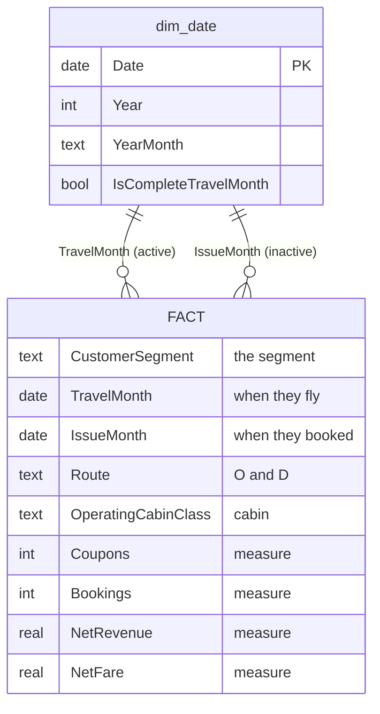

# PAL Customer Segmentation — Power BI Starter Guide

**What this is:** every PAL flight coupon (May 2024 → May 2027) tagged with a customer segment,
ready to drop into Power BI. 38.1M coupons, 22.9M bookings, 13.4M customers.

**Read time: 5 minutes.** Full field reference is in `summary.md`.

---

## 1. The model

It's a simple star: **one fact table + one date table.** Everything else (segment, route,
cabin, channel, farebrand) lives inside the fact as a plain column, so there are no extra
joins to wire up.



**The date table plays two roles** — travel date and booking date. Make `TravelMonth` the
active relationship (most visuals are "when did they fly"), and reach the booking side with
`USERELATIONSHIP` when you need it.

---

## 2. What's in the folder

```
powerbi_export/
├── START-HERE.md                 ← you are here
├── summary.md                    full field dictionary + data-quality detail
│
├── model/                        ✅ LOAD THESE
│   ├── dim_date.csv                 120 KB — mark as Date table
│   ├── dim_segment.csv               11 rows — persona cards + segment colours & caveats
│   ├── scorecard_segment_month.csv  127 KB — ⭐ per-segment scorecards (start here)
│   ├── fact_flight/                 470 MB — your main fact table
│   └── fact_dashboard.parquet        29 MB — optional lightweight alternative
│
├── qa/
│   └── sample_100k.csv               33 MB — build + test your DAX here first
│
└── detail/
    └── fact_coupons/                1.4 GB — only if you need Age or UniqueID
```

**Load `model/`. That's it.** `fact_flight/` is pre-summed to ~20.6M rows instead of 38.1M —
same answers, much lighter — and still supports flight number, O&D and lead-time pickup.

`fact_dashboard.parquet` is a smaller/faster alternative (2.1M rows) if you only need the
headline visuals — but it has **no** flight number, O&D or `LeadTimeDays`.

`detail/fact_coupons/` is the only place **Age** and **UniqueID** survive; aggregating drops them.

---

## 3. Build it in seven steps

1. **Get Data → Folder →** point at `model/fact_flight/`, Combine & Load. *(Parquet, partitioned
   by year — Power BI handles this natively.)*
2. **Get Data → Text/CSV →** load `model/dim_date.csv`.
3. **Modeling → Mark as Date Table →** pick `dim_date`, key column `Date`.
4. **Relationships:** drag `dim_date[Date]` → `FACT[TravelMonth]`. Make it **active**.
   Add a second relationship to `FACT[IssueMonth]` and leave it **inactive**.
5. **Get Data → Text/CSV →** load `model/dim_segment.csv`, then relate
   `dim_segment[Segment]` → `FACT[CustomerSegment]` (one-to-many, active).
6. **For scorecards, also load `model/scorecard_segment_month.csv`** and relate
   `[CustomerSegment]` → `dim_segment[Segment]` and `[TravelMonth]` → `dim_date[Date]`. See §3a.
7. **Add a page-level filter: `IsCompleteTravelMonth = TRUE`.** Do this before anything else —
   see note ⚠️ #1 below. Then start building.

---

## 3a. Per-segment scorecards — `scorecard_segment_month.csv` ⭐

**If your job is "a scorecard per segment", load this file and stop.** It exists so you never have to
aggregate 20M rows to fill a KPI tile.

- **Grain:** segment × travel month, plus only the flags a scorecard must filter on — `IsInternational`,
  `IsCompleteTravelMonth`, `IsCompleteTravelYear`, and the `IsRefund` / `IsAward` / `IsNonRev` /
  `RevMissing` exclusions. **1,835 rows**, 127 KB. Open it in Excel and check totals before writing a
  single measure.
- **Relate:** `scorecard_segment_month[CustomerSegment]` → `dim_segment[Segment]`, and
  `[TravelMonth]` → `dim_date[Date]`. Persona text, penalty weights and segment colours then come
  free from `dim_segment` (§3b).
- **Every numeric column is additive** — `Coupons`, `Bookings`, `PaxCount`, `NetRevenue`, `NetFare`.
  Sum at any level and the answer is correct.

### ⚠️ There are no percentages in this file — do not add any

A stored share is only correct for the filter context it was computed in. The moment the report slices
to one region or one month it is **silently wrong and nothing visibly breaks**. Write them as measures:

```dax
Bookings         = SUM ( scorecard_segment_month[Bookings] )
Net Revenue      = SUM ( scorecard_segment_month[NetRevenue] )
Rev per Booking  = DIVIDE ( [Net Revenue], [Bookings] )

Segment Share of Bookings =
    DIVIDE ( [Bookings], CALCULATE ( [Bookings], REMOVEFILTERS ( dim_segment ) ) )

Bookings LY      = CALCULATE ( [Bookings], SAMEPERIODLASTYEAR ( dim_date[Date] ) )
Bookings YoY %   = DIVIDE ( [Bookings] - [Bookings LY], [Bookings LY] )
```

### The three things that otherwise produce a wrong scorecard

1. **`Bookings` is `sum(IsPrimaryCoupon)`, not a distinct count** — that is what keeps it additive.
   Never swap in `DISTINCTCOUNT`.
2. **Filter `IsCompleteTravelMonth = TRUE` on every trend and YoY tile.** Travel months past the extract
   boundary are still-filling forward book, not demand — unfiltered, a trend draws a **fake cliff**. Use
   `IsCompleteTravelYear` for full-year comparisons (**TRUE for 2025 only**).
3. **Exclude `IsRefund` / `IsNonRev` / `RevMissing` from commercial tiles** (and usually `IsAward` —
   its revenue is taxes only). A clean commercial filter is:
   `IsCompleteTravelMonth && !IsRefund && !IsNonRev && !RevMissing`.

**Every flag is guaranteed non-NULL.** They are coalesced to FALSE on write, because a NULL makes
`IsRefund = FALSE` silently drop those rows and quietly break reconciliation. The ~542 bookings whose
refund status is genuinely unknown all carry `RevMissing = TRUE`, so they stay identifiable rather than
disguised as clean. The file is **asserted to reconcile to the fact table on every build** — coupons and
bookings must match exactly or the export fails.

### 🚫 Do not build an accuracy or recall gauge

There is deliberately **no model-accuracy KPI in this export.** Per-segment recall requires SME
ground-truth labels, which have not arrived; every accuracy figure computable today is measured against
the rules that produced the labels — i.e. circular, and it would mislead on a scorecard.

`dim_segment` carries `PenaltyWeight` (Corporate ×10 → Budget ×1) and `RevenueAtRiskPerError`, so a
**cost-weighted risk** tile is legitimate and useful. An accuracy gauge is not — there is no honest
number to put in it yet.

---

## 3b. Persona cards — `dim_segment.csv`

One row per segment — 11 rows, 29 columns. This is the table that turns a segment name into something a
commercial reader can act on.

### ⚠️ Read this before you build: two kinds of number, and they behave differently

| | `Profile*` columns in `dim_segment` | Measures over `scorecard_segment_month` |
|---|---|---|
| Scope | **Whole population, whole period** — baked in at build time | Whatever the report is filtered to |
| Reacts to slicers? | **No. Never.** | **Yes** |
| Example | `ProfileMedianLeadDays` = 6 for Corporate, always | `[Bookings]` changes when you slice to North America |

**Do not mix them silently on one visual.** If a card shows `[Bookings]` (filtered) beside
`ProfileMedianLeadDays` (not filtered), a user who slices to one region sees a filtered count next to an
unfiltered lead time with nothing indicating that only half the card moved. Either:

- **label the profile block** — every row carries `ProfileScope` ("All bookings, all periods — not
  filtered by report slicers"), so drop it on the card as a caption; or
- **keep them in separate sections** of the card — "Profile" vs "Selected period".

Every measured column is prefixed `Profile` for exactly this reason, and so that `Bookings` means one
unambiguous thing in the model.

### Three kinds of column — the difference matters when someone asks *how do you know*

| Kind | Columns | Provenance |
|---|---|---|
| **Measured** (static profile) | `ProfileBookings` · `ProfileBookingSharePct` · `ProfileMedianLeadDays` · `ProfileRoundTripPct` · `ProfileInternationalPct` · `ProfilePremiumCabinPct` · `ProfileConnectingPct` · `ProfileGroupBookingPct` · `ProfileMedianRevenuePerBooking` · `ProfileAvgRevenuePerBooking` · `ProfileAvgCouponsPerBooking` · `ProfileTopDestinationRegions` · `ProfileModalChannel` · `ProfileModalIssueCountry` | Recomputed from the booking table on **every build**, at **booking grain** |
| **Editorial** | `PersonaName` · `PersonaHeadline` · `WhyTheyFly` · `WhatTheyWant` · `WhatNotToDo` | Written by the project team — informed inference. **Motivation cannot be measured from a booking extract; do not present these as findings.** |
| **Governance** | `Trust` · `DataCaveat` · `IsModelledSegment` · `PenaltyWeight` · `RevenueAtRiskPerError` · `SegmentColorHex` · `ProfileScope` | Project metadata; the penalty/peso figures are **PAL's own estimates** |

### How to actually build the cards

**Setup, once:**

1. Load `model/dim_segment.csv`. Relate `dim_segment[Segment]` → `FACT[CustomerSegment]` **and** →
   `scorecard_segment_month[CustomerSegment]` (one-to-many, single direction).
2. **Sort segments in priority order, not alphabetically:** select the `Segment` column → *Column tools
   → Sort by column* → `SegmentSortOrder`. Corporate first, `Excluded (non-revenue)` last.
3. Hide `SegmentSortOrder` and `SegmentColorHex` from report view (they drive behaviour, not display).

**Pattern A — one card per segment, all on a page (recommended for a review deck).**
Use the **Multi-row card** visual bound to `dim_segment`. It renders one block per row, which *is* a
persona card, with no custom visual needed.
- Fields, in this order: `PersonaName` · `PersonaHeadline` · `ProfileBookings` ·
  `ProfileMedianLeadDays` · `ProfileRoundTripPct` · `ProfileAvgRevenuePerBooking` ·
  `ProfileTopDestinationRegions` · `WhyTheyFly` · `WhatTheyWant` · `Trust` · `DataCaveat`
- *Format → General → Title* = "Segment personas". Turn **word wrap on** for the text fields.
- Add a page filter `IsModelledSegment = TRUE` to drop `Unassigned` and `Excluded (non-revenue)`.

**Pattern B — a slicer plus a detail card (recommended for exploration).**
1. A **slicer** on `dim_segment[Segment]`, set to *single select*.
2. **Card (new)** or **Table** visuals for the editorial text: `PersonaName`, `PersonaHeadline`,
   `WhyTheyFly`, `WhatTheyWant`, `WhatNotToDo`.
3. A **Table** for the static profile block — include `ProfileScope` as the caption so the "doesn't
   filter" behaviour is visible.
4. A separate row of KPI cards for the **live** numbers, using scorecard measures (`[Bookings]`,
   `[Net Revenue]`, `[Rev per Booking]`, `[Bookings YoY %]` from §3a). Title that row
   **"Selected period"** so the distinction is on screen, not in a footnote.
5. A **callout / text box** bound to `DataCaveat`, styled as a warning. See below — this is not optional.

**Brand the card with the segment's own colour.** On any visual with a colour property: *Format → Data
colors → fx → Format by = Field value → Based on field = `SegmentColorHex`*. That keeps Power BI, the
Python figures and the slide deck colouring each segment identically. For a coloured accent bar, a
1-pixel-tall bar chart of a constant with `SegmentColorHex` as the fill works well.

**A cost-weighted risk tile is legitimate, an accuracy gauge is not:**

```dax
Revenue at Risk = SUM ( scorecard_segment_month[Bookings] ) * MAX ( dim_segment[RevenueAtRiskPerError] )
```

That is a *sizing* measure — "what is on the line in this segment if we get it wrong" — not a claim about
how often we get it wrong. There is no honest accuracy number yet (§3a).

**Put `Trust` and `DataCaveat` on the card itself — they are not footnotes.** Persona cards persuade,
so a card reading *"Mabuhay Loyalist · 0.03% of bookings"* invites the reader to conclude the loyalty
programme is irrelevant, when the truth is that we cannot see it (no loyalty-tier field; award
redemption is the only signal). `Family` has the same problem — it means *ticketed as a group*, not
*is a family*.

Filter `IsModelledSegment = FALSE` out of commercial visuals: it flags `Unassigned` (9.6% — a real
taxonomy gap awaiting a PAL definition, **not** junk: it out-earns OFW/Migrant per booking) and
`Excluded (non-revenue)` (staff/industry travel, present only so totals reconcile).

Revenue columns here carry **no currency symbol** — the extract's revenue unit is undocumented
(plausibly single-currency, magnitudes look like USD). Ratios are safe; absolutes should not be quoted
externally until PAL confirms the unit. The peso figures in `RevenueAtRiskPerError` are a different
thing: those come from the requirements document.

---

## 4. Starter measures

```dax
Passengers      = SUM ( 'FACT'[Coupons] )              -- 1 coupon = 1 passenger-sector
Bookings        = SUM ( 'FACT'[Bookings] )             -- already additive, do NOT distinctcount
Net Revenue     = SUM ( 'FACT'[NetRevenue] )
Avg Fare        = DIVIDE ( SUM ( 'FACT'[NetFare] ), SUM ( 'FACT'[PaxCount] ) )

Revenue LY      = CALCULATE ( [Net Revenue], SAMEPERIODLASTYEAR ( dim_date[Date] ) )
Revenue YoY %   = DIVIDE ( [Net Revenue] - [Revenue LY], [Revenue LY] )

-- Clean commercial revenue: strip refunds, blanks, award and staff travel
Commercial Revenue =
CALCULATE (
    [Net Revenue],
    'FACT'[IsRefund]  = FALSE(),
    'FACT'[RevMissing] = FALSE(),
    'FACT'[IsAward]   = FALSE(),
    'FACT'[IsNonRev]  = FALSE()
)

-- Booking curve / pickup: what was on hand N days before departure
On Hand 60d = CALCULATE ( [Bookings], 'FACT'[LeadTimeDays] >= 60 )

-- Sales-date view (uses the inactive relationship)
Revenue by Sale Date =
CALCULATE ( [Net Revenue], USERELATIONSHIP ( dim_date[Date], 'FACT'[IssueMonth] ) )
```

---

## 5. Notes — the four that actually matter

### ⚠️ 1. The data stops on **21 July 2026**. Filter your trend charts.

Anything after that date is **forward bookings still filling up**, not real demand.
September 2026 currently shows ~22% of a normal month simply because it's months away.

> Plot a 12-month trend unfiltered and it shows a dramatic collapse that isn't real.

**Always filter to `IsCompleteTravelMonth = TRUE`.**
Same trap on years: 2024 only starts in May, so full-year 2025-vs-2024 compares 12 months
against 8. Use `IsCompleteTravelYear` (TRUE for 2025 only).

### ⚠️ 2. `DaysBeforeMonthEnd` cannot do pickup analysis.

It looks like a snapshot field but isn't — it holds **one single value per departure month**.
Every August booking carries the same number whether it was booked yesterday or last year,
so it says nothing about *when* something was booked.

**Use `LeadTimeDays` instead** — that's a real booking curve and it *is* comparable year on year.

### ⚠️ 3. `PaxCount` is not party size.

It counts flight **sectors**, so it's 1 on virtually every row.
**Passenger volume = row/coupon count.** For actual groups, filter `BookingType = "Group"`.

### ⚠️ 4. `Bookings` is pre-calculated — just `SUM()` it.

Never `DISTINCTCOUNT`. The column is built so it adds up correctly at every level of the report;
a distinct count layered on pre-summed data gives the wrong answer.

---

## 6. Two more things worth knowing

**`Route` repeats on connecting flights.** A two-leg journey has the same `Route` on both coupons.
Counting coupons by route double-counts connections — use `Bookings` for journey counts.

**`OperatingCarrierCode` is always `"PR"`.** The whole extract is PR-operated, so a carrier filter
does nothing. Interline shows up as `TripOD` ≠ `OnlineOD` instead.

---

## 7. Before this goes to leadership

`CustomerSegment` is a **rule-based label, not a validated model output**. It's solid enough to
design and build the report on, but it hasn't yet been checked against human-labelled examples —
the numbers may move once it is.

Two related caveats:

- **~11% of bookings are `Unassigned`** — no rule matched them. A known taxonomy gap raised with
  PAL, *not* a data error. Show it explicitly rather than hiding it.
- **`Mabuhay Loyalist` (0.03%) and `Digital Nomad` (absent)** can't be detected — the loyalty
  field wasn't in the extract. Leave them off the report rather than showing them near zero.

---

## Segment mix at a glance

Volume and value rank almost inversely — worth defaulting your headline views to **revenue**,
not passenger count.

| Segment | % coupons | % revenue |
|---|---:|---:|
| Budget/Adventure | 35.6% | 10.8% |
| Balikbayan/VFR | 19.9% | **29.0%** |
| OFW/Migrant | 13.8% | 19.7% |
| Unassigned | 11.3% | 12.7% |
| Last-Minute | 10.2% | 6.5% |
| Corporate | 4.5% | 7.9% |
| Premium Bleisure | 2.7% | **11.6%** |
| Family · Pilgrimage · Mabuhay | 2.0% | 1.7% |

*Full field dictionary, reconciliation and data-quality detail: `summary.md`.*
