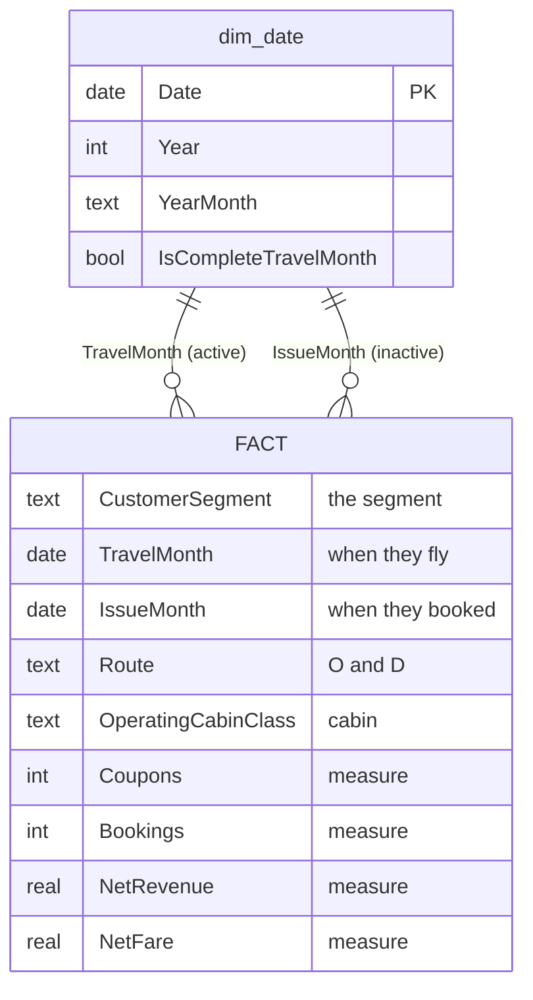

# PAL Customer Segmentation — Power BI Starter Guide

**What this is:** every PAL flight coupon (May 2024 → May 2027) tagged with a customer segment,
ready to drop into Power BI. 38.1M coupons, 22.9M bookings, 13.4M customers.

**Read time: 5 minutes.** Full field reference is in `summary.md`.

---

## 1. The model

It's a simple star: **one fact table + one date table.** Everything else (segment, route,
cabin, channel, farebrand) lives inside the fact as a plain column, so there are no extra
joins to wire up.



**The date table plays two roles** — travel date and booking date. Make `TravelMonth` the
active relationship (most visuals are "when did they fly"), and reach the booking side with
`USERELATIONSHIP` when you need it.

---

## 2. What's in the folder

```
powerbi_export/
├── START-HERE.md                 ← you are here
├── summary.md                    full field dictionary + data-quality detail
│
├── model/                        ✅ LOAD THESE THREE
│   ├── dim_date.csv                 120 KB — mark as Date table
│   ├── fact_flight/                 470 MB — your main fact table
│   └── fact_dashboard.parquet        29 MB — optional lightweight alternative
│
├── qa/
│   └── sample_100k.csv               33 MB — build + test your DAX here first
│
└── detail/
    └── fact_coupons/                1.4 GB — only if you need Age or UniqueID
```

**Load `model/`. That's it.** `fact_flight/` is pre-summed to ~20.6M rows instead of 38.1M —
same answers, much lighter — and still supports flight number, O&D and lead-time pickup.

`fact_dashboard.parquet` is a smaller/faster alternative (2.1M rows) if you only need the
headline visuals — but it has **no** flight number, O&D or `LeadTimeDays`.

`detail/fact_coupons/` is the only place **Age** and **UniqueID** survive; aggregating drops them.

---

## 3. Build it in five steps

1. **Get Data → Folder →** point at `model/fact_flight/`, Combine & Load. *(Parquet, partitioned
   by year — Power BI handles this natively.)*
2. **Get Data → Text/CSV →** load `model/dim_date.csv`.
3. **Modeling → Mark as Date Table →** pick `dim_date`, key column `Date`.
4. **Relationships:** drag `dim_date[Date]` → `FACT[TravelMonth]`. Make it **active**.
   Add a second relationship to `FACT[IssueMonth]` and leave it **inactive**.
5. **Add a page-level filter: `IsCompleteTravelMonth = TRUE`.** Do this before anything else —
   see note ⚠️ #1 below. Then start building.

---

## 4. Starter measures

```dax
Passengers      = SUM ( 'FACT'[Coupons] )              -- 1 coupon = 1 passenger-sector
Bookings        = SUM ( 'FACT'[Bookings] )             -- already additive, do NOT distinctcount
Net Revenue     = SUM ( 'FACT'[NetRevenue] )
Avg Fare        = DIVIDE ( SUM ( 'FACT'[NetFare] ), SUM ( 'FACT'[PaxCount] ) )

Revenue LY      = CALCULATE ( [Net Revenue], SAMEPERIODLASTYEAR ( dim_date[Date] ) )
Revenue YoY %   = DIVIDE ( [Net Revenue] - [Revenue LY], [Revenue LY] )

-- Clean commercial revenue: strip refunds, blanks, award and staff travel
Commercial Revenue =
CALCULATE (
    [Net Revenue],
    'FACT'[IsRefund]  = FALSE(),
    'FACT'[RevMissing] = FALSE(),
    'FACT'[IsAward]   = FALSE(),
    'FACT'[IsNonRev]  = FALSE()
)

-- Booking curve / pickup: what was on hand N days before departure
On Hand 60d = CALCULATE ( [Bookings], 'FACT'[LeadTimeDays] >= 60 )

-- Sales-date view (uses the inactive relationship)
Revenue by Sale Date =
CALCULATE ( [Net Revenue], USERELATIONSHIP ( dim_date[Date], 'FACT'[IssueMonth] ) )
```

---

## 5. Notes — the four that actually matter

### ⚠️ 1. The data stops on **21 July 2026**. Filter your trend charts.

Anything after that date is **forward bookings still filling up**, not real demand.
September 2026 currently shows ~22% of a normal month simply because it's months away.

> Plot a 12-month trend unfiltered and it shows a dramatic collapse that isn't real.

**Always filter to `IsCompleteTravelMonth = TRUE`.**
Same trap on years: 2024 only starts in May, so full-year 2025-vs-2024 compares 12 months
against 8. Use `IsCompleteTravelYear` (TRUE for 2025 only).

### ⚠️ 2. `DaysBeforeMonthEnd` cannot do pickup analysis.

It looks like a snapshot field but isn't — it holds **one single value per departure month**.
Every August booking carries the same number whether it was booked yesterday or last year,
so it says nothing about *when* something was booked.

**Use `LeadTimeDays` instead** — that's a real booking curve and it *is* comparable year on year.

### ⚠️ 3. `PaxCount` is not party size.

It counts flight **sectors**, so it's 1 on virtually every row.
**Passenger volume = row/coupon count.** For actual groups, filter `BookingType = "Group"`.

### ⚠️ 4. `Bookings` is pre-calculated — just `SUM()` it.

Never `DISTINCTCOUNT`. The column is built so it adds up correctly at every level of the report;
a distinct count layered on pre-summed data gives the wrong answer.

---

## 6. Two more things worth knowing

**`Route` repeats on connecting flights.** A two-leg journey has the same `Route` on both coupons.
Counting coupons by route double-counts connections — use `Bookings` for journey counts.

**`OperatingCarrierCode` is always `"PR"`.** The whole extract is PR-operated, so a carrier filter
does nothing. Interline shows up as `TripOD` ≠ `OnlineOD` instead.

---

## 7. Before this goes to leadership

`CustomerSegment` is a **rule-based label, not a validated model output**. It's solid enough to
design and build the report on, but it hasn't yet been checked against human-labelled examples —
the numbers may move once it is.

Two related caveats:

- **~11% of bookings are `Unassigned`** — no rule matched them. A known taxonomy gap raised with
  PAL, *not* a data error. Show it explicitly rather than hiding it.
- **`Mabuhay Loyalist` (0.03%) and `Digital Nomad` (absent)** can't be detected — the loyalty
  field wasn't in the extract. Leave them off the report rather than showing them near zero.

---

## Segment mix at a glance

Volume and value rank almost inversely — worth defaulting your headline views to **revenue**,
not passenger count.

| Segment | % coupons | % revenue |
|---|---:|---:|
| Budget/Adventure | 35.6% | 10.8% |
| Balikbayan/VFR | 19.9% | **29.0%** |
| OFW/Migrant | 13.8% | 19.7% |
| Unassigned | 11.3% | 12.7% |
| Last-Minute | 10.2% | 6.5% |
| Corporate | 4.5% | 7.9% |
| Premium Bleisure | 2.7% | **11.6%** |
| Family · Pilgrimage · Mabuhay | 2.0% | 1.7% |

*Full field dictionary, reconciliation and data-quality detail: `summary.md`.*
