# PAL Customer Segmentation — Pipeline Study Guide

**For:** the Friday stakeholder + mentor presentation
**Covers:** what the EDA found → how the methodology evolved → raw gzip → cleaned coupons → bookings →
the segment labels → Power BI
**Read time:** ~30 minutes. Everything here is traceable to a script in `src/` or an output in `outputs/`.

> **The thesis in one sentence.**
> *The customer base is a continuum, not a set of natural clusters — so the business rules label the
> data, and machine learning's job is to check, refine and monitor those labels.*

---

## 0. The 60-second version

| | |
|---|---|
| **Input** | 38.1M coupon rows (4 gzipped CSVs, travel dates 2024-05 → 2027-05) |
| **Modelling row** | The **booking** = `(customer_id, issue_date)` — one purchase decision = one trip purpose |
| **The model** | A **prioritised rule waterfall** ("first match wins") → **9 named segments + Unassigned**. The 10th target segment, Digital Nomad, is **not implemented** — see §5.1 |
| **What learns** | **Nothing at the top level.** The label is deterministic and auditable |
| **Where ML lives** | *Below* the rules (sub-segmentation), *around* them (validation), *after* them (drift) |
| **Output** | Segment joined back down to all 38.1M coupons → Power BI star schema |
| **Honest limit** | Validation is **circular** (we test our rules against our rules) until SME labels land |

---

## 1. What the data actually looks like (EDA)

*Full report: `docs/eda-report-real-data.md`. Stage outputs: `outputs/profile_raw/`,
`outputs/clean_report/`, `outputs/eda_real/confirmations.md`.*

Everything downstream — including the decision to stop clustering — follows from three facts about
this extract. **Lead with these; they make the pivot feel inevitable rather than defensive.**

### The three facts that shape the whole project

| # | Fact | Why it matters |
|---|---|---|
| **1** | **Most customers are occasional flyers.** Median customer has 2 coupons; 95% have fewer than 8. Only **26.1% ever book twice** | There is no rich purchase history to cluster on. A customer-level model would be fitting one or two events per person |
| **2** | **This is overwhelmingly an economy, Philippines-centred airline.** 95.2% economy cabin · **88% of coupons in the three cheapest fare brands** · 57.7% of bookings domestic | The "value axis" is real but compressed into a narrow band. Most of the variance is *where* and *when*, not *how much* |
| **3** | **The data is clean but demographically thin.** Near-zero nulls on operational fields, but **`Age` is 57% missing** and award tickets are **0.02% of coupons** | Segmentation must lean on **behaviour** — lead time, route, fare tier, channel, issue country — not on who the customer says they are |

### Dataset at a glance

| Attribute | Value |
|---|---|
| Coupon rows (raw) | 38,116,260 · 42 columns |
| Distinct customers | 13,447,672 (zero nulls on the key) |
| Coupons per customer | mean 2.83 · median 2 · p95 8 · max 771 |
| Departure dates | 2024-05-01 → 2027-05-31 |
| Issuance dates | 2023-03-24 → 2026-07-20 |
| Operating carrier | PR only (100%) |
| Rows removed in cleaning | **1** (junk cabin code); ~0 exact duplicates |

Four source files: 2024 (10.4M) · 2025 (16.2M) · 2026 Jan–May (7.1M) · 2026 Jun–2027 May (4.4M,
forward bookings still filling). **19.73% of customers appear in more than one file** with consistent
behaviour — which is what confirms the customer key persists and the rollup is valid.

### The distributions that drive the rules

**Cabin and fare** — Y 95.2% · J 2.9% · W 2.8%. Economy Saver 38.6% + Supersaver 29.7% + Value 19.8%
≈ **88% of all coupons**. Business is 2.8%. Value tiers 1–2 alone hold 26.0M of 38.1M coupons.

**Geography — Manila-centred with strong diaspora corridors.** Top origins MNL 14.4M, CEB 2.3M,
DVO 2.1M; LAX and ICN lead international. Country of issue: PH 61.6%, then US, SG, JP, HK, CA, KR, AU —
**the classic OFW/diaspora footprint, and 38.4% of coupons are foreign-issued.** Route regions:
domestic 57.7% · East Asia 14.8% · SE Asia 11.8% · North America 8.4% · Middle East 4.0% · Oceania 3.3%.
South Asia and Europe are ≈0 — no own-metal service in this extract.

**Channel** — WEB/APP 35.4% · Traditional Travel Agency 27.8% · OTA 14.9% · Ticket Office 6.1% ·
Contact Center 4.7% · **Sea Crew 3.7%** · NDC 2.4% · TMC 1.8%.

**Booking behaviour** — lead time median **25 days**, mean 53.2, max 679. **13.3% book within 3 days** —
a large, genuine last-minute population, which is why that rule exists at all.

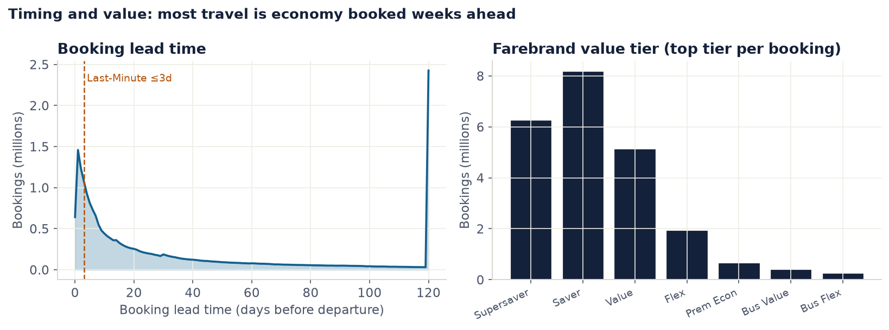

**Timing and value, the two rule axes.** Left: booking lead time, with the Last-Minute 3-day cut marked — **13.3% of bookings fall inside it**. (The spike at 120 is the display cap, not a real cluster.) Right: value tier is heavily bottom-loaded — two-thirds of the book sits in the two cheapest brands.

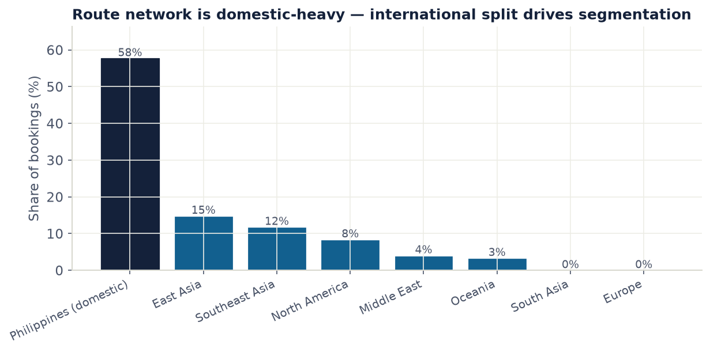

**The network shape that drives the rules.** 58% of bookings are domestic. The domestic-versus-international split is the single most important axis in the waterfall — it gates five of the ten rules.


### Grain confirmation — the booking definition was tested, not assumed

| Check | Result |
|---|---|
| Bookings from 38.1M coupons | 22,924,577, averaging **1.66 coupons each** |
| Round-trips (journey returns to origin) | **42.7%** · single-direction 55.3% · >2 directions only 1.4% |
| Heavy tail (100+ coupons) | just **4,896 customers**, 21.7% of them touching Sea Crew — agency/crew buying, not travellers |
| All-non-revenue customers | **12,306** (0.092%) — cleanly excluded before feature engineering |
| Negative lead time (reissues) | 1,728 rows (0.005%) — clamped and flagged |

### What the EDA settled — and how each finding became a design decision

This table is the bridge between §1 and the rest of the document. **Every row is a "we found X, so we
did Y".**

| The EDA found | So the design does |
|---|---|
| Age 57% null, loyalty signal 0.05% of customers | **Behavioural features carry the segmentation.** Demographics are auxiliary at best |
| Sea-crew and agency heavy tails distort far beyond their headcount | **Exclude, don't model, operational populations.** All-non-revenue customers dropped; sea-crew excluded from validation entirely |
| `(customer_id, issue_date)` recovers round-trips cleanly at 1.66 coupons/booking | **The booking grain is confirmed as the modelling row** |
| The 2026-Jun→2027-May file is forward bookings only | **Guard against calendar censoring** — the `IsCompleteTravelMonth` flags, and outcome fields excluded from temporal work |
| Mabuhay and Pilgrimage are far below any density threshold | **Rare segments need rules or asymmetric costs**, not clustering — they would never survive a density-based method |
| 88% of coupons sit in three fare brands | **Value alone cannot separate customers.** Purpose (route, direction, timing, channel) has to do the work |

> **The last two rows are the ones that predicted the pivot.** Before a single clustering algorithm was
> benchmarked, the EDA had already shown that the value axis is compressed and the rare segments are
> undetectable by density. §2 is what happened when we tested that formally.

---

## 2. The pivot — the thing to lead with

We started as a classic unsupervised segmentation project: cluster the passengers, name the clusters.
The data refused.

```
What we expected                     What we found
──────────────────                   ─────────────
   ●●●   ●●●                          ░▒▓█▓▒░▒▓█▓▒░
  ●●●●● ●●●●●                        ░▒▓███▓▒░▒▓███▓▒░
   ●●●   ●●●                          ░▒▓█▓▒░▒▓█▓▒░
 distinct clusters                    one smooth continuum
 "a box of crayons"                   "a rainbow"
```


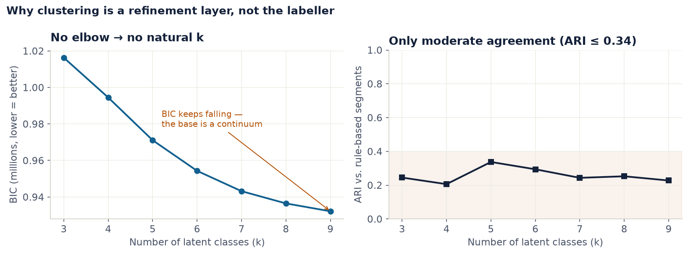

**The chart that changed the project.** Left: the model-selection score keeps falling as we add groups — **there is no bottom, so there is no natural number of segments**. Right: even at its best, a data-driven grouping agrees with our business taxonomy only ~0.34 (1.0 = identical). 60k stratified sample, k = 3–9.

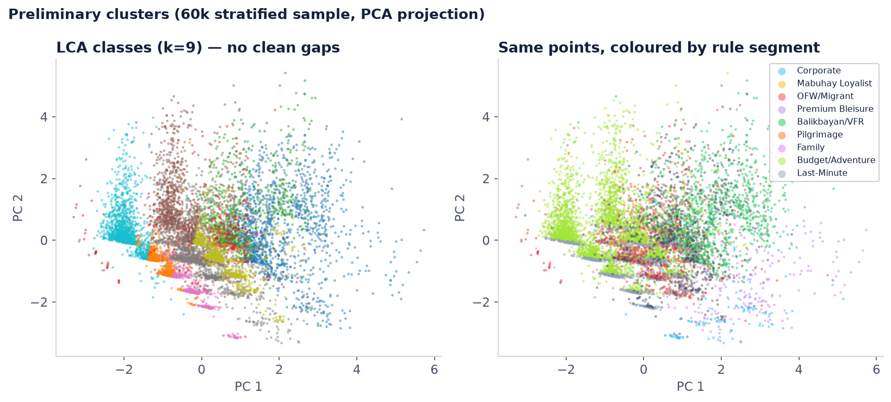

**What a continuum looks like.** The same 60k bookings, twice. Left coloured by what the algorithm found, right by our business rules. **Neither picture has clean gaps between groups** — the colours shade into each other rather than sitting in separate islands.

**The evidence, from ten methods across six families** (`src/model_stress_test.py`):

| Test | Result | Reading |
|---|---|---|
| LCA BIC across *k* = 3–12 | **No elbow** — falls monotonically | There is no natural number of segments |
| Gower silhouette, best of 10 methods | **0.381 ceiling** | Even the best partition is weakly separated |
| H₀ persistent homology | **1 significant component** | Label-free, assumption-free: one blob |
| TDA-Mapper | separation ≈ 0 | No topological structure |
| Support Vector Clustering | emergent *k* = 1 | Fragments only by ejecting 43–62% of rows |
| Median cross-method ARI | **0.41** | The methods don't even agree with each other |


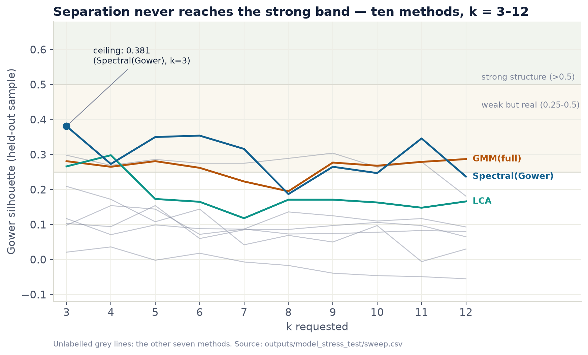

**The honest upper bound on any clustering claim here.** Ten methods, k = 3–12. **Separation never reaches the “strong structure” band** — the ceiling is 0.381, achieved once. Grey lines are the other seven methods.

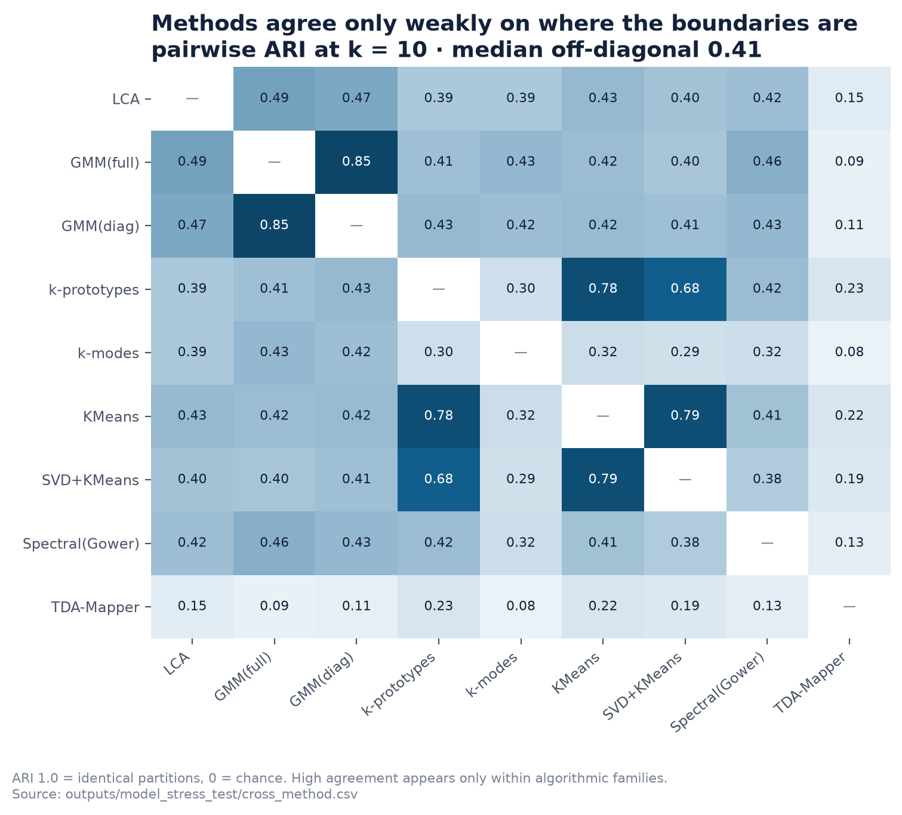

**The methods do not agree with each other.** Pairwise agreement at k = 10; **median off-diagonal 0.41**. High agreement appears only *within* algorithmic families (KMeans vs SVD+KMeans 0.79) — never across them. If real groups existed, different methods would find the same ones.

**So we inverted the design.** Rules draw the boundaries; clustering checks whether we drew them
*across* the spectrum rather than along it.

> **Two cautions worth memorising** — a mentor will probe here:
> **(a)** An SVM separability probe scores **0.85–0.99 for nearly every method**, including ones with
> silhouette ≈ 0.1. A geometric cut through a continuum is perfectly *learnable* while being wholly
> *arbitrary* — never quote a separability or accuracy figure without the silhouette beside it.
> **(b)** KMeans and k-prototypes were the **most stable** methods in the field with nearly the **least**
> separation. **Stability without separation is not structure.**

---

## 3. How we got here — the decision trail

*Nothing in the current methodology was chosen up front. Every stage below was a test that changed
something, and the ones that changed nothing are recorded too — that is what makes it a trail rather
than a story.*

| When | What we ran | What it showed | What changed |
|---|---|---|---|
| **11 May** | 8-stage baseline on a 30k-row sample; 7 algorithms compared | HDBSCAN best on that sample (silhouette 0.435 vs KMeans 0.167) | **HDBSCAN became the plan of record.** Also: 5 resampling strategies tested and **rejected** — F1 0.99+ meant the classifier was re-learning our labelling rules, not generalising |
| **Jul** | The real 38M-coupon extract arrives; full EDA (§1) | Economy-dominated, demographically thin, loyalty invisible | Feature design shifts to **behaviour only**; booking grain confirmed |
| **23 Jul** | `cluster_diagnostic.py` — LCA + k-prototypes on the real data | **BIC has no elbow** (falls monotonically 3→9). Agreement with the taxonomy only **ARI 0.20–0.34**. The clusters that do form **split along our own rule axes** — route, direction, value, timing | ⚠️ **The pivot.** Rules become primary; clustering becomes refinement + validation. **HDBSCAN dropped for the real data** — categorical-heavy, not density-separable |
| **27 Jul** | `kproto_compare.py` — full k-prototypes vs k-modes vs LCA, k = 3–12 | **LCA wins the refinement layer**: ARI 0.336 vs 0.216 / 0.212, Gower silhouette 0.30 vs 0.09 / 0.15. k-prototypes is the *most* reproducible (split-half 0.97) with the *worst* separation | **Decision unchanged** — and k-prototypes demoted to a diagnostic cross-check. First sighting of *stability without separation is not structure* |
| **27 Jul** | `export_powerbi.py` — Stage X built | Row-preserving join works (38,116,259 in = out) | Delivery exists. **Two blocking data gaps surfaced**: the forward-book boundary and `DaysBeforeMonthEnd` (§10.1) |
| **28 Jul** | `validation_anchors.py` + V1 + V2 | Circularity is real and has *semantic* leaks a name check misses | **Validation stops being blocked on SME labels.** Plan B begins |
| **28 Jul** | `model_stress_test.py` — 10 methods, 6 families, 8 axes | **GMM(full) beats LCA on the top-level benchmark** (0.849 vs 0.763, and 0.798 vs 0.762 with the circular axis zeroed). Continuum reconfirmed by **four independent new tests**. **Separation ceiling 0.381** | **Pipeline deliberately unchanged.** The benchmark scores *top-level* segmentation; LCA's actual job is *sub*-segmentation. Refinement layer marked **under review pending a stage-matched re-test** |
| **29 Jul** | `detection_power.py` (V3) — plant segments of known size | Panel recovers planted groups at **≥2%** prevalence; **nothing below ~1%** at any distinctness | The null result becomes **falsifiable**. A **stated blind spot** (~229k bookings) now travels with the continuum claim. H₀ homology **retired as a detector** (1→120 across 100 draws of unchanged data) |
| **29 Jul** | `validate_temporal.py` (V4) | Shares hold (TVD 1.93 pp); a model fitted a year earlier **transfers for free**; **revenue mix is the weaker leg** (3.21 pp) | Confirms it is not a one-period artefact. Records that **the extract is filtered on *departure*, not issuance** — so naive calendar windows would report a fake lead-time collapse |
| **31 Jul** | Persona dimension + per-segment scorecard for BI | Persona cards persuade, so caveats must ship *as columns* | `dim_segment.csv` splits **measured** / **editorial** / **governance** columns so a reader can tell evidence from assertion |
| **12 Aug** | `rule_confidence.py` (§10.2) | 66.5% of labels uncontested; **Corporate is the most contested segment despite its ×10 penalty** | Gives us a **sampling frame for the SME ask** and a proposed `SegmentConfidence` column |

### The three decisions a reviewer is most likely to challenge

**"You dropped HDBSCAN — wasn't that just because it was hard?"**
No. It won on a 30k-row sample of *numeric-heavy* engineered features and lost on the real data because
the real features are **categorical-heavy** — route region, channel, direction, issue country. Density
methods need a meaningful notion of distance in a continuous space; one-hot categories do not provide it.
The decision is recorded with the diagnostic that produced it, on 2026-07-23.

**"GMM beat your chosen method — why didn't you switch?"**
Because the benchmark and the pipeline stage are not the same job. The stress test scored **top-level
segmentation of the whole population**; LCA's actual role is **sub-segmenting inside a parent segment**.
Swapping a layer on the strength of a test of a different task would be exactly the kind of shortcut this
project has been trying to avoid. It is logged as a **candidate under review**, with the re-test
specified.

**"Your rules keep changing — how do we know they're stable?"**
They changed **once**, on 2026-07-23, and the change is documented: Corporate was broadened (corporate
channel *or* business fare with short lead) and Budget/Adventure broadened to domestic-non-premium. The
outbound PH-issued international economy population was **deliberately left Unassigned** rather than
absorbed — which is the 9.6% gap we are asking PAL to define, not an accident.

---

## 4. The pipeline in one picture

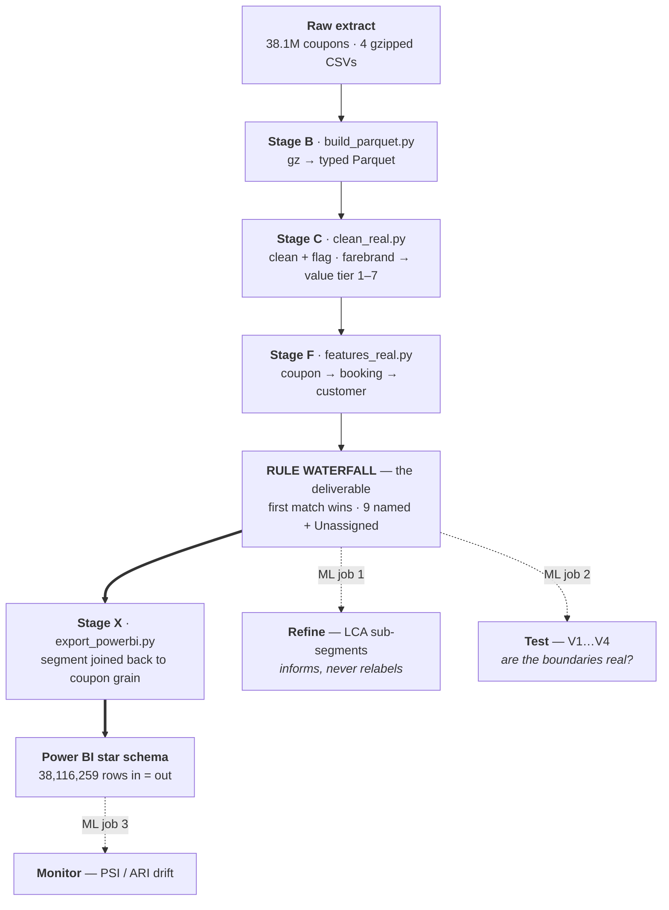

**Solid arrows are data flow. Dashed arrows are checks and feedback.** The rules are the only thing on
the critical path to Power BI.

### The grain changes twice — this is the part people miss

```
38,116,259 coupons      one flown leg          "MNL→CEB on PR 123, 4 Jun"
        │  GROUP BY customer_id, issue_date
        ▼
22,911,450 bookings     one purchase decision  ← THE MODELLING ROW. One booking = one purpose.
        │  GROUP BY customer_id
        ▼
13,435,365 customers    one person             only 26% book more than once
        │  join segment back DOWN
        ▼
38,116,259 coupons      + CustomerSegment      ← what Power BI receives
```

**Why the booking, not the customer?** A trip *purpose* belongs to a purchase, not to a person. The same
traveller can be Corporate in March and Balikbayan/VFR in December. Customer grain still ships
(`CustomerDominantSegment`) but it is a rollup, not the model.

---

## 5. Stage by stage

| Stage | Script | In → Out | Job | The one gotcha |
|---|---|---|---|---|
| **B** | `build_parquet.py` | 4 × `.txt.gz` → typed Parquet | One decompression pass; partition by issue year | Timestamps carry 100-ns precision DuckDB can't parse → read as text, cast first 19 chars |
| **C** | `clean_real.py` | 38,116,260 → **38,116,259** | Clean, flag, map farebrand → value tier | The award/group flag **flips on 2026-04-01** (booking class F/G swap meaning) |
| **F** | `features_real.py` | coupons → **22.9M bookings** → **13.4M customers** | Aggregate, join region, engineer features, **apply the waterfall** | Excludes 12,306 all-non-revenue customers (staff/industry travel) |
| **X** | `export_powerbi.py` | bookings + coupons → star schema | Join segment down, add guards, build dims | Row-preserving: **38,116,259 in = out**, asserted every build |

### Stage C — the value axis is PAL's own, not ours

We do **not** invent a value score. The client's V1 data dictionary defines a farebrand ladder; we
encode it as an ordinal tier.

| Tier | Farebrand | Booking classes | Share of coupons |
|---:|---|---|---|
| 7 | Business Flex | J, C, D | ↑ premium |
| 6 | Business Value | I, Z | |
| 5 | Premium Economy | W, N | |
| 4 | Economy Flex | Y, S, L, M, H | |
| 3 | Economy Value | Q, V, B, X | |
| 2 | Economy Saver | K, E, T | **38.6%** |
| 1 | Economy Supersaver | U, O | **29.7%** |
| — | Award / Group / Non-revenue | F, G, A, R, P | 0.24% (NULL tier) |

Two-thirds of the book sits in tiers 1–2. **The value axis is real but heavily bottom-loaded** — worth
saying out loud before someone reads the revenue chart as a surprise.

Other Stage C facts to have ready: **93.4% flown**, avg lead time **53.2 days**, **43.0% age known**,
**38.4% foreign-issued**, **27.6% connecting**.

### 5.1 Features considered — including three worth raising on the day

*Checked against the code and the raw extract on 2026-08-13. **Two of these are commonly assumed to be
impossible with this data and are not.***

| Feature | Status | Evidence |
|---|---|---|
| **Round trip** | ✅ **In the model, and load-bearing** | It is the *only* thing separating rules ⑤ and ⑥ — OFW/Migrant vs Balikbayan/VFR. Also exported as `RoundTrip` |
| **Stay pattern** (length of stay) | ⚠️ **Not in the model — but derivable, contrary to our own docs** | Computable for **9.67M bookings (42.7%)** at 98.8% coverage |
| **Is-upgrade** | ⚠️ **Not in the model — but derivable, field is 100% populated** | 1.02% of coupons flew a different cabin than was sold; **upgrades outnumber downgrades ~18:1** |
| **Digital Nomad** | ❌ **Not implemented** — the 10th target segment is absent | See below. The blocker recorded in our own export summary is **the wrong blocker** |

#### Round trip — already doing heavy lifting

Nothing to add except the caution already in §7: it carries the **weakest boundary in the taxonomy**
(0.608 on independent evidence). One bit is deciding the fate of 6.8M bookings.

#### Stay pattern — our documentation says this is blocked. It isn't.

`docs/methodology.md` lists *Length of stay* under **Known Data Gaps (Blocking)**. That is true of the raw
field — there isn't one — but **the quantity is derivable from the coupon dates we already have**: for a
round-trip booking, outbound departure to return departure.

| Measure | Value |
|---|---|
| Round-trip bookings | **9,787,386** (42.7% of all bookings) |
| Of those, stay length computable | **98.8%** |
| Median stay | **5 nights** (IQR 3–12) |

**Stay distribution (round-trip, 1–365 nights):** 1–3 nights **31.5%** · 4–7 **33.7%** · 8–14 **14.1%** ·
15–30 **13.3%** · 31–90 **6.7%** · 90+ **0.8%**.

**And it already discriminates — on a field no rule has ever seen:**

| Segment | Median stay (round-trip) |
|---|---:|
| Last-Minute · OFW/Migrant | 3 nights |
| Family · Budget/Adventure · **Corporate** | 4 nights |
| Mabuhay Loyalist · Unassigned | 5 nights |
| **Premium Bleisure** | **10 nights** |
| **Balikbayan/VFR** | **13 nights** |
| **Pilgrimage** | **33 nights** |

That ordering is exactly what the personas predict, and **nothing in the waterfall put it there.** Two
uses follow: it is a **candidate Tier-A validation anchor** (§7) strengthening the non-circular evidence,
and it is the missing input for Corporate-vs-Bleisure separation. ⚠️ It is only available for round trips
— itself a rule bit — so admissibility would need the same per-pair treatment as the other conditional
anchors.

#### Is-upgrade — fully populated, never used

`SoldOperatingCabinClass` is **0% null** across all 38.1M coupons, and can be compared with the cabin
actually operated.

| Direction | Coupons |
|---|---:|
| Economy sold → **Premium Economy flown** | 210,968 |
| Economy sold → **Business flown** | 133,819 |
| Premium Economy sold → **Business flown** | 24,274 |
| *Downgrades (all directions)* | *~20,400* |

**~369k upgrades against ~20k downgrades — roughly 18:1.** ⚠️ **The critical caveat:** we cannot tell a
*paid or bid* upgrade from an *involuntary operational* one. So this measures "flew better than they
bought", not willingness to pay — and must be presented that way. Even so it is a clean signal for
Premium Bleisure and the only visible handle on upsell in the whole extract.

#### Digital Nomad — the missing tenth segment

**The delivered taxonomy is 9 named segments + Unassigned.** The business requirement asks for 10; the
10th, **Digital Nomad, was never implemented in the real-data waterfall.** It exists only in the
superseded 30k-row prototype.

> **Our own export summary records the reason as the missing `Loyalty status` field. That is wrong** —
> and it matters, because it makes the gap look unfixable. The prototype's Digital Nomad rule never used
> loyalty; `methodology.md`'s own gap table attributes it to **Length of stay** — which, as above, **is
> derivable.**

**What the data says about whether the segment is even there:**

| Population | Bookings | Share |
|---|---:|---:|
| Round-trip, stay **31+ nights** | **725,748** | **3.2%** of all bookings |
| Narrower: long-stay + international + economy + non-group + web/OTA | **207,512** | **0.91%** |

**Where the long-stay population sits today:** 66.3% inside Balikbayan/VFR, 11.1% Budget/Adventure,
**10.7% Unassigned**, 5.1% Premium Bleisure.

Two readings, and the tension between them is the honest answer:

- The **broad** population (3.2%) is comfortably **above our ~1% detection floor** — a real, findable group.
- The **narrow** definition (0.91%) sits **right at the blind spot** identified in §7 V3. Which is exactly
  why clustering was never going to surface it, and why a **rule or an SME definition is the right
  instrument** here, not a better algorithm.

**Recommendation: do not add a Digital Nomad rule unilaterally.** Take this evidence to the commercial
experts — *"there are ~726k long-stay round trips, two-thirds currently labelled Balikbayan/VFR; is that a
distinct customer to you?"* It belongs with the Unassigned question in §14, as a taxonomy decision.

### Stage F — the rule waterfall (the actual model)

Read top to bottom. **The first line that matches wins, and nothing below it is consulted.**

```
 ①  is_award ......................................... → Mabuhay Loyalist
 ②  corp_channel OR (business fare AND lead ≤ 7d) ..... → Corporate
 ③  destination is JED or MED ....................... → Pilgrimage
 ④  channel = Sea Crew .............................. → OFW/Migrant
 ⑤  foreign-issued + intl + tier ≤ 4 + ONE-WAY ...... → OFW/Migrant
 ⑥  foreign-issued + intl + tier ≤ 4 + ROUND-TRIP ... → Balikbayan/VFR
 ⑦  premium cabin + international .................... → Premium Bleisure
 ⑧  ticketed as a group ............................. → Family
 ⑨  lead time ≤ 3 days .............................. → Last-Minute
 ⑩  domestic AND not premium ........................ → Budget/Adventure
     ─────────────────────────────────────────────────
     nothing matched ................................ → Unassigned
```

Note ⑤ vs ⑥: **OFW/Migrant and Balikbayan/VFR are separated by a single bit — `round_trip`.** That is
the weakest boundary in the taxonomy and you should volunteer it before anyone finds it.

**Result at booking grain** (`outputs/features_real/summary.md`):

| Segment | Bookings | Share | Avg revenue/booking | Penalty ×|
|---|---:|---:|---:|---:|
| Budget/Adventure | 9,037,176 | 39.4% | 74 | ×1 |
| OFW/Migrant | 3,919,216 | 17.1% | 312 | ×5 |
| Last-Minute | 2,945,686 | 12.9% | 137 | ×1 |
| Balikbayan/VFR | 2,911,290 | 12.7% | 618 | ×2 |
| **Unassigned** | **2,194,061** | **9.6%** | 360 | — |
| Corporate | 1,001,638 | 4.4% | 493 | ×10 |
| Premium Bleisure | 481,666 | 2.1% | **1,504** | ×4 |
| Family | 370,647 | 1.6% | 235 | ×2 |
| Pilgrimage | 43,617 | 0.19% | 404 | ×3 |
| Mabuhay Loyalist | 6,453 | 0.03% | 113 | ×8 |


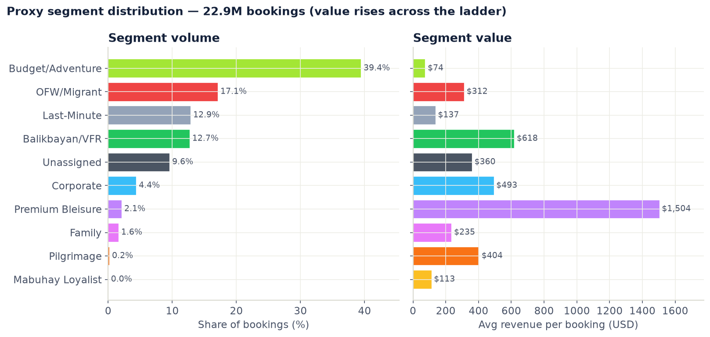

**Volume and value are inverted — the commercial case in one picture.** Budget/Adventure is 39% of bookings at the lowest value per booking; Premium Bleisure is 2.1% at roughly 20× that. ⚠️ **The axis reads USD, but the extract's currency is undocumented** — treat the unit as unconfirmed and the ratio as the finding.

**The three numbers to say out loud:**
1. **Premium Bleisure is 2.1% of bookings at 1,504 vs Budget/Adventure's 74** — a 20× spread. That is
   the commercial case for segmenting at all.
2. **9.6% Unassigned is a deliberate blank, not a failure.** It is mostly one identifiable group — a
   Philippines-issued economy passenger flying internationally — that matches none of the ten rules. We
   left it empty rather than folding it into the nearest segment to tidy the chart. **It needs a PAL
   definition; that is a commercial decision, not a modelling problem.**
3. **Mabuhay Loyalist at 0.03% cannot be true.** There is no loyalty-tier field in the extract, so award
   redemption is the only visible signal. *The segment is real; our ability to see it is not.*

---

## 6. What ML actually does here

| Job | Method | Script | Status |
|---|---|---|---|
| **1. Refine** — split oversized parent segments into sub-types | LCA (StepMix) | `sub_segment.py` | In pipeline, **under review** (GMM beat it on a top-level benchmark; needs a stage-matched re-test) |
| **2. Test** — are the boundaries real? | Gradient boosting, planted segments, adversarial AUC | `validate_*.py`, `detection_power.py` | Run, results below |
| **3. Monitor** — has the world drifted? | PSI · ARI · centroid/volume | `monitor_metrics.py` | Specified, **not yet wired** |

**Dropped, with evidence:** HDBSCAN. It was the original plan of record; the real data is
categorical-heavy and therefore not density-separable. Retired 2026-07-23.

Example of ML job 1 — LCA inside Balikbayan/VFR finds 4 sub-types that the rules never encoded:

| Sub-type | Share | Median lead | Median revenue |
|---|---:|---:|---:|
| round-trip · far-advance · saver (connecting) | 22.8% | 62d | 420 |
| round-trip · far-advance · saver (direct) | 23.9% | 105d | 987 |
| round-trip · advance · saver | 41.2% | 29d | 317 |
| round-trip · advance · value | 12.2% | 40d | 643 |

⚠️ These sub-types are **provisional** — split-half ARI 0.495, the least reproducible in the taxonomy.

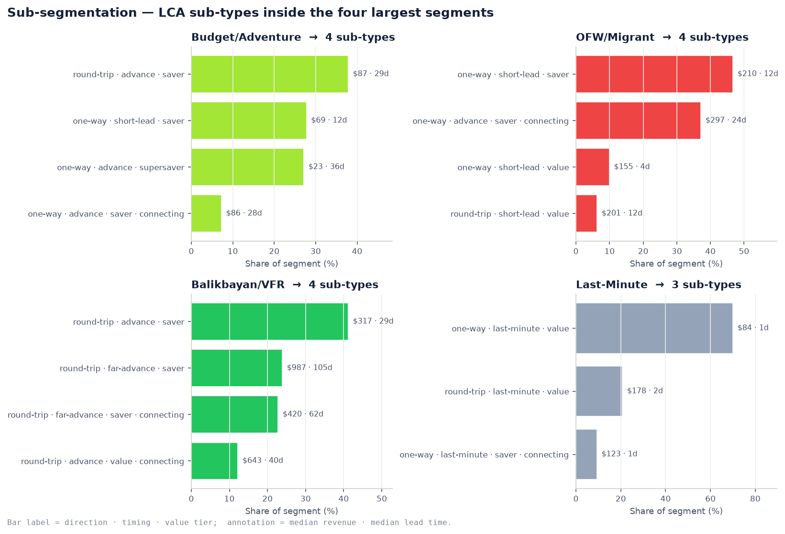

**What the machine learning actually contributes.** LCA sub-types inside the four largest rule segments — patterns the rules never encoded. Note Balikbayan/VFR: **far-advance bookers are worth roughly 3× the advance-saver group**. ⚠️ Provisional — these are the least reproducible split in the taxonomy.


### 6.1 How each layer is scored — the metrics map

**The single most common misunderstanding, including inside the team.** Classic cluster-quality metrics
(BIC, silhouette) only mean something *where a model actually fits* — you cannot compute the likelihood
of a rulebook. So the two layers are scored by two different families of metric. **Neither layer is
unmeasured; they are measured for different things.**

```
                        INTERNAL metrics                    EXTERNAL metrics
                        "does this partition hold           "does this partition correspond
                         together?"                          to anything real?"
                        ────────────────────                ──────────────────────────
Top-level (rules)       ✗ nothing is fitted —          →    ✓ V1 · V2 · V3 · V4
                          no likelihood to score              + rule-confidence diagnostics
Sub-segments (LCA)      ✓ BIC · silhouette · split-half  →   (inherits the parent's)
```

**Layer 1 — sub-segmentation.** A model fits, so internal metrics apply
(`sub_segment.py`, and the within-parent head-to-head in `kproto_compare.py` §5):

| Metric | The question it asks | LCA result inside the parents |
|---|---|---|
| **BIC** | How many sub-types? | 4 · 4 · 4 · 3 — **but see the caveat** |
| **Gower silhouette** | Are the sub-types actually separated, under a distance that respects mixed data types? | Budget **0.264** · OFW **0.215** · Balikbayan **0.204** |
| **Split-half ARI** | Fit on half the data, predict the other half — same answer? | Budget **0.934** · OFW **0.840** · Balikbayan **0.495** |
| **Size balance** | Smallest vs largest sub-type — is the split degenerate? | smallest 10–23% — no 2%-vs-60% collapses |

> **The BIC caveat, stated before a reviewer finds it.** BIC is monotone *inside* the segments too — the
> continuum does not disappear when you zoom in. So `sub_segment.py` caps the search at 2–5 sub-types and
> takes the best BIC within that range. That is **a deliberate business-actionable cut, not a natural
> *k***, and the code says so in a comment.

> **Why LCA and not k-prototypes for this layer.** k-prototypes scored *better* on split-half
> (0.943 / 0.953 / 0.700) and *worse* on separation (0.241 / 0.151 / 0.193). LCA leads on silhouette in
> all three parents. The project's recurring rule, applied at the sub-layer: **stability without
> separation is not structure.**

> **And the honest read on those silhouettes.** 0.204–0.264 sits in the same *weak-but-real* band as the
> top-level ceiling of 0.381 (bands: >0.5 strong · 0.25–0.5 weak but real · <0.25 none). **The sub-types
> are not dramatically better separated than the top level** — exactly what you would expect if the
> continuum goes all the way down. Balikbayan's 0.495 split-half is why its sub-types are flagged
> provisional.

**Layer 2 — the rule-based top level.** Nothing is fitted, so external-validity metrics apply instead:

| Study | Metric used | Result |
|---|---|---|
| **V1** construct | Held-out ROC-AUC, gradient boosting on independent anchors | 0.608–0.965; controls clean at ≈0.50 |
| **V2** criterion | AUC ladder → *signal retained*, *incremental value* | 0.324 / ≈0.002 |
| **V3** detection power | Best-F1 recovery of planted segments | detects at ≥2% prevalence |
| **V4** temporal | TVD · adversarial AUC · transfer ARI | 1.93 pp / 0.61 / 0.763 |
| **Rule confidence** (§10.2) | Rule competition · runner-up · boundary fragility | 66.5% uncontested |
| **The actual optimisation target** | **Asymmetric cost matrix + per-segment recall** | **built and tested — awaiting ground truth** |

That last row is the one to keep in your pocket: the cost matrix is the metric the model is *meant* to be
judged on — business cost of error rather than accuracy — and it is the one blocked on SME labels.

**The one-line version for the room:**
> *"Sub-segments are scored the way you'd score any clustering — BIC, silhouette, split-half stability.
> The top-level segments can't be scored that way because nothing is fitted, so they're scored on
> external validity instead: can independent evidence tell them apart, do they predict outcomes they
> never saw, do they survive a year. Different layer, different question, different metric."*

### 6.2 Every metric in plain words

*If you can only explain a number by naming it, you cannot defend it. This section is written to be read
aloud to someone non-technical.*

#### There are only four questions

Every metric in this project is answering one of four questions. Once you see that, the alphabet soup
stops mattering.

```
1. HOW MANY groups are there?          → BIC
2. Are they actually SEPARATE?         → silhouette
3. Would I get the SAME ANSWER again?  → ARI (split-half, bootstrap, transfer)
4. Do they mean anything OUTSIDE       → AUC, F1, TVD, PSI
   the model that made them?
```

**Questions 1–3 are internal** — they interrogate the grouping on its own terms. **Question 4 is
external** — it goes looking for corroboration elsewhere. Our rule-based top level can only be asked
question 4; the sub-segments get all four (§6.1).

#### How to read *any* score you are shown

Three questions, in order. They work for every metric in this document and most outside it.

1. **What is the range?** (0–1? −1 to +1? Unbounded?)
2. **What does *no signal* look like?** — the null value. For AUC it is 0.5, for ARI it is 0, for a
   silhouette it is 0. **A number without its null is meaningless.**
3. **What did the control do?** If a test that *should* find nothing still reports something, the test is
   broken and every other number from it is void.

> **This is why our validation reports lead with a negative control.** We split a segment randomly in
> half and try to tell the two halves apart. There is no real difference to find, so the score *must*
> come back at chance. Ours landed at **0.494–0.506** — like running a medical test on a healthy person
> and correctly getting "not sick". Only then are the real numbers worth reading.

#### The metrics themselves

| Metric | The question, in plain words | The picture to hold | Range · what good looks like | Ours |
|---|---|---|---|---|
| **BIC** | *How many groups should there be?* | A **golf score for grouping**: you gain points for explaining the data well and get **fined for every extra group you add**, so it punishes needless complexity. Lower is better. Normally the score falls, bottoms out, then rises — that bottom is the natural number of groups | Unbounded; you look for the **bottom of the curve** | **There is no bottom.** It just keeps falling, 3 → 9 groups. *That is the continuum finding* |
| **Silhouette** | *Is each member closer to its own group than to the neighbouring one?* | A crowded party. For each guest, ask: *are you standing nearer your own conversation circle, or the next one?* If most people are hovering between circles, it is **one big mingle**, not separate conversations | −1 to +1 · **>0.5 strong · 0.25–0.5 weak but real · <0.25 none** | **0.381 ceiling** — the best any of ten methods achieved. Weak but real |
| **Gower** (the *distance* silhouette uses) | *How do you measure "far apart" when your data is part numbers, part categories?* | You cannot say *"Manila is 5 km from the Web channel."* Gower compares each field in its own natural way, then averages — so numbers and categories can sit in one distance | It is a distance, not a score | Used everywhere we quote a silhouette |
| **ARI** | *Do two groupings agree?* | Take any **two bookings**. Did both methods put them together, or both apart? Count the agreements — then **subtract the credit you would get from pure luck** (that is the "adjusted" part) | 0 to 1 · **0 = no better than random · 1 = identical** | Methods agree with each other only **0.41** — they can't even agree on the answer |
| **Split-half ARI** | *If I'd only had half the data, would I have got the same answer?* | Give **two sorters half the mail each** and check they built the same piles. If they didn't, the piles were in the sorter's head, not the mail | 0 to 1 · **>0.8 reliable** | Sub-types: 0.934 / 0.840 / **0.495** ← why Balikbayan's are provisional |
| **AUC** | *Given one from each group, how often can a model pick which is which?* | **A guessing game.** Hand the model one Corporate booking and one Budget booking, unlabelled: how often does it point at the right one? 0.5 means it is flipping a coin | 0.5 to 1 · **0.5 = chance · >0.75 clearly different** | 0.608–0.965 across segment pairs |
| **Signal retained** | *How much predictive information survives being squashed into 10 labels?* | **Summarising a book in ten words.** How much of the meaning is still there? | 0 to 1+ | **0.324** — the labels keep about a third |
| **Incremental value** | *Does the label tell us anything the raw data didn't already?* | You describe someone as "a Corporate traveller". Did that add anything the **booking details** hadn't already told us? | ≈0 means no | **≈0.002** — essentially nothing. The segments are a **summary, not new information** |
| **F1 / precision / recall** | *Did we find the group — and is everyone we found actually in it?* | **Recall:** of the real Corporate bookings, how many did we catch? **Precision:** of the ones we called Corporate, how many really were? **F1** balances the two, because either alone is gameable — call *everything* Corporate and recall is perfect | 0 to 1 | Used in the planted-segment test |
| **Detection power** (the *test*, not a metric) | *If a segment existed that we're missing, would we spot it?* | **A smoke-alarm test.** You light a small, controlled fire to check the alarm works. We plant fake segments of known size into the real data and see whether our methods find them | — | Finds them at **≥2%** of bookings; **blind below ~1%** |
| **TVD** | *How much did the pie chart move between two periods?* | Lay last year's pie chart over this year's. **Add up how much each slice changed**, and halve it. That is the number | 0 to 1 (quoted in percentage points) · **small = stable** | **1.93 pp** on segment sizes — very stable. **3.21 pp** on revenue mix — the weaker leg |
| **Adversarial AUC** | *Can a model tell which year a booking came from?* | Show someone a booking with the date hidden. **If they can guess the year, something changed.** If they can't, the population held still | 0.5 = unchanged · 1.0 = totally different | **0.61** — mildly changed, against controls at 0.49 and 0.99 |
| **Transfer ARI** | *If we'd built the model a year earlier, would it still work today?* | Fit on last year, apply to this year, and see whether you get the same groups as building fresh. **The trick is what you compare against** — not a perfect 1.0, but the method disagreeing with *itself* on two halves of the same year. That is the realistic ceiling | Compare to the ceiling, not to 1.0 | **0.763 against a 0.746 ceiling** — a year costs us *nothing* |
| **PSI** | *Has the incoming data drifted away from what we built on?* | A **smoke detector for data.** It watches the shape of arriving bookings and goes off when they stop resembling the ones the model was built for | **<0.1 fine · 0.1–0.25 watch · >0.25 investigate** | Specified, not yet wired |
| **Per-segment recall + cost matrix** | *Of the real Corporate bookings, how many did we catch — and what did the misses cost?* | **Not all mistakes cost the same.** Missing a Corporate booking costs ~10× missing a Budget one, so we count the **pesos of error**, not the percentage of error | Lower cost is better | **Built and tested — awaiting ground truth.** This is the real target |

#### Reading one number end to end — a worked example

Take the weakest number in the whole project: **OFW/Migrant vs Balikbayan/VFR scores 0.608 on V1.**

1. **What is it?** An AUC — the guessing game. Hand the model one booking from each segment, with every
   rule-based clue removed, and ask which is which.
2. **What is the null?** 0.5. A coin flip.
3. **What did the controls do?** The negative control (a segment split randomly in half — no real
   difference exists) came back at 0.494–0.506 ✅. The positive controls, on pairs we *know* are
   different, hit 0.77–0.95.
4. **So what does 0.608 mean?** The model gets it right about **61 times in 100** where chance is 50.
   **Better than nothing, but far below the 0.77–0.95 band where a genuinely different pair sits.**

**In one sentence for the room:** *"When we strip away the rule that created these two segments and look
only at independent evidence, we can barely tell them apart — which is exactly why we are asking a
commercial expert whether a one-way versus return ticket should really define two different customers."*

That is the whole method in miniature: a number, its null, its control, and an honest sentence.

### 6.3 Where GMM fits

GMM comes up constantly and its status is easy to misstate, so: **GMM is not in the pipeline.** It plays
three distinct roles, and conflating them is how the "GMM beat your model" question becomes awkward.

| Role | What it means | Status |
|---|---|---|
| **1. Benchmark contender** | One of ten methods in the 2026-07-28 stress test, scored on eight axes at the **top level** | **Won the composite** — 0.849 vs LCA 0.763 |
| **2. Measurement instrument** | Part of the *deployable panel* used to run our own tests: V3 detection power (with LCA, KMeans, SVD+KMeans) and V4 model transfer (with LCA) | **In active use** — this is where GMM earns its keep today |
| **3. Candidate refinement layer** | Proposed replacement for LCA at the sub-segmentation stage | ⏸️ **Under review — not switched** |

**What GMM(full) actually won on, and what it lost:**

| Axis | GMM(full) | LCA | Winner |
|---|---:|---:|---|
| Composite score | **0.849** | 0.763 | GMM |
| Composite, circular axis zeroed | **0.798** | 0.762 | GMM — so the win is *not* borrowed from our own rules |
| Taxonomy agreement (ARI) | **0.409** @ k=6 | 0.337 | GMM |
| Split-half + bootstrap stability | **0.812** | 0.680 | GMM |
| Noise / dropout robustness | **0.757** | 0.645 | GMM |
| **Gower silhouette (separation)** | 0.262 | **0.298** | **LCA** |

**Why we did not switch — the answer to give verbatim:**

> The benchmark and the pipeline stage are **not the same job**. The stress test scored *top-level
> segmentation of the whole population*. LCA's actual role is *sub-segmenting inside a parent segment*.
> Swapping a layer on the strength of a test of a **different task** is exactly the shortcut this project
> has been avoiding — and note that on the one axis that matters most for a refinement layer,
> **separation, LCA still wins**. GMM has never been run in the within-parent head-to-head that
> `kproto_compare.py` §5 performs. **That re-test is the gate**; until it runs, GMM stays a logged
> candidate.

**A caution on GMM specifically:** it is a *Gaussian* mixture — it assumes continuous, elliptical
components. Our features are categorical-heavy (route region, channel, direction, country of issue), so
GMM is fitting Gaussians to encoded categories. That works, and it clearly works *well* on the benchmark
axes, but it is another reason the stage-matched test matters before it takes a production role.

### 6.4 External benchmarks — how our numbers compare to the published literature

*Every number in §6.1–6.3 is quoted against its own null and its own control, which answers "is this
signal?" but not "is this good?" This section supplies the second answer from aviation and tourism
segmentation studies. It exists because "the silhouette is only 0.381" is the single most likely
challenge from a technical reviewer, and the correct response is not a defence — it is a benchmark.*

#### The reference values

| # | Benchmark | Value | Source |
|---|---|---|---|
| **B1** | Silhouette, European air-passenger segmentation (fuzzy c-means, 5 clusters) | **0.37** Manhattan · **0.59** Euclidean | MDPI *Tourism & Hospitality* 6(1):27 |
| **B2** | Silhouette, airline customer segmentation (K-Means vs DBSCAN) | **0.145** K-Means · **0.68** DBSCAN | *Black Sea J. Eng. & Sci.*, K-Means/DBSCAN comparison |
| **B3** | Published aviation silhouette range | **≈0.14 – 0.68** | B1 + B2 |
| **B4** | Tourism data-structure regimes: **natural clusters → reproducible clusters → constructive segmentation** | natural clusters are **rare** in tourism data | Dolnicar & Leisch, *Marketing Letters* 21(1) 83–101 |
| **B5** | Airline no-show prediction, best of six algorithms | **AUC 0.78** (KNN) | *No-Show Passenger Prediction for Flights* |
| **B6** | Minimum sample for data-driven tourism segmentation | **70×** variables (2014), revised **100×** (2016) | Dolnicar, Grün, Leisch & Schmidt, *J. Travel Research* |
| **B7** | Airline segmentation study scale and segment count | **n = 5,800** frequent flyers → **5 segments** (latent class) | Teichert, Shehu & von Wartburg, *Transp. Res. A* 42(1) 227–242 |
| **B8** | Revenue gain from airline cancellation forecasting / overbooking | **1.15 – 4.16%** (a second study: 0.4–3.2%) | *Airline passenger cancellations: modeling, forecasting and impacts on RM* |

> **State this before anyone else does.** B1–B3 are **Euclidean silhouettes on survey attitude data**,
> n in the thousands. Ours is a **Gower silhouette on mixed-type behavioural data**, n = 22.9M. Same
> word, different measurement. These are order-of-magnitude sanity checks, **not a like-for-like league
> table** — and B1/B6 were read from indexed summaries rather than the publisher PDFs, so verify before
> either goes into a client deliverable.

#### Layer 2 (top level) against the benchmarks

| Metric | Our result | Ideal | Benchmark | Read |
|---|---|---|---|---|
| Gower silhouette (ceiling, 10 methods) | **0.381** | >0.5 | **0.37** (B1) · 0.14–0.68 (B3) | ✅ **At benchmark** — matches published air-passenger segmentation almost exactly |
| Data-structure regime | **constructive / reproducible** | natural clusters | natural clusters **rare** (B4) | ✅ Field-normal, not a failure |
| V1 construct AUC, 36 pairs | **0.608–0.965**, median **0.796** | >0.75 | **0.78** (B5) | ✅ **Above** the aviation predictive benchmark |
| V1 pairs clearly distinct | **25 / 36** · **0** failures | 36 / 36 | — | ✅ Strong |
| V2 segment-only AUC | **0.632** | >0.75 | **0.78** (B5) | ⚠️ **Below** — but label-only vs a full feature model, not a fair match |
| V2 incremental value | **+0.002** | >0.02 | none published | ❌ Lossy re-encoding — a communication tool, not new signal |
| V3 detection floor | **≥2%** prevalence at distinctness ≈0.337 | ≤1% | 0.37 (B1) | ⚠️ We would catch a B1-grade segment at ≥2%; **blind below ~1%** |
| V4 transfer ARI | **0.763** (ceiling 0.746) | ≥0.90 | B4 is **qualitative only** | ✅ Reproducible regime; at its own ceiling |
| Fitting sample | **20,000** | 11 × 100 = **1,100** (B6) | n = 5,800 (B7) | ✅ **18× the requirement**, 3.4× the airline study |
| Named segments | **9** + Unassigned | — | **5** (B7) | ⚠️ **Nearly double the airline-literature norm, on weaker separation** |

#### Layer 1 (sub-segments) against the benchmarks

| Parent | Gower silhouette | vs B1 (0.37) | vs B2 (0.145) | Split-half ARI | Ideal ≥0.90 |
|---|---|---|---|---|---|
| Budget/Adventure | **0.264** | ❌ below | ✅ above | **0.934** | ✅ |
| OFW/Migrant | **0.215** | ❌ below | ✅ above | **0.840** | ⚠️ acceptable |
| Balikbayan/VFR | **0.204** | ❌ below | ✅ above | **0.495** | ❌ unstable |
| Last-Minute | *never tested* | — | — | *never tested* | ❌ coverage gap |

**No sub-segment reaches B1.** All three tested clear the weaker B2 case. This is the same reading as
§6.1's honest note, now with an external anchor: the sub-types are *weaker* than published air-passenger
segments, and only Budget/Adventure is reproducible enough to act on without a caveat.

#### The metrics with no aviation or tourism benchmark

Searching the aviation and tourism segmentation literature returned **no published values** for these.
The "ideal" columns above and in §6.1 are therefore **logical targets, not literature-derived ones** —
say so rather than implying a standard exists.

| Metric | Why there is no benchmark | Nearest available anchor |
|---|---|---|
| Total-variation distance (segment drift) | not used in tourism segmentation papers | PSI 0.10 / 0.25 — a credit-scoring convention, already in `monitoring-metrics.md` |
| Adversarial drift AUC | our own instrument | its own controls (0.49 / 0.99) |
| Detection-power floors (prevalence × distinctness) | no published planted-segment study in aviation | B1/B2 silhouettes as a distinctness reference |
| Rule-competition % · boundary fragility | rule-waterfall diagnostics are absent from the literature | none |
| Signal retained · incremental value | our own ladder | B5 as an outcome-prediction reference |
| Minimum viable segment size | substantiality is stated qualitatively, never numerically | none — our ~1% floor has **no** published comparator |
| Numeric ARI thresholds | **B4's framework is qualitative**, not a cut-off | our own 0.90 / 0.75 bands |

#### The three sentences to have ready

> **1. "Your separation is weak."** — *"It is 0.381, and the published segmentation of European air
> passengers is 0.37. We are at the field benchmark, not below it. And per Dolnicar & Leisch, naturally
> occurring clusters are rare in tourism data — the honest classification for behavioural travel data is
> reproducible-or-constructive segmentation, which is exactly what we report."*

> **2. "So the segments aren't real."** — *"Median pairwise AUC across 36 segment pairs is 0.796 on
> evidence the rules never saw, against 0.78 for published airline no-show prediction. The segments are
> demonstrably distinguishable. What they are **not** is a source of new predictive signal —
> incremental value is +0.002. Both of those are true at once, and we report both."*

> **3. "Why nine segments?"** — *"The airline literature typically lands on five. Ours is nine because
> it is business-constructed rather than discovered — which B4 explicitly licenses as the correct
> approach when the data is a continuum. The taxonomy is a commercial decision with measured support,
> not a clustering output."*

**The gap this section exposes.** B8 is the only benchmark we cannot answer at all: airline cancellation
forecasting is worth a documented **1.15–4.16% revenue gain**, and nothing in `outputs/` estimates the
commercial value of this segmentation. That is the number a client will ask for, and it is currently
unmeasured.

---

## 7. Validation — and the honest limit

**The crux: every agreement number we can compute today is measured against `proxy_segment`, which is
the rule waterfall's own output. That is circular by construction.** Two routes out, both live:

```
10 rule-based segments
├── CIRCULAR (today) ──── per-segment recall + cost matrix, measured against our own rules.
│                         Machinery built and tested. Awaiting an answer key.
├── PLAN B — no labels ── V1 construct · V2 criterion · V3 detection power · V4 out-of-time
│                         gated by validation_anchors.py (the circularity contract)
└── PLAN A — ground truth ~1,000 SME-labelled bookings + inter-rater agreement. OUTSTANDING.
```

**Plan B answers "is there real structure here?" Plan A answers "are these the *right* labels for PAL?"**
They are complements. Nothing but Plan A can confirm the *names* — which is why the SME ask is the
critical path even though Plan B is complete.

### 7.1 Why a rulebook cannot grade itself

**Layer 1 is a self-assessment. Layer 2 is a background check.** The sub-segmentation layer can report how
well its model fits its own data (§6.1). The rule layer has no model, so there is nothing to self-assess —
instead we treat the ten segments as **a claim about the world** and go looking for corroboration the rules
never had access to.

**And there is a trap you have to design around first.** If I write a rule *"one-way ticket → OFW"* and
then test whether OFW bookings are one-way, I get 100% — and I have proved nothing except that my computer
works. That is circularity, and it dictates the whole shape of this layer.

So step one is **quarantining the evidence.** Every field the rules consumed is banned from testing. What
survives is thin but clean:

| | Fields | Usable for testing? |
|---|---|---|
| **Rule inputs** | `is_award`, `corp_channel`, `any_business`, `lead_days`, `pilgrimage`, `sea_crew`, `foreign_issue`, `is_international`, `max_tier`, `round_trip`, `any_premium`, `is_group`, `is_domestic` | ❌ **Never** — circular by construction |
| **Trip-type proxies** | `rev_pos`, `n_coupons`, `connecting`, `n_directions`, `min_tier` | ❌ They leak `round_trip` |
| **Tier-A anchors** | **`age` · `age_known` · `dep_month` · `n_bookings`** | ✅ **Always** — independent of every rule field |
| **Conditional anchors** | `issue_country`, `channel`, `dest_region` | ⚠️ Only where the rule bit they encode is *not* the boundary under test |

> **The subtle version of the trap — and why this is enforced in code rather than by convention.**
> *"Destination region = Domestic"* **is** the domestic flag wearing a disguise. Admit it as evidence for a
> pair the rules split on domestic-vs-international and you get a near-perfect score that proves only that
> we applied our own rule consistently. **A name-based check waves it through.** So admissibility is decided
> **per comparison**, and `validation_anchors.py` **raises an error rather than warning**.
>
> Same reason **sea-crew bookings are excluded throughout**: one level of the `channel` anchor is literally
> `Sea Crew`, which *is* the OFW rule. Keeping them would leak the rule through an anchor. That is why OFW
> appears as 2.82M rather than 3.92M in the validation — a booking whose channel says Sea Crew is
> identified *by definition* and needs no validating.

### 7.2 Four ways a segmentation can be worthless — one test each

This is the cleanest way to hold V1–V4 in your head.

| A segmentation is worthless if… | The test that catches it | Verdict |
|---|---|---|
| the groups are just **my own rule echoed back** | **V1** — do they differ on evidence we never used? | ✅ Pass, one weak boundary |
| the groups **don't connect to anything that happens** | **V2** — do they predict outcomes no rule reads? | ⚠️ Partial — a summary, not a discovery |
| there are **real groups we never found** | **V3** — would we even have seen them? | ✅ Bounded, with a stated blind spot |
| the groups are **one year's accident** | **V4** — do they survive a 12-month step? | ✅ Pass on size, weaker on value |

#### V1 — construct validity: *"do they differ in ways we never told them to?"*

**The picture.** Sort a school's students into "athletes" and "musicians" using only which club they signed
up for. Now hide the club data and check — do the two groups differ in **height**? In **what time they eat
lunch**? If they differ **on evidence you never used**, your sorting caught something real about the people.
If they don't, you just relabelled a sign-up sheet.

**Our version.** For each of the **45 segment pairs**, a model gets only the four Tier-A anchors and must
guess which segment a booking came from. Bands: **<0.60 not distinguishable · 0.60–0.75 weakly · >0.75
clearly distinct.**

- Range **0.608 → 0.965**. Strongest: Budget/Adventure vs Balikbayan/VFR **0.965**.
- Weakest: **OFW/Migrant vs Balikbayan/VFR 0.608** — the single bit boundary (§5).
- **Negative control 0.494–0.506 ✅** · positive controls 0.770–0.945.

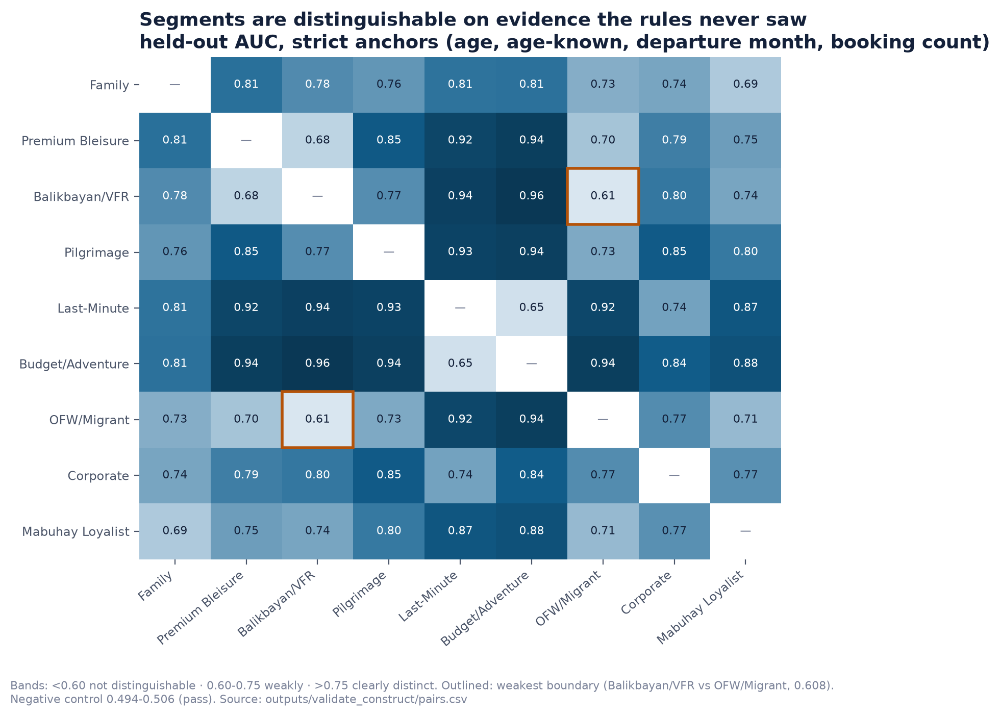

**V1 — do the segments differ on evidence the rules never saw?** Held-out AUC using only age, whether age was recorded, departure month and lifetime booking count. **Outlined: the weakest boundary in the taxonomy** — OFW/Migrant vs Balikbayan/VFR at 0.61, against a 0.5 coin flip. Negative control passed at 0.494–0.506.


**The control is what makes those numbers readable.** Split one segment randomly in half and try to tell the
halves apart: there is nothing to find, so it *must* land at 0.5. Had it come back at 0.7, every other
number here would be void — **like a kitchen scale that reads 3 kg with nothing on it.**

#### V2 — criterion validity: *"do the labels predict things they weren't built to predict?"*

**The picture.** A doctor groups patients by symptoms. The real test is not whether the groups match the
symptoms — of course they do. It is whether the groups predict **who recovers.** Outcome, not input.

**Our outcomes** are things no rule reads: did they actually fly, did they refund, did they book again
within 180 days.

| | Value | What it means |
|---|---|---|
| **Signal retained** | **0.324** | A segmentation is a **compression** — squashing 11 features into 10 labels *must* lose information. That is arithmetic, not failure. About a third survives |
| **Incremental value** | **≈0.002** | Does the label add anything *on top of* the raw booking details? **Essentially nothing** |

> **The analogy that makes this land.** "Corporate traveller" is a **book blurb**. Genuinely useful — you
> can put it on a slide, a whole department can act on it, it aligns people who would otherwise argue. But
> if you already have the book, the blurb tells you nothing new. **The segments are a summary, not a
> discovery — and must never be sold as a forecasting tool.**

Two honesty details worth having ready: refunds are so rare that some segments have literally **3 events in
22.9M bookings**, so that outcome is **reported as infeasible rather than fitted**. And for rebooking we
**excluded** bookings sitting too close to the extract boundary — counting them as "did not rebook" would
have manufactured a fake collapse in loyalty.

#### V3 — detection power: *"if we'd missed a segment, would we know?"*

**The sharpest test in the project, and the one that most impresses reviewers.** Everything else says *"no
natural clusters exist."* A fair reviewer replies: **"or are your instruments blind?"** Ten methods agreeing
on "nothing there" is only evidence if those methods can find something when there *is* something.

**The picture: a smoke-alarm test.** You do not trust a smoke detector because it is silent. You light a
small, controlled fire and check that it screams.

So we take the real bookings and **append** a fake segment of known size (0.5 · 1 · 2 · 5 · 10%) and known
distinctness, then re-run the methods and see whether they find it. Three design choices carry the stage:

1. **Appended, not substituted** — the question is *"what if PAL's book **also** contained this group"*, not
   *"what if part of the book were replaced"*.
2. **Three archetypes, and the third matters most.** Two are plausible business stories; the third is a
   **random direction with no business story at all.** A floor that holds there is a property of our
   *methods*, not of two lucky guesses.
3. **Majority rule, never best case.** With 12 method × archetype combinations, *something* clears the bar by
   luck. The luckiest cell would have claimed detection at **0.5% prevalence** while groups **nine times more
   distinct** were missed elsewhere in the same grid. Both cannot be a floor — so every published number is
   where **more than half the panel agrees**.

**Result: detection at ≥2% of bookings; blind below ~1% (~229k bookings).** That bound now travels *with*
the continuum claim instead of sitting as an unknown.

Two things to volunteer before being asked. The failure mode is **smearing** — the faint group gets found
but absorbed into a much larger cluster, so it would never be actionable. And this stage **retired one of
our own instruments**: re-running a topology statistic 100 times on *unchanged* data, where the answer must
be identical every time, returned anywhere from **1 to 120**. A statistic with that range cannot screen for
anything. Also note the floors are **optimistic** — a planted group is internally tidier than a real messy
segment of the same size.


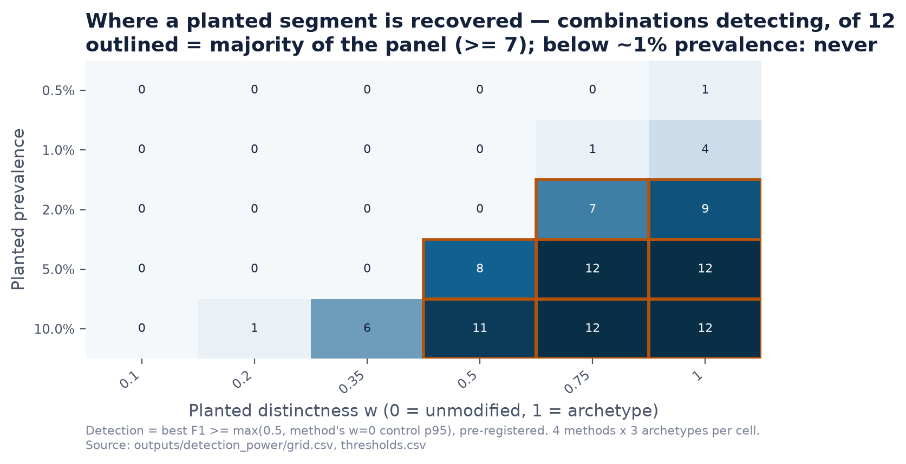

**V3 — the smoke-alarm test, and where the alarm stops working.** Each cell counts how many of 12 method × archetype combinations recovered a planted segment. Outlined = a majority of the panel. **Below ~1% prevalence, nothing is detected at any distinctness** — that is our stated blind spot, roughly 229k bookings.

#### V4 — out-of-time: *"is this just one year's weather?"*

**The picture.** You find a pattern in a single photograph of the year. Fine — but a segment that exists
only because of one year's fare sale would pass every test above and still be worthless to act on. So cut
time in half and re-ask everything.

| Measure | Result | Plain reading |
|---|---|---|
| **Share stability** (TVD) | **1.93 pp** ✅ | Did the pie chart move? Barely |
| **Profile drift** | 7 of 10 segments negligible, carrying **98.2%** of bookings | Catches the failure a size report hides: **a segment can hold its share while its members change underneath** |
| **Adversarial AUC** | **0.61** (controls 0.49 / 0.99) | Can a model guess which year a booking came from? Mildly — so **real shift happened that the segment sizes absorbed** |
| **Transfer ARI** | **0.763** vs a **0.746** ceiling | Fit last year, score this year. **A year costs us nothing** |
| **Revenue-mix stability** (TVD) | **3.21 pp** ⚠️ | The weaker leg — see the limitations below |


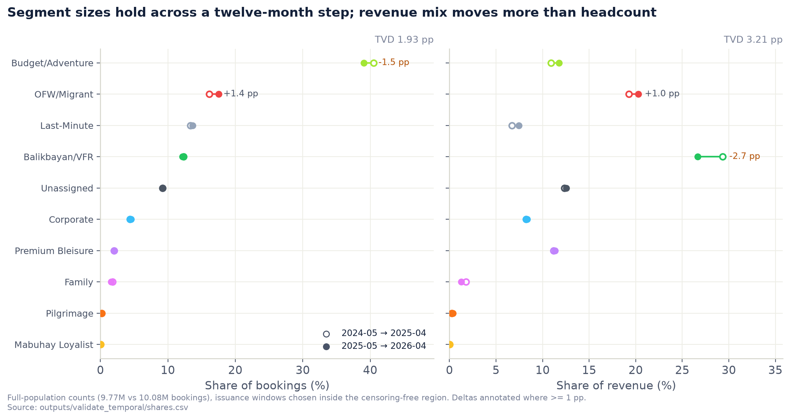

**V4 — sizes hold, value moves.** Two adjacent 12-month issuance windows on full-population counts. **Left: segment sizes barely move (1.93 pp). Right: revenue mix moves further (3.21 pp)** — Balikbayan/VFR loses 2.7 pp of revenue share on a flat headcount share. A segment holding its size is not evidence its value held.

> **Two design points worth quoting.** *Profile drift is stratified, and must be* — a uniform sample would
> give Mabuhay Loyalist about **nine rows**, so exactly the segments whose stability we know least would
> return "n/a". And *the transfer control is a ceiling, not a baseline*: it is the method disagreeing with
> **itself** on two halves of the same year. **You compare against that, not against a perfect 1.0.**

**The near-miss worth telling as a story.** The extract is filtered on **departure** date, not issuance. A
naive "2024–25 vs 2026–27" split would have reported a spectacular collapse in lead time that is **pure
selection** — bookings issued early only appear at all if their lead time was long enough to reach the
travel window (mean lead **105 days** in the excluded region vs **38** inside). We nearly fooled ourselves,
caught it, and redrew the windows. Same reason outcome fields are excluded here entirely: `flown_any` runs
~100% for early issuance and **30.7%** for 2026Q3, which is censoring, not a collapse in travel.

**What V4 does not establish:** one 12-month step inside one extract. That is not evidence of surviving a
demand shock, a network change or a fare-structure revision — the mechanism that would break it is not in
this data.

### 7.3 The one Layer 2 metric still missing

**Per-segment recall + the asymmetric cost matrix** — the metric the model is actually *meant* to be judged
on. Recall in plain words: *"of the real Corporate bookings, how many did we catch?"* The cost matrix adds
that **not all misses cost the same** — missing a Corporate booking runs about **10×** a Budget one — so we
would count **pesos of error, not percentage of error.**

It is built and tested. It is the one thing blocked on expert labels, **because you cannot compute recall
without an answer key.**

### 7.4 Two limitations to state before you are asked

- **Revenue mix is the weaker leg.** Balikbayan/VFR held its headcount share while falling
  **29.35% → 26.64% of revenue** year on year. *A segment holding its size is not evidence its value held.*
- **Every method is fragile to feature dropout** (leave-one-out ARI minima 0.15–0.49) — a real production
  risk given the extract's known field gaps.

**The unifying sentence for the room:**
> *"We can't grade the rulebook against itself, so we go looking for corroboration it never had access to —
> do the groups differ on independent evidence, do they predict outcomes they never saw, would we have
> spotted a group we missed, and do they survive a year. **Four different ways of being wrong, one test
> each.**"*

---

## 8. Delivery — what actually lands in Power BI

`src/export_powerbi.py` joins the booking-grain segment back down onto every coupon and ships a star
schema. **99.95% segment match; the 0.05% remainder are the all-non-revenue customers Stage F excludes,
labelled `Excluded (non-revenue)` so BI totals still tie to the full extract.**

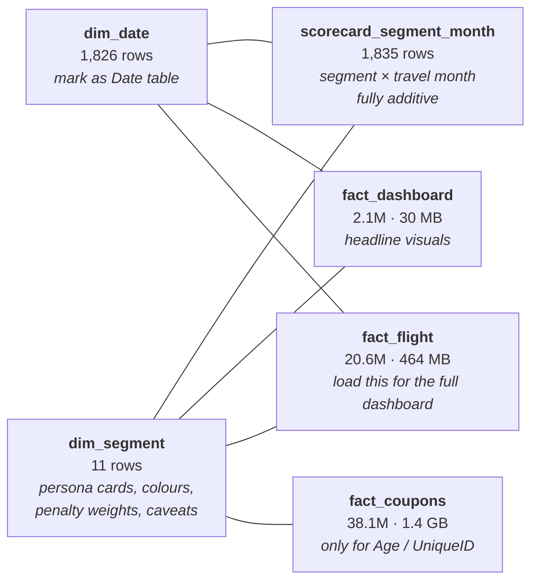

### The four traps that will silently produce a wrong report

| # | Trap | Why | Fix |
|---|---|---|---|
| 1 | **The forward-book cliff** | Data stops at **2026-07-21**. Sep-2026 holds ~22% of a mature month because those bookings *have not been made yet*. 2024 also starts in May, so a full-year YoY compares 12 months to 8 | Filter **`IsCompleteTravelMonth = TRUE`** on every trend; `IsCompleteTravelYear` (TRUE for **2025 only**) for annual |
| 2 | **`DaysBeforeMonthEnd` ≠ pickup** | One single value per departure month — see §10.1 | Use **`LeadTimeDays`** |
| 3 | **`PaxCount` ≠ party size** | It counts *sectors*, so it is 1 on virtually every row | Passenger volume = coupon count; groups = `BookingType = "Group"` |
| 4 | **`Bookings` is pre-summed** | It is `SUM(IsPrimaryCoupon)` — exactly one TRUE per booking — so it stays additive at every level | `SUM()` it. **Never `DISTINCTCOUNT`** |

Also: `Route` repeats on both legs of a connection (count `Bookings`, not coupons), and
`OperatingCarrierCode` is constant `PR` (dead filter).

```dax
Bookings           = SUM ( scorecard_segment_month[Bookings] )
Net Revenue        = SUM ( scorecard_segment_month[NetRevenue] )
Rev per Booking    = DIVIDE ( [Net Revenue], [Bookings] )
Segment Share      = DIVIDE ( [Bookings], CALCULATE ( [Bookings], REMOVEFILTERS ( dim_segment ) ) )
Bookings LY        = CALCULATE ( [Bookings], SAMEPERIODLASTYEAR ( dim_date[Date] ) )
```

**Why no percentages are stored in the scorecard:** a stored share is only correct for the filter context
that produced it. The moment the report slices to one region it is silently wrong and nothing visibly
breaks. Shares are always measures.

**Why there is no accuracy gauge in the export, on purpose:** per-segment recall needs SME ground truth.
Every accuracy figure computable today is circular. `dim_segment` carries `PenaltyWeight` and
`RevenueAtRiskPerError` if you want a *cost-weighted risk* tile instead — **but do not build an accuracy
gauge; there is no honest number to put in it.**

---

## 9. Cheat sheet — numbers to have in your head

| | |
|---|---|
| 38,116,259 | cleaned coupons (row-preserving through export) |
| 22,911,450 | bookings — the modelling row |
| 13,435,365 | customers · only **26%** book more than once |
| 9 + 1 | named segments + Unassigned (**9.6%**) · Digital Nomad **not implemented** |
| 0.381 | Gower silhouette ceiling across all ten methods |
| 1.93 pp | segment-share drift across a 12-month step |
| 1,504 vs 74 | Premium Bleisure vs Budget/Adventure, avg revenue per booking |
| 2026-07-21 | the extract boundary — everything after is forward book |
| Python 3.14 · DuckDB · Parquet | fully open source, no proprietary platform in the loop |

---

## 10. Your two questions

### 10.1 — Have we considered `DaysBeforeMonthEnd`?

**Yes, in depth — and your instinct about what it *is* is correct.** The V1 data dictionary defines it as
*"days prior to the end of the **travel month**"*, a **revenue-accounting snapshot** so finance can
compare a month like-for-like year on year at the same point in the accounting cycle. So it is a capture
/ snapshot field, exactly as you thought.

**The problem is that this extract contains only ONE capture.** A snapshot field is only useful if you
have several snapshots to compare. Verified on all 38.1M raw coupons:

| Check | Result |
|---|---|
| Distinct values per departure month | **exactly 1**, for every one of the 37 months |
| Issue months feeding each departure month | **12.9 on average** (13–15 typical) |
| Distinct values in the entire extract | **12** |
| Share of rows equal to `-7` | **91.45%** |

The full value set is `-7` (all 26 departure months through Jun-2026), then `11, 42, 72, 103, 133, 164,
195, 223, 254, 284, 315` — stepping by month length for each future month. In other words it is a
**deterministic function of the departure month measured against a single extract date (~2026-07-20)**.

> **It therefore carries zero booking-timing information.** Every August booking has the same value
> whether it was bought yesterday or eleven months ago. It cannot distinguish "booked 60 days out" from
> "booked 3 days out", so it **cannot anchor the LY-vs-CY pickup measure it was requested for.**

**What we did with it:** carried through Stage C as an explicit *BI passthrough, never a model feature*
(`clean_real.py:151`), exported under its requested name with a ⚠️ in the field dictionary, and flagged
as one of the two blocking BI data gaps.

**Two ways to actually get pickup:**
1. **`LeadTimeDays`** (departure − issuance) — genuine per-coupon booking timing, already exported, and
   it *is* year-on-year comparable. This is the answer for Friday.
2. **Repeated dated extracts of the same departure months** — a real snapshot series. This is a **data
   request to PAL**, and worth making the ask on the day.

> 🔧 **Correction found while checking this for you.** Four docs (`methodology.md`, `knowledge-base.md`,
> `stakeholder-report.md`, `tuesday-punchlist.md`) said *"8 distinct values, 99.7% of them `-7`"*. The
> verified figures are **12 distinct values, 91.45% `-7`**. The conclusion is unchanged — arguably
> stronger, since the "exactly one value per departure month" check is the load-bearing one and it holds
> at 37/37. **Docs corrected; don't quote the old numbers.**

---

### 10.2 — How can we measure the strength / confidence of the rule-based segments?

This splits into **two different questions that are easy to conflate**, and separating them is itself a
good answer to give a mentor:

```
  INTERNAL confidence                        EXTERNAL validity
  "How determined is this label              "Is this label CORRECT?"
   by the rule set itself?"
  ─────────────────────────                  ────────────────────────
  Computable today, on all 22.9M rows        Needs evidence outside the rules
  Answers: is the label an artefact          Answers: does the segment exist,
  of priority ordering or of a               and is it what PAL means by the name
  knife-edge threshold?
```

#### (a) External validity — already measured, four legs

You already have these; quote them as the evidence base (details in §7):

| Leg | Metric | Result |
|---|---|---|
| V1 construct | held-out AUC on anchors the rules never saw | 0.608–0.965; controls clean at ≈0.50 |
| V2 criterion | signal retained / incremental value | 0.324 / ≈0.00 → lossy re-encoding |
| V3 detection power | planted-segment recovery floor | detects ≥2% prevalence; blind below ~1% |
| V4 out-of-time | TVD + transfer ARI over a 12-month step | 1.93 pp shares; transfers for free |

**None of these can confirm the segment *names*.** Only SME labels can. Say
*"behaviourally validated; segment names not externally confirmed"* every time.

#### (b) Internal confidence — three measures, computed for you on all 22.9M bookings

These are new; I ran them while preparing this doc. They are cheap, exact (no sampling), and directly
answer *"how strong is this cluster?"* for a deterministic labeller.

**① Rule competition — how many rules a booking matches.** If only one rule fires, the label is
uncontested. If four fire, the label is an artefact of the priority order we chose.

| Segment | Uncontested (1 rule) | 2 rules | 3+ rules | Mean rules matched |
|---|---:|---:|---:|---:|
| Budget/Adventure | **100.0%** | 0.0% | 0.0% | 1.00 |
| Premium Bleisure | 95.5% | 4.5% | 0.0% | 1.05 |
| Balikbayan/VFR | 89.2% | 10.3% | 0.5% | 1.11 |
| Mabuhay Loyalist | 63.6% | 21.0% | 15.4% | 1.52 |
| OFW/Migrant | 61.5% | 31.3% | 7.1% | 1.46 |
| Family | 45.8% | 47.2% | 7.0% | 1.61 |
| Pilgrimage | 35.2% | 56.1% | 8.7% | 1.74 |
| Last-Minute | 15.9% | 84.1% | 0.0% | 1.84 |
| **Corporate** | **6.4%** | 68.0% | **25.6%** | **2.20** |
| Unassigned | — | — | — | 0.00 (matches nothing, by definition) |

**Overall: 66.5% of bookings match exactly one rule · 24.0% match two or more · 9.6% match none.**

> **The headline finding — lead with this, it is genuinely interesting.**
> **Corporate is the most contested segment in the taxonomy (only 6.4% uncontested, 25.6% matching three
> or more rules) — and it carries the highest misclassification penalty (×10).** The segment we can
> least afford to get wrong is the one whose label depends most on our chosen priority order. That is
> exactly the boundary to put in front of the SMEs first.
>
> Conversely, **Budget/Adventure is 100% uncontested** — but read that honestly: it is the terminal
> catch-all, so "nothing else claimed it" is close to true by construction. High confidence that the
> *rule* fired cleanly; it says nothing about whether the *segment* is meaningful.

**② Runner-up label — what the booking would have been called one priority step lower.**

| Segment | Would otherwise have been | Share of segment |
|---|---|---:|
| Last-Minute | Budget/Adventure | **84.1%** |
| Family | Budget/Adventure | 37.5% |
| Corporate | Budget/Adventure | 28.0% |
| Corporate | OFW/Migrant | 19.7% |
| OFW/Migrant | Last-Minute | 17.9% |
| Pilgrimage | Budget/Adventure | 16.5% |
| Balikbayan/VFR | Last-Minute | 6.2% |
| Premium Bleisure | Last-Minute | 4.0% |

This makes the taxonomy's real shape visible: **Last-Minute is not a peer of the other nine — it is a
behavioural overlay cutting across them.** 84% of it would be Budget/Adventure otherwise. Worth deciding
with PAL whether it should be a *segment* or a *flag on* a segment.

**③ Boundary fragility — how many labels flip when one threshold moves one notch.**

| Threshold moved | Labels flipped | Share of book |
|---|---:|---:|
| Last-Minute lead ≤3d → ≤7d | 1,963,598 | **8.57%** |
| Last-Minute lead ≤3d → ≤2d | 658,401 | 2.87% |
| Last-Minute lead ≤3d → ≤4d | 575,206 | 2.51% |
| Value cut tier ≤4 → ≤3 | 387,327 | 1.69% |
| Value cut tier ≤4 → ≤5 | 109,152 | 0.48% |
| Corporate lead ≤7d → ≤10d | 38,157 | 0.17% |
| Corporate lead ≤7d → ≤5d | 33,648 | **0.15%** |

Per-segment survival under the same moves:

| Perturbation | Segment most affected | Keeps its label |
|---|---|---:|
| lead ≤3 → ≤2 | Last-Minute | 77.7% |
| lead ≤3 → ≤4 | Budget/Adventure | 94.6% |
| tier ≤4 → ≤3 | Balikbayan/VFR | 93.1% |
| tier ≤4 → ≤5 | **Premium Bleisure** | **81.4%** |

**Three readings worth presenting:**
- **The Corporate lead-time threshold barely matters** (0.15–0.17%). The `corp_channel` branch is doing
  virtually all the work. So the ×10-penalty segment rests on *channel identity*, not on our arbitrary
  7-day cut — that is reassuring, and it tells the SMEs precisely which input to scrutinise.
- **The Last-Minute 3-day cut is the single most consequential arbitrary number in the model.** Widening
  it to a week relabels 8.6% of the entire book.
- **Premium Bleisure is the most fragile segment** — move the value cut one tier and 18.6% of it is
  reclaimed by the OFW/Balikbayan branches, because Premium Economy would then count as "economy" there.

#### (c) What I recommend shipping

A **`SegmentConfidence`** column, computed in `features_real.py` and carried into the fact table so
Power BI can filter on it:

| Tier | Definition | Approx. share |
|---|---|---:|
| **High** | matched exactly 1 rule **and** not within ±1 notch of any threshold it depends on | ~⅔ |
| **Medium** | matched 1 rule but sits near a threshold, **or** matched 2 rules | ~¼ |
| **Low** | matched 3+ rules — the label is a priority-order artefact | ~5% |
| **None** | Unassigned — matched nothing | 9.6% |

Two payoffs. **For the dashboard:** stakeholders can see a campaign list restricted to high-confidence
members. **For the SME session:** it is a ready-made sampling frame — spend the ~1,000 precious SME
labels on the *Low* and *Medium* bookings at the contested boundaries (Corporate ↔ Budget/Adventure,
OFW ↔ Balikbayan) rather than uniformly at random, where most would land in obvious cases.

> ⚠️ **The honest caveat to state when you present this.** These three measures quantify how
> *determined* a label is by the rule set — **not whether it is right**. A booking can be 100%
> uncontested and still be in the wrong segment if the rule itself is wrong. Internal confidence is a
> **map of where to look**, not a correctness measure. Correctness still needs SME ground truth.

---

## 11. Questions you are likely to be asked — by department

The room is cross-functional: some VPs are technical, some are commercial, some are neither. Answers are
grouped by where the question usually comes from.

### Commercial & Revenue Management

| They ask | You say |
|---|---|
| *"Can I use these to set fares tomorrow?"* | **Not for pricing yet** — the labels are preliminary until an expert confirms them. Today they are solid for **reporting, targeting and prioritisation**. Pricing should wait for the expert review, which is weeks of effort, not months. |
| *"Premium Bleisure is only 2.1% — why care?"* | It earns **1,504 per booking vs Budget/Adventure's 74** — 20× on unit value. Headcount share is the wrong lens; the persona card carries that warning as a column so it can't be cropped out of a slide. |
| *"Which segment should I worry about most?"* | **Corporate** — highest misclassification penalty (×10) *and* the most contested label in the taxonomy (6.4% uncontested, §10.2). Highest cost of error, lowest label certainty. |
| *"Balikbayan/VFR looks stable — is it?"* | **In size yes, in value no.** It held passenger share while falling 29.35% → 26.64% of revenue. *A segment holding its size is not evidence its value held.* |

### Marketing & Loyalty

| They ask | You say |
|---|---|
| *"Can I build a campaign list from this?"* | Yes — and filter it. Once `SegmentConfidence` ships, restrict to **High** (~⅔ of bookings) so spend lands where the label is solid. Also filter `IsModelledSegment = FALSE` to drop the Unassigned gap and staff travel. |
| *"Why is Mabuhay only 0.03%? That's obviously wrong."* | **It is, and we agree.** No loyalty-tier field exists in the extract, so the only visible signal is an actual award redemption — members flying on paid tickets are invisible. The segment is real; our ability to see it is not. A data request, not a model change. |
| *"Is 'Family' really families?"* | **No — it means "ticketed as a group".** A family of four booking four individual tickets is invisible. The field that would give party size counts *sectors*, not people. Under-counted by design. |
| *"Should Last-Minute be its own segment?"* | **Genuinely open — we'd like your view.** 84% of it would otherwise be Budget/Adventure; it behaves as a behaviour cutting *across* segments. As a flag instead, you could see last-minute Corporate separately from last-minute leisure. |

### Finance & Planning

| They ask | You say |
|---|---|
| *"Can I trust the revenue numbers?"* | Two caveats. **Currency is undocumented** — plausibly single (7.3× median spread across 26 issue countries, within normal route-mix variation) but confirm with PAL before summing across countries. **Exclusion flags matter** — refunds, awards and non-revenue travel ship as flags so totals reconcile; commercial tiles must filter them. |
| *"Why does the trend fall off a cliff?"* | It doesn't — the data stops at **2026-07-21** and later months are forward book still filling (Sep-2026 ≈ 22% of a mature month). Filter `IsCompleteTravelMonth = TRUE`. Same on years: 2024 starts in May, so unguarded full-year YoY compares 12 months to 8. |
| *"What does this cost to run?"* | **No licence cost** — Python, DuckDB and Parquet, open source end to end, no proprietary platform. A full rebuild is minutes on a laptop, not hours on a cluster. |

### IT, Data & Engineering

| They ask | You say |
|---|---|
| *"How is it refreshed? Reproducible?"* | Every stage is one script writing a checkable report; seeds and versions pinned. **Scoring a new booking needs no inference** — you apply the same rules, so the labeller cannot drift. Drift enters only through the input distribution, which is what monitoring watches (specified, not yet wired). |
| *"What's the production risk?"* | **Every method tested is fragile to a missing input column** (leave-one-out ARI 0.15–0.49). A field silently stopping would degrade the segmentation rather than fail loudly — so a **feature contract validated at ingestion** should gate any production deployment. |
| *"Which table do we load?"* | `fact_flight` (20.6M, 464 MB) for the full dashboard · `fact_dashboard` (2.1M, 30 MB) for summary visuals · `fact_coupons` (38.1M, 1.4 GB) only for Age / customer key. Build DAX against the 100k QA sample first. |
| *"Data privacy?"* | The customer key is already anonymised — no names, contacts or payment data anywhere in the pipeline. Age is present on 43% of rows (international ops only) behind an explicit `AgeKnown` flag. |

### Mentors & technical reviewers

| They ask | You say |
|---|---|
| *"So you didn't really use machine learning?"* | Ten methods across six families over eight axes — and the finding was that no natural clusters exist. **Acting on that is the result.** Forcing a clustering onto a continuum produces boundaries that look sophisticated and mean nothing. ML now does three jobs. |
| *"How accurate is it?"* | No honest accuracy number yet, **by design rather than omission** — every computable figure is circular. The machinery is built and tested; it needs ~1,000 expert-labelled bookings. That is the main ask. |
| *"Why 10 segments?"* | The **requirement** asks for 10; the data contains a continuum, so the number comes from the business, not the data. *Naming "orange" is a business decision; proving the spectrum runs red-to-violet is the analysis.* Be precise: **we deliver 9 named + Unassigned — Digital Nomad is not implemented** (§5.1) |
| *"Isn't your validation circular?"* | **Yes, and we say so first.** That is why Plan B exists — four label-free studies gated by a circularity contract enforced in code that **raises rather than warns**. It catches the subtle leaks too: `dest_region == 'Domestic'` *is* `is_domestic` in finer clothing, so it is disqualified for any comparison turning on that bit. |
| *"What would change your mind?"* | Expert labels disagreeing with a rule; two segments proving indistinguishable on independent evidence; or a boundary unstable across time. Policy: an unsupported split becomes **a proposal to PAL with the evidence attached**, never a unilateral merge. |
| *"What are you blind to?"* | Three things. **(1)** Any segment below ~1% of bookings (≈229k) — tested by planting artificial segments and failing to recover them. **(2)** Anything needing loyalty tier, length of stay or ancillary spend. **(3)** Behaviour under a demand shock or fare-structure change — we tested one 12-month step inside one extract. |

---

## 12. Glossary

*Four groups: the airline words, our data words, the method words, and the field names people will meet on
the dashboard. Written so a non-technical reader can look up any term in this document.*

### 12.1 Airline & ticketing — the business words

| Term | Plain meaning |
|---|---|
| **PNR** | *Passenger Name Record* — the reservation file created when someone books. One PNR can cover several passengers and several flights. Our "booking" is the closest thing we can rebuild from this extract |
| **Coupon** | **One flown leg of a ticket.** Manila–Cebu–Davao is two coupons. This is the raw row of our data — 38.1M of them |
| **Sector** | A single flight leg, e.g. MNL→CEB. What one coupon covers |
| **O&D** | *Origin & Destination* — the journey the passenger actually intends (MNL→DVO), even if flown via Cebu. Distinguishes the **trip** from the **legs** |
| **TripOD vs OnlineOD** | `TripOD` is the whole journey including other airlines; `OnlineOD` is the part PAL operates. If they differ, another carrier is involved |
| **Interline** | Part of the journey flown by another airline under the same ticket |
| **Route** | The O&D shown on the dashboard. ⚠️ It repeats on both legs of a connection — count bookings, not coupons |
| **POO** | *Point of Origin* — the airport the journey starts from |
| **Cabin** | The physical class flown: economy (Y), premium economy (W), business (J). 95.2% of our coupons are economy |
| **Booking class** | The single-letter fare code (K, Q, J …). **Finer than cabin** — many booking classes map to one cabin at different prices |
| **Farebrand** | PAL's fare product family (Business Flex, Economy Saver …), derived from the booking class letter |
| **Value tier** | Farebrand turned into a number **1–7** so the rules can compare "more expensive" |
| **YQ** | A carrier-imposed surcharge shown separately from base fare. `NetRevenue` includes it; `NetFare` does **not** |
| **Award ticket** | Paid with Mabuhay miles. The cash line is only taxes, so **revenue is structurally near zero** — never judge this segment on revenue |
| **Non-revenue** | Staff, industry or complimentary travel. Excluded from every commercial measure |
| **Group fare** | Inventory sold as a block to a group booking. Our "Family" segment means *ticketed as a group* — not *is a family* |
| **Reissue** | A ticket reissued after the original departure. Shows up as **negative lead time** |
| **Flown vs open coupon** | *Flown* = the leg was taken. *Open* = still to fly, or unused. 93.4% of ours are flown |
| **Lead time** | Days between buying the ticket and departing. **Our genuine booking-timing measure** |
| **Forward book** | Trips already booked but not yet flown. Looks like a collapse on a chart if you don't filter it out |
| **Sea Crew** | A distinct, contract-driven channel for seafarers — 3.7% of coupons, and effectively **definitional** for OFW/Migrant |
| **TMC** | *Travel Management Company* — a corporate travel agency. One of our two corporate signals |
| **OTA** | *Online Travel Agency* — an aggregator booking site |
| **NDC** | A distribution **technology standard**. ⚠️ Not a corporate signal — deliberately excluded from the Corporate rule |
| **OFW** | *Overseas Filipino Worker* |
| **Balikbayan / VFR** | A returning Filipino / *visiting friends and relatives* travel |
| **Hajj / Umrah** | Pilgrimages to Mecca — the reason Jeddah and Medina define the Pilgrimage segment |
| **LCC** | *Low-cost carrier* — the competitive context for Budget/Adventure |

### 12.2 Our data & pipeline

| Term | Plain meaning |
|---|---|
| **Grain** | **What one row represents.** Getting this wrong is the commonest cause of wrong numbers in a report |
| **Booking** *(ours)* | One purchase decision — everything a customer bought on the same day. **Our modelling row**, 22.9M of them |
| **Customer rollup** | Bookings grouped up to the person. Ships as `CustomerDominantSegment`, but it is a summary, not the model |
| **Extract** | The single delivery of data we were given — four gzipped files, one point in time |
| **Parquet** | A compressed columnar file format. Turns multi-minute scans of the raw files into sub-second queries |
| **DuckDB** | The open-source engine that does the heavy lifting, so 38M rows never have to fit in memory |
| **Stages B / C / F / X** | Build (raw→typed) · Clean+flag · Features+grain change · eXport to Power BI. See §5 |
| **Rule waterfall** | The ordered rule list in §5. **First match wins**, and nothing below it is consulted |
| **Proxy label** | A label produced by rules rather than confirmed by an expert. **Everything we have today is a proxy label** |
| **Unassigned** | The 9.6% matching none of the ten rules. **A deliberate gap awaiting a PAL definition** — not junk |
| **Sub-segment** | A finer type found *inside* a rule segment by clustering. Informs; never relabels |
| **Penalty weight** | PAL's estimate of the cost of putting a booking in the wrong segment. Corporate is **×10** |
| **Anchor** | A field allowed to *test* the segments because no rule used it — age, whether age was recorded, departure month, lifetime booking count |
| **Circular validation** | Testing a model against the rules that produced its answers. **Marking your own homework** |
| **Ground truth** | Expert-confirmed labels — the answer key we don't yet have |
| **SME** | *Subject-Matter Expert* — the PAL commercial person who would provide that answer key |
| **Continuum** | A smooth spectrum with no natural dividing lines. **What our customer base turned out to be** |
| **Drift** | Incoming data gradually stopping looking like the data the model was built on |

### 12.3 Method & metrics

*Fuller explanations with analogies are in §6.2 — these are the one-line versions.*

| Term | Plain meaning |
|---|---|
| **BIC** | A golf score for grouping: rewards fit, **fines you for every extra group**. Lower is better; you look for the bottom of the curve. **Ours has no bottom** |
| **Silhouette** | How well-separated groups are (−1 to +1). **>0.5 strong · 0.25–0.5 weak but real · <0.25 none.** Our ceiling is 0.381 |
| **Gower** | A distance that handles numbers and categories together — you can't say "Manila is 5 km from the Web channel" |
| **ARI** | Agreement between two groupings, **corrected for luck**. 0 = random, 1 = identical |
| **Split-half** | Fit on half the data, predict the other half. Tests whether the groups are reproducible or in the sorter's head |
| **AUC** | Given one from each group, how often can a model pick which is which? **0.5 = coin flip**, 1.0 = perfect |
| **Negative control** | A test run where there is nothing to find. **It must come back at chance** — otherwise the harness leaks and every other number is void |
| **Positive control** | A test on a pair we know differs, to calibrate what "a real difference" scores |
| **Signal retained** | How much predictive information survives being squashed into 10 labels. Ours: **0.324** |
| **Incremental value** | Whether the label adds anything **beyond** the raw data. Ours: **≈0.002 — essentially nothing** |
| **Precision / recall / F1** | *Recall:* of the real Corporates, how many did we catch? *Precision:* of those we called Corporate, how many were? *F1* balances the two |
| **Planted segment** | A fake group of known size injected into the real data to test whether we could detect it — the smoke-alarm test |
| **Adversarial test** | Can a model tell which year a booking came from? If not, the population held still |
| **Transfer** | Fit on last year, apply to this year. Compared against **the method disagreeing with itself**, not against a perfect score |
| **TVD** | *Total variation distance* — how far a set of shares moved between two periods, in percentage points |
| **PSI** | A smoke detector for data drift. **<0.1 fine · 0.1–0.25 watch · >0.25 investigate** |
| **Cost matrix** | Counting **pesos of error rather than percentage of error** — because not all mistakes cost the same |
| **LCA** | *Latent Class Analysis* — probabilistic clustering suited to categorical data. **Our refinement layer** |
| **GMM** | *Gaussian Mixture Model* — won the top-level benchmark; **not in the pipeline**, used as a measurement instrument (§6.3) |
| **HDBSCAN** | Density-based clustering. Was the original plan; **dropped with evidence** |
| **k-prototypes / k-modes** | Mixed-type clustering methods. Diagnostic cross-checks only — stable but poorly separated |

### 12.4 Field names you'll meet on the dashboard

| Field | What it is · and the trap if there is one |
|---|---|
| **Star schema** | The standard Power BI shape: fact tables surrounded by small lookup tables |
| **Measure vs column** | A *column* is stored; a *measure* is calculated live in the filter context. **Shares must always be measures** — a stored share is wrong the moment you slice |
| **DAX** | The formula language Power BI uses to write measures |
| **`BookingID`** | A surrogate key so bookings can be counted correctly across multiple coupons |
| **`IsPrimaryCoupon`** | Exactly one TRUE per booking. Filter on it for booking-level measures |
| **`Bookings`** | Pre-calculated and **additive**. `SUM()` it — ⚠️ **never `DISTINCTCOUNT`** |
| **`IsCompleteTravelMonth` / `Year`** | ⚠️ **Filter every trend on these.** They exclude the still-filling forward book that draws a fake cliff |
| **`DataAsOfDate`** | The extract boundary — 21 July 2026 |
| **`LeadTimeDays`** | Departure minus issuance. **Use this for pickup / booking-curve analysis** |
| **`DaysBeforeMonthEnd`** | ⚠️ Departure-month accounting metadata, **not** a booking snapshot. Cannot do pickup — see §10.1 |
| **`PaxCount`** | ⚠️ Counts **sectors**, not people. It is 1 on virtually every row. Passenger volume = row count |
| **`NetRevenue` vs `NetFare`** | `NetRevenue` includes the YQ surcharge; `NetFare` is base fare only |
| **Exclusion flags** | `IsRefund`, `IsAward`, `IsNonRev`, `RevMissing`, `IsGroupFare`, `IsReissue`, `AgeKnown`. Shipped as flags rather than pre-filtered **so totals still reconcile** — but commercial tiles must filter them |
| **`dim_segment`** | One row per segment: persona text, colours, penalty weight, and the `Trust` / `DataCaveat` governance columns |
| **`dim_date`** | The date table — mark it as such in Power BI for time intelligence to work |
| **`scorecard_segment_month`** | Segment × travel month, ~1,800 rows, **every column additive and no stored percentages** |
| **`fact_dashboard` / `fact_flight` / `fact_coupons`** | 2.1M for summary visuals · **20.6M — load this one** · 38.1M only for age and customer key |
| **`IsModelledSegment`** | FALSE for `Unassigned` and `Excluded (non-revenue)`. Filter it out of commercial visuals |

---

## 13. Strategic recommendations — what the segmentation suggests PAL could do

> ⚠️ **Read this framing first, and say it out loud before presenting any of it.** These are
> **hypotheses grounded in measured behaviour**, not validated recommendations. The segment labels are
> preliminary until an expert confirms them (§7), and the segmentation is a **summary rather than a
> predictive tool** (V2). Every number below is measured; every *action* is our inference. **Present them
> as "here is what the data would suggest — is that consistent with what you see commercially?"** That
> question is worth more from this audience than agreement.

### 13.1 Where the money is — three commercial plays

**① Protect and grow Premium Bleisure — the segment headcount reporting hides.**
2.1% of bookings, **1,504 average / 1,038 median per booking** — 20× Budget/Adventure. **100%
international, 100% premium cabin, 63% round-trip, median lead 40 days.** They plan ahead and they chose
to pay up. Top corridors: North America 32%, East Asia 29%. Modal channel is the **traditional travel
agency**, not direct.

*What that suggests:* this segment is **won at the agency counter and lost on seat product**. A
headcount-ranked report will always bury it — so give it a revenue-weighted view, and treat agency
relationships in the North America and East Asia corridors as a premium-yield channel rather than a
commodity one. **Do not deprioritise on volume share.**

**② The diaspora corridor is 30% of bookings — and it has a 3× spread hiding inside it.**
OFW/Migrant (17.1%, 312) plus Balikbayan/VFR (12.7%, 618) is nearly a third of the book. Both are
overwhelmingly international, agency-booked, and issued **in the US**. Balikbayan books furthest ahead of
anyone (**median 48 days**) and always returns; OFW is 94% one-way with **38% connecting**.

*The actionable finding sits below the segment.* Inside Balikbayan/VFR the sub-types differ by **3× in
value**: far-advance direct bookers run **987 median**, versus **317** for the advance-saver group.

*What that suggests:* **early-bird capture on diaspora corridors is worth disproportionately more than the
segment average implies** — the people booking 60–105 days out are the valuable ones. And because both
segments are agency-and-connection heavy, the levers are likely **baggage allowance, in-language agency
support, and connection reliability** rather than headline fare. ⚠️ The sub-types are provisional
(split-half 0.495) — treat as a hypothesis to test, not a plan.

**③ Budget/Adventure is 39% of bookings at 74 — this is the LCC battleground.**
100% domestic, 100% non-premium, modal channel **WEB/APP**, median lead 23 days.

*What that suggests:* competing on headline fare here is a race the cost base decides, not the
segmentation. The realistic levers are **cost-to-serve and ancillary attach** on a digital channel that is
already direct. Its unit value is the lowest in the book, but **collectively it is four in ten bookings** —
so small per-booking improvements compound further here than anywhere else.

### 13.2 Two early-warning signals we would act on now

**① Balikbayan/VFR is quietly downtrading.** It held its passenger share while falling
**29.35% → 26.64% of revenue** year on year. *A segment holding its size is not evidence its value held.*
A volume dashboard would never have shown this. **Recommendation: put a revenue-mix tile next to every
volume tile, and ask commercially whether this is fare mix, corridor mix, or competitive loss.**

**② The population is shifting underneath stable segment sizes.** The adversarial test can tell which year
a booking came from at **0.61** — mild, but real, movement that the segment shares absorbed. Combined with
signal ①, that is the profile of change happening *inside* segments rather than between them.
**Recommendation: monitor per-segment revenue mix, not just per-segment size.**

### 13.3 Repeat-purchase behaviour — the most under-used finding in the report

Rebooking within 180 days, measured on outcomes no rule reads:

| Segment | Rebooks within 180 days | The strategic read |
|---|---:|---|
| **Corporate** | **53.1%** | Highest repeat rate in the book. Retention economics, not acquisition |
| **Last-Minute** | **46.7%** | **Low value per booking, high repeat rate** — do not read cheap as disloyal |
| Premium Bleisure | 39.7% | High value *and* returns — the best combination in the taxonomy |
| Unassigned | 38.1% | Another reason not to ignore it |
| Budget/Adventure | 34.1% | Volume engine, moderate return |
| OFW/Migrant | 28.3% | Contract-cycle driven, not calendar-driven |
| Family | 20.1% | Occasion-driven |
| Balikbayan/VFR | 18.8% | **Seasonal — likely annual, so 180 days is the wrong window for them** |
| Pilgrimage | 8.3% | Once-in-a-lifetime for many. Not a retention target |

*What that suggests:* **Last-Minute is the clearest missed opportunity.** It is the cheapest segment per
booking and the second most likely to come back — so judging it on unit revenue understates it badly. And
**Balikbayan's low rate is probably a measurement artefact**, not disloyalty: an annual visit home does not
fit a 180-day window. Worth re-measuring at 12 months before drawing any conclusion.

### 13.4 Taxonomy decisions only PAL can make

Three genuine forks, each with our recommendation attached — but each is a **commercial call, not a
modelling one**:

| Decision | What we found | Our suggestion |
|---|---|---|
| **What is the 9.6% Unassigned?** | 2.19M bookings, **360 average — out-earning OFW/Migrant per booking** — and **18.6% fly premium**. Mostly PH-issued economy passengers flying abroad | **Define it, don't absorb it.** This is the single largest actionable gap, and it is not low-value residue |
| **Should Last-Minute be a segment, or a flag?** | 84.1% of it would otherwise be Budget/Adventure; it cuts *across* the taxonomy rather than sitting beside it | **Make it a flag.** Then you can see last-minute *Corporate* separately from last-minute leisure — far more actionable |
| **Is one-way vs return really two customers?** | OFW and Balikbayan are split on a single bit, and are the least distinguishable pair on independent evidence (0.608) | **Put this pair in front of a commercial expert first.** It governs 6.8M bookings |

### 13.5 Data investments, ranked by what they unlock

| Investment | Unlocks | Why it ranks here |
|---|---|---|
| **1. Mabuhay tier on the booking** | The loyalty segment, and a cleaner Corporate | Today loyalty is visible only when someone *spends* miles — 0.03%. **You cannot manage what you cannot see, and there is a real risk of under-investing in loyalty because the report makes it look irrelevant** |
| **2. ~1,000 expert-labelled bookings** | A real accuracy figure; the cost-weighted target | Turns every claim in this report from "behaviourally validated" into "validated" |
| **3. Repeated dated extracts** | Genuine pickup / booking-curve analysis | The current field cannot do it (§10.1); this is a standing revenue-management capability, not a one-off |
| **4. Ancillary + baggage spend** | The OFW/Balikbayan proposition | Our strongest hypothesis about the diaspora corridor is **unmeasurable** with today's fields |
| **5. Length of stay** | Corporate vs leisure separation; the bleisure story | Would sharpen the most contested boundary in the taxonomy (§10.2) |

### 13.6 How to use the segmentation — and how not to

| ✅ Use it for | ❌ Do not use it for |
|---|---|
| **Organisational alignment** — one shared language for the customer base | **Forecasting.** V2 is explicit: the labels add ≈0 on top of the raw features. Forecast on the features |
| **Targeting and campaign lists** — filtered to high-confidence members (§10.2) | **Pricing decisions**, until expert labels land |
| **Revenue-weighted reporting** — seeing where value concentrates, not just volume | **Any accuracy gauge on a dashboard.** There is no honest number to put in it yet |
| **Prioritising commercial attention** and framing the SME conversation | **Judging a segment by revenue per booking alone** — Mabuhay is structurally near-zero, Last-Minute is high-repeat |

> **The strategic sentence we would put on the last slide:** *"The segmentation is not a forecasting
> engine and we will not sell it as one. What it gives PAL is a shared, auditable language for 22.9 million
> bookings — and the first honest map of where value concentrates, where it is quietly eroding, and where
> we are still blind."*

---

## 14. What we need from PAL — the asks, in priority order

| # | Ask | Why it matters | Who |
|---|---|---|---|
| **1** | **~1,000 hand-labelled bookings** from a commercial expert | The only thing that replaces circular validation with a real accuracy figure. Template already in `data/labels/`. Sample from the contested boundaries in §10.2, not uniformly at random | Commercial |
| **2** | A definition for the **9.6% Unassigned** | 2.19M bookings deliberately left blank rather than guessed. Mostly PH-issued economy flying abroad. A commercial decision, not a modelling one | Commercial |
| **3** | **Mabuhay tier** on the booking record | Without it the loyalty segment is invisible (0.03%) and Corporate is diluted — we cannot separate a corporate traveller from a wealthy last-minute leisure one | Loyalty / IT |
| **4** | **Repeated dated extracts** of the same departure months | The only route to a genuine LY-vs-CY pickup measure — see §10.1 | IT / Revenue Mgmt |

**Also welcome, and cheap to give: corrections to the rules themselves.** The ladder in §5 is our best
reading of PAL's business from the data dictionary and industry practice — **not from their expertise**.
If rule ② should say five days rather than seven, or if "issued abroad + one-way" is not how they identify
an overseas worker, that is a ten-minute conversation that improves 22.9 million labels.

---

## 15. Where things live

| Want | Open |
|---|---|
| The authoritative method spec | `docs/methodology.md` |
| Every fact we have learned, newest first | `docs/knowledge-base.md` §15 |
| **The full EDA** (§1 in long form) | `docs/eda-report-real-data.md` · raw stats in `outputs/profile_raw/`, `outputs/clean_report/`, `outputs/eda_real/confirmations.md` |
| **The decision trail** (§3) in original form | `docs/methodology.md` changelog + `docs/knowledge-base.md` §15 |
| Segment counts and profiles | `outputs/features_real/summary.md` |
| The BI field dictionary + caveats | `outputs/powerbi_export/summary.md` + `START-HERE.md` |
| The ten-method benchmark | `outputs/model_stress_test/summary.md` |
| Validation results | `outputs/validate_construct/`, `validate_criterion/`, `detection_power/`, `validate_temporal/` |
| The §10.2 confidence numbers, reproducible | `python src/rule_confidence.py` → `outputs/rule_confidence/summary.md` |
| Talk track for a technical mentor | `docs/mentor-presentation-guide.md` |
| **This guide as a presentation-grade report** | `docs/pipeline-study-guide.html` — open in a browser. Has an audience switcher (Everyone / Business / Technical) and prints to PDF with everything expanded |

---

*Last updated: 12 August 2026. Internal-confidence figures in §10.2 computed from
`data/interim/pal_features_booking.parquet` (22,911,450 bookings, full population, no sampling).*
